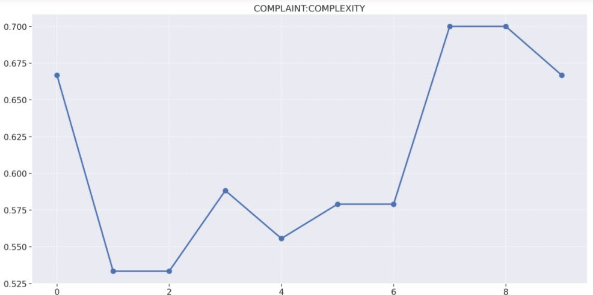
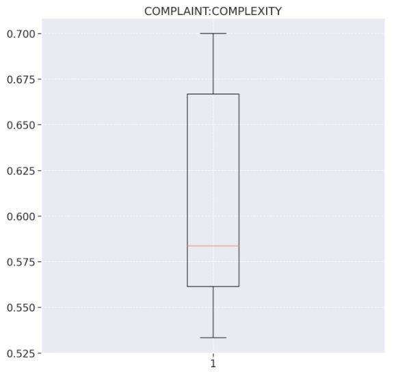
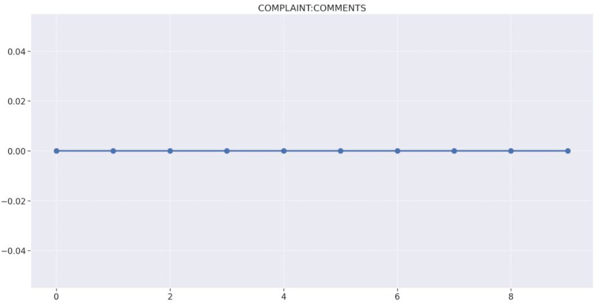
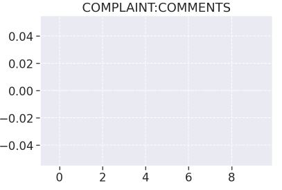
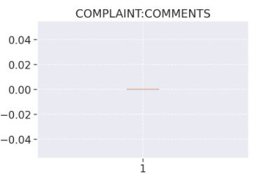
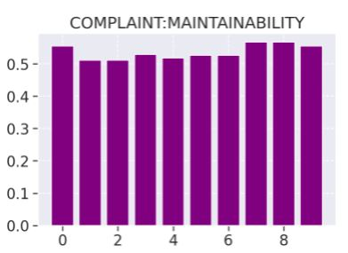
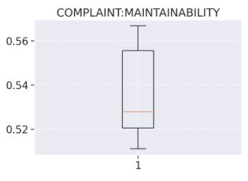
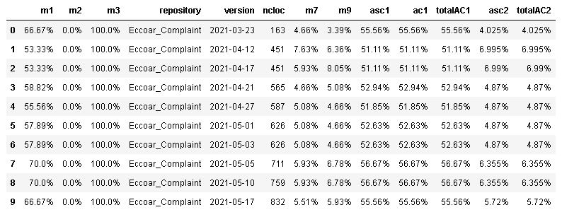
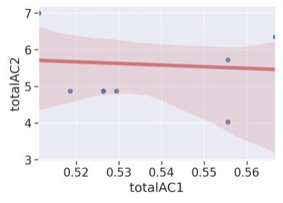
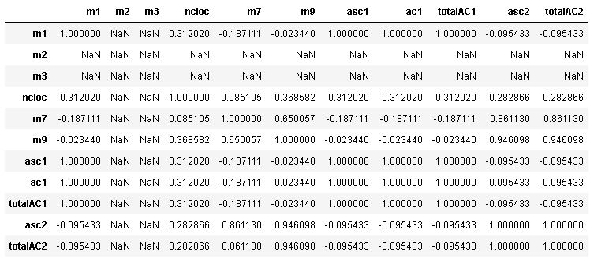

# Analytics Complaint

## Complexidade

1. Release 2
    - 52.5% de arquivos não complexos
    - 44 arquivos alterados
        - 23 novos arquivos
        - 11 arquivos editados
    - A complexidade nessa Release no repositório de Complaints aumentou porque na Release 2 tivemos muitos arquivos de configuração de ambiente, além da criação dos primeiros métodos de requisições e alterações no banco de dados usando a controller. Isso exigiu muitos desvios de fluxos com condicionais pela conferência de campos, variação de comportamento, try catches, dentre outros fatores que aumentaram a complexidade ciclomática de forma significativa.
2. Release 3
    - 59.5% de arquivos não complexos
    - 5 arquivos alterados
        - 2 novos arquivos
        - 3 arquivos editados
    - A complexidade diminui porque só houve a configuração da Migrations para o nosso banco de dados. Assim, a complexidade caiu pela proporção de código não complexo desenvolvido.
3. Release 4
    - 55% de arquivos não complexos
    - 3 arquivos alterados
        - 1 novos arquivos
        - 2 arquivos editados
    - A complexidade aumentou nessa Release pela adição do Sentry, que conta com um handler de erro para caso haja algum problema na execução. Esse tratamento acaba aumentando a complexidade por se configurar como um desvio de fluxo.
4. Release 5 e 6
    - 58% de arquivos não complexos
    - 8 arquivos alterados
        - 1 novo arquivo
        - 7 arquivos editados
    - Aqui já vemos a complexidade baixar novamente por conta de uma pequena alteração na coleta de métricas do Sonar, o que tornou a complexidade do código mais baixa em totalidade.
5. Release 7 e 8
    - 70% de arquivos não complexos 
    - 22 arquivos alterados
        - 3 novos arquivos
        - 19 arquivos editados
    - A complexidade do código diminuiu novamente na Release 7 apesar do fato de que nessa Release foram desenvolvidas funcionalidades de deleção de denúncias no repositório. Nessa Release também implementamos a função de remover votos, que possui condicionais que aumentam a complexidade, mas em comparação com a quantidade de outros códigos lineares implementados, a complexidade total diminuiu.
6. Release 9
    - 56% de arquivos não complexos
    - 6 arquivos alterados
        - 1 novo arquivo
        - 5 arquivos editados
    - A complexidade aumentou na última Release por conta da implementação da funcionalidade de pegar denúncias próximas por geolocalização. Isso exige um tratamento de erros e desvios condicionais, o que aumenta significativamente a complexidade ciclomática.

## Densidade de linhas comentadas

O repositório do Complaints possui uma quantidade de comentários zeradas em todas as Releases pelo fato de que o time do projeto Eccoar ter decidido por eliminar a inserção de qualquer comentário nos repositórios.

## Densidade de linhas duplicadas

A ausência de duplicações se manteve em 100% no decorrer de todo o projeto, ficando constante no decorrer de todas as releases.

## Produtividade

## Manutenibilidade

## Análise descritiva

- Na métrica m1, de não complexidade do código, vemos que a média está em 61%, o que mostra uma média razoável que poderia ter melhora. O desvio padrão já demonstra que há uma variação de 6.65% apenas, o que demonstra que o código permaneceu com uma complexidade próxima da média ao longo do projeto, sem variações numéricas muito bruscas.
- Na métrica m2, de densidade de linhas comentadas, temos que ela está zerada porque o time não usou comentários no desenvolvimento do código.
- Na métrica m3, de linhas de código duplicadas, vemos que ela permaneceu constante em todo o desenvolvimento.

## Análise de percentis

## Regressão linear

## Matriz de correlação

Nessa tabela podemos perceber que:

- m1/m2/m3/m7/m9/asc1/ac1/totalAC1/asc2/totalAC2 e m2/m3 possue uma correlação nula, já que seu coeficiente é igual a zero. Dessa forma, não ocorre uma relação.

- m1 e m7/m9 se correlacionam negativamente. Como seu valor é aproximado de zero, sua correlação é fraca.

- m1 e asc1/ac1/totalAC1 se correlacionam positivamente. Como seu valor é igual a 1, sua correlação é forte.

- m1 e asc2/totalAC2 se correlacionam negativamente. Como seu valor é aproximado de zero, sua correlação é fraca.

- m7 e m9 se correlacionam positivamente. Como seu valor é aproximado de 1, sua correlação é forte.

- m7 e asc1/ac1/totalAC1 se correlacionam negativamente. Como seu valor é aproximado de zero, sua correlação é forte.

- m7 e asc2/totalAC2 se correlacionam positivamente. Como seu valor é aproximado de 1, sua correlação é forte.

- m9 e asc1/ac1/totalAC1 se correlacionam negativamente. Como seu valor é aproximado de 0, sua correlação é fraco.

- m9 e asc2/totalAC2 se correlacionam positivamente. Como seu valor é aproximado de 1, sua correlação é forte.

- asc1/ac1 e totalAC1 se correlacionam positivamente. Como seu valor é igual a 1, sua correlação é forte.

- asc1/ac1/totalAC1 e asc2/totalAC2 se correlacionam negativamente. Como seu valor é aproximado de 0, sua correlação é fraca.