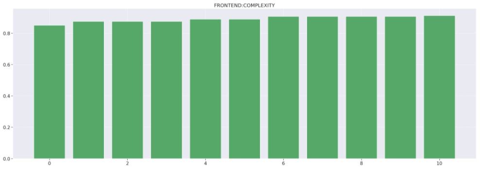
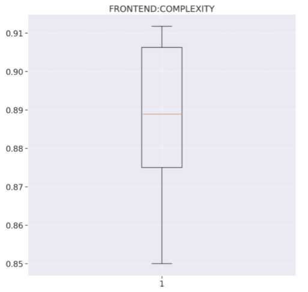
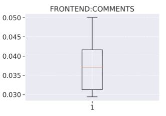
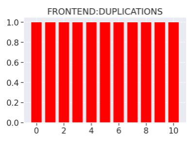
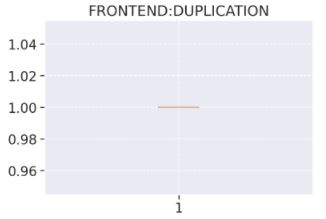
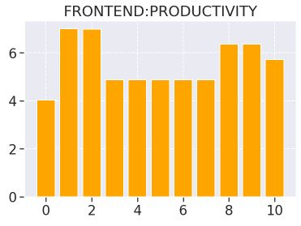
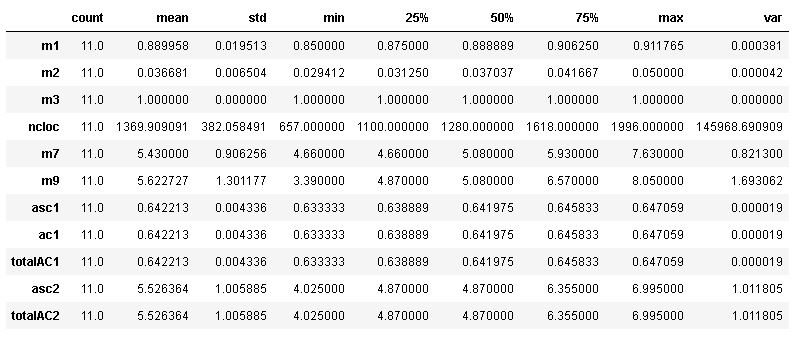
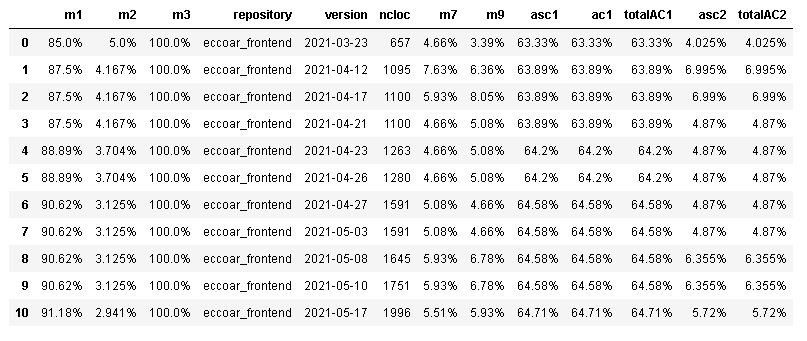
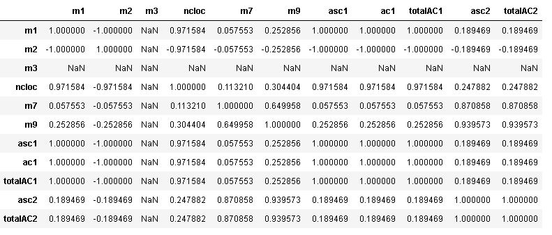

# Analytics Front-end

## Complexidade

1. Release 1
    - 87.5% de arquivos não complexos
    - 34 arquivos alterados
        - 10 novos arquivos
        - 2 arquivos deletados
        - 22 arquivos editados
    - A não complexidade aumentou nessa Release pelo fato de que criamos muito do código inicial. A página inicial do nosso sistema, a página de detalhamento de denúncia, criação de componentes, CSS, dentre outros, foram criados nessa primeira Release. Apesar de termos condicionais para mudar o CSS, para popular a homepage e a página de detalhamento de denúncia, a maior quantidade do código não possui uma alta complexidade ciclomática com desvios de fluxo. Portanto, pela proporção, a complexidade acabou diminuindo.
    
2. Release 2 e 3
    - 87.5% de arquivos não complexos
    - 24 arquivos alterados
        - 13 novos arquivos
        - 0 arquivos deletados 
        - 11 arquivos editados      
    - A não complexidade permaneceu alta e constante porque o trabalho consistiu em configuração do ambiente, correções da Pipeline, Sonar e outros. Esse tipo de código possui um quantia insignificante de condicionais, não causando desvios de fluxo suficientes para tornar o código mais complexo.

3. Release 4
    - 89% de arquivos não complexos
    - 11 arquivos alterados
        - 3 novos arquivos
        - 0 arquivos deletados
        - 8 arquivos editados
    - Nessa release, houve um aumento significativo da não complexidade porque nela, apesar de ter sido desenvolvida a funcionalidade de geolocalização do usuário no front-end, que utiliza muitos desvios de fluxo, que aumentam a complexidade ciclomática, como: uso de condicionais para saber se a geolocalização estava presente para plotar um mapa pro usuário, try catches para verificar erros de uso da localização do usuário, dentre outras implementações que exigiam desvios de fluxo. Isso aconteceu porque o código, em totalidade, acaba tendo mais código não complexo, o que compensa a complexidade adicionada.

4. Release 5
    - 89% de arquivos não complexos
    - 11 arquivos alterados
        - 3 novos arquivos
        - 8 arquivos editados
    - Nessa release foram adicionados commits relacionados à refatoração do código do frontend, com isso conseguimos ver que não houve um impacto na complexidade do código, porque só foram mexidos em testes unitários, CSS e HTML.

5. Release 6
    - 90.8% de arquivos não complexos
    - 27 arquivos alterados
        - 11 novos arquivos
        - 16 arquivos editados
    - Nessas releases foram editados arquivos de configuração da pipeline, que resultaram em um aumento do número de códigos complexos, também foram implementadas US relacionadas ao cadastro de novos usúarios, que acarretou na criação de novas regras para usuários que estão ou não logados, além de adicionar novos arquivos para páginas de cadastro, que foram considerados complexos. Novamente, o aumento da complexidade ainda se torna proporcionalmente menor com a quantidade de código total não complexo.

6. Release 10
    - 91% de arquivos não complexos
    - 41 arquivos alterados
        - 6 novos arquivos
        - 11 arquivos com nome ou caminho editados
        - 24 arquivos editados
    - Podemos fazer uma análise que na última release (tag 1.5.0) houve um alto pico de não complexidade. Isso deve-se ao fato que a implementação da funcionalidade de login e autenticação no front-end não exigem desvios de fluxo constantes, como o uso de condicionais e loops. O impacto, então é uma complexidade ciclomática baixa, representada pelo pico no gŕafico, uma vez que a codificação implementada não é considerada complexa por não ter desvios de fluxo.

## Densidade de linhas comentadas

As linhas comentadas sofrem diminuição de densidade nas Releases até o final. As linhas comentadas só aumentam no código quando há a criação de novos componentes, que precisam de comentários para orientar sobre os props. Quando em outras releases não há criação de comentários para props, naturalmente desenvolve-se código sem comentários, o que acaba diminuindo a densidade de linhas comentadas no gráfico analisado.

## Densidade de linhas duplicadas

A ausência de duplicações se manteve em 100% no decorrer de todo o projeto, ficando constante no decorrer de todas as releases.

## Produtividade

## Manutenibilidade

## Análise descritiva

- Na m1, podemos ver que a média de não complexidade ficou em 89%, o que demonstra que o código apresenta uma boa linearidade de execução no seu fluxo. Além disso, podemos observar que o mínimo de não complexidade é 85%, o que é um valor alto ainda, confirmando a hipótese apresentada anteriormente.
- Na m2, vale destacar que o desvio padrão de densidade de linhas comentadas é bem baixo. Isso indica que não houve uma variação brusca da média, que vale 3,67%. Esse raciocínio permite concluir que há um baixo teor de linhas comentadas no repositório do front.
- Na m3, observando os dados, olhamos que a constância de densidade de código duplicado permanece máxima em todo momento.
- Na m7, podemos perceber que a quantidade de issues concluídas do total criada no ambiente do GitHub atingiu 85.17%, o que demonstra que aproximadamente 15% do que ainda estava listado foi despriorizado pela equipe.
- A métrica m8 não aparece na análise descritiva estatística pelo fato desses cálculos matemáticos não serem contemplados com a distribuição de labels em cada issue. Dessa forma, não teríamos uma análise interessante sobre média, desvio, mínimo, etc.
- Na m9, cabe pontuar que a quantidade de issues que não são bugs atingiu um valor de 86.02%, mostrando que a correção de falhas correspondeu a 14% do trabalho do time.

## Análise de percentis

## Regressão linear

## Matriz de correlação

Nessa tabela podemos perceber que:

- m1/m2/m3/m7/m9/asc1/ac1/totalAC1/asc2/totalAC2 e m3 possue uma correlação nula, já que seu coeficiente é igual a zero. Dessa forma, não ocorre uma relação.

- m1 e m2 se correlacionam negativamente. Como seu valor é aproximado de -1, sua correlação forte.

- m1 e m7/m9 se correlacionam negativamente. Como seu valor é aproximado de zero, sua correlação é fraca.

- m1 e asc1/ac1/totalAC1 se correlacionam positivamente. Como seu valor é igual a 1, sua correlação é forte.

- m1 e asc2/totalAC2 se correlacionam positivamente. Como seu valor é aproximado de zero, sua correlação é fraca.

- m2 e m7 se correlacionam negativamente. Como seu valor valor é aproximado de 1, sua correlação é forte.

- m2 e m9 se correlacionam negativamente. Como seu valor valor é aproximado de 1, sua correlação é forte.

- m2 e asc1/ac1/totalAC1 se correlacionam negativamente. Como seu valor é igual a -1, sua correlação é forte.

- m2 e asc2/totalAC2 se correlacionam negativamente. Como seu valor é igual 0, sua correlação é fraca.

- m7 e m9 se correlacionam positivamente. Como seu valor é aproximado de 0, sua correlação é fraco.

- m7 e asc1/ac1/totalAC1 se correlacionam positivamente. Como seu valor é aproximado de 1, sua correlação é forte.

- m7 e asc2/totalAC2 se correlacionam positivamente. Como seu valor é aproximado de 1, sua correlação é forte.

- m9 e asc1/ac1/totalAC1 se correlacionam positivamente. Como seu valor é aproximado de 0, sua correlação é fraco.

- m9 e asc2/totalAC2 se correlacionam positivamente. Como seu valor é aproximado de 1, sua correlação é forte.

- asc1/ac1 e totalAC1 se correlacionam positivamente. Como seu valor é igual a 1, sua correlação é forte.

- asc1/ac1/totalAC1 e asc2/totalAC2 se correlacionam positivamente. Como seu valor é aproximado de 0, sua correlação é fraca.