# Analytics Gateway

## Complexidade

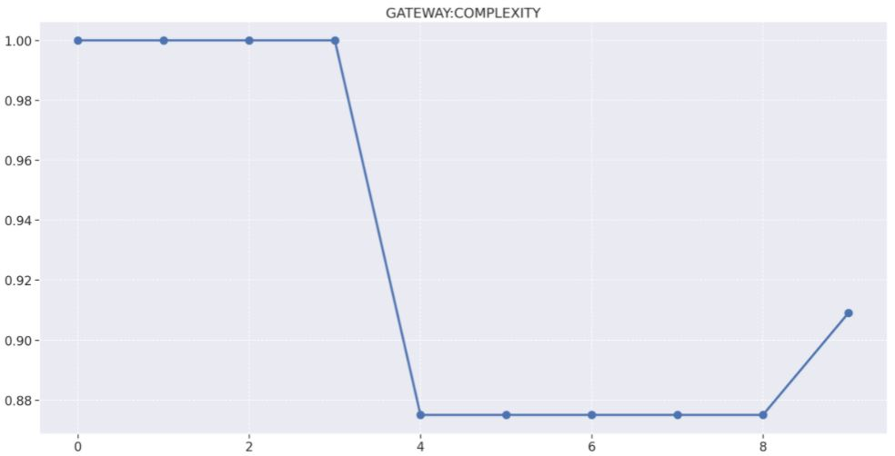
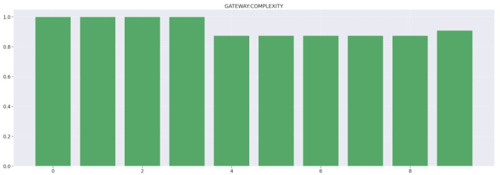

1. Release 4
    - Queda de 100% para 88% de arquivos não complexos
    - 7 arquivos alterados
        - 1 novo arquivo
        - 6 arquivos editados
    - A queda ocorreu pois foi adicionado o arquivo sentry.ts, que é um arquivo sem funções, como a divisão de complexidade por funções resulta em NaN, o arquivo é considerado com complexo, diminuindo a densidade de arquivos não complexos.
2. Release 9
    - Aumento de 88% para 91%
    - 12 arquivos alterados
        - 4 novos arquivos
        - 8 arquivos editados
    - A diferença na densidade de arquivos não complexos mudou apenas por conta da adição de novos arquivos, como novos arquivos não considerados complexos foram adicionados, a densidade aumentou.

## Densidade de linhas comentadas

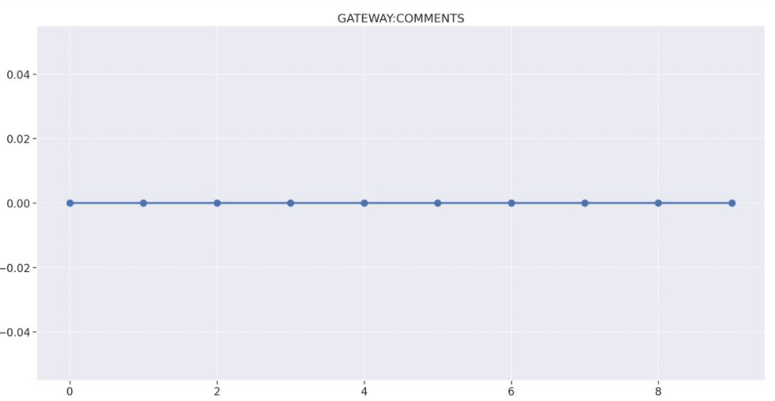
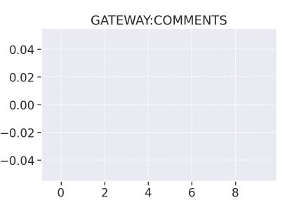
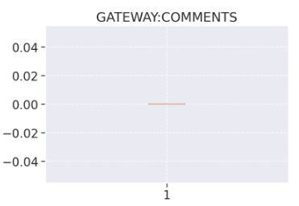

O repositório do Gateway possui uma quantidade de comentários zeradas em todas as Releases pelo fato de que o time do projeto Eccoar ter decidido por eliminar a inserção de qualquer comentário nos repositórios.

## Densidade de linhas duplicadas

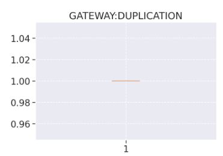

A ausência de duplicações se manteve em 100% no decorrer de todo o projeto, ficando constante no decorrer de todas as releases.

## Produtividade

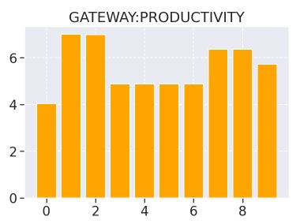

## Manutenibilidade

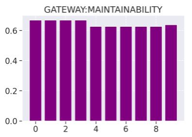
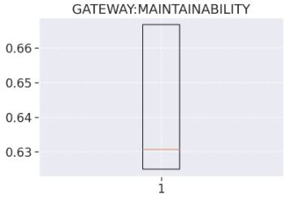

## Análise descritiva

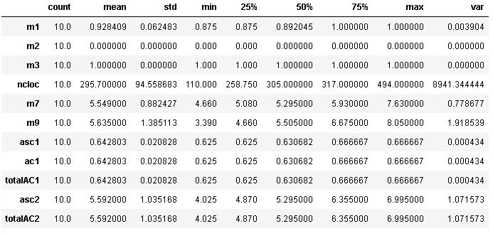

- Na m1, podemos ver que a média de não complexidade ficou em 92%, isso significa que o código está bem linear em relação à execução de seu fluxo(pouco complexo). Também conseguimos ver que o mínimo dessa média ficou em 87%, que ainda é um valor alto, já o valor máximo ficou em 100%, isso ocorreu apenas nas primeiras releases, quando o código ainda era bem pequeno.
- Como visto nos gráficos anteriores a densidade de duplicações e de comentários se manteve constante no decorrer de todas as releases, então não há muita análise que pode ser feita em relação a isso.

## Análise de percentis

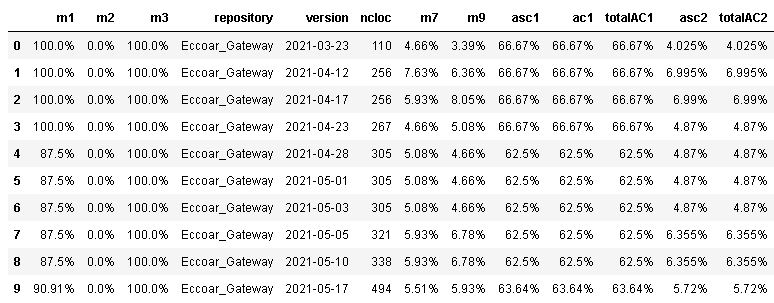

## Regressão linear

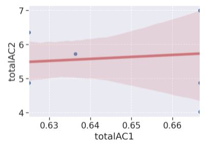

## Matriz de correlação

Nessa tabela podemos perceber que:

- m1/m2/m3/m7/m9/asc1/ac1/totalAC1/asc2/totalAC2 e m2/m3 possue uma correlação nula, já que seu coeficiente é igual a zero. Dessa forma, não ocorre uma relação.

- m1 e m7/m9 se correlacionam positivamente. Como seu valor é aproximado de zero, sua correlação é fraca.

- m1 e asc1/ac1/totalAC1 se correlacionam positivamente. Como seu valor é igual a 1, sua correlação é forte.

- m1 e asc2/totalAC2 se correlacionam positivamente. Como seu valor é aproximado de zero, sua correlação é fraca.

- m7 e m9/asc1/ac1/totalAC1 se correlacionam positivamente. Como seu valor é aproximado de zero, sua correlação é fraca

- m7 e asc2, totalAC2 se correlacionam positivamente. Como seu valor é aproximado de 1, sua correlação é forte.

- m9 e asc1/ac1/totalAC1 se correlacionam positivamente. Como seu valor é aproximado de 1, sua correlação é forte.

- m9 e asc2/totalAC2 se correlacionam positivamente. Como seu valor é aproximado de 1, sua correlação é forte.

- asc1/ac1 e ac1/totalAC1 se correlacionam positivamente. Como seu valor é igual a 1, sua correlação é forte.

- asc1/ac1/totalAC1 e asc2/totalAC2 se correlacionam positivamente. Como seu valor é aproximado de 0, sua correlação é fraca.