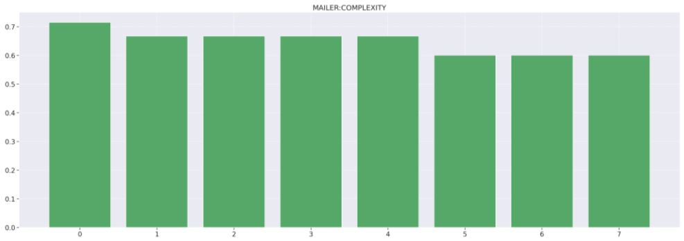
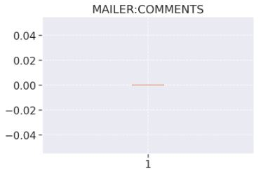
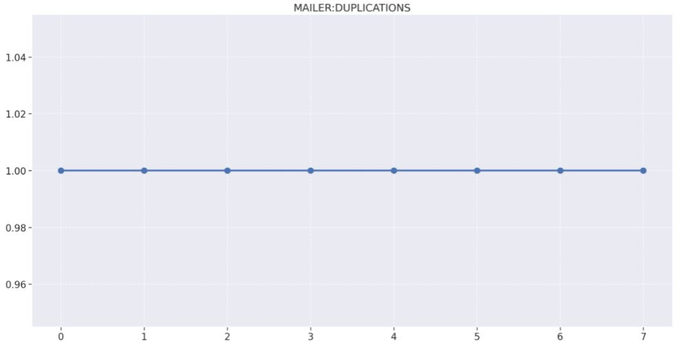
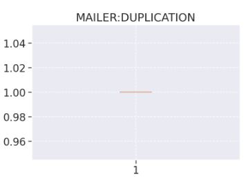
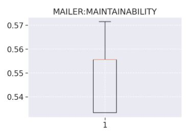
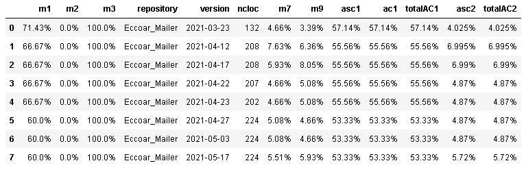
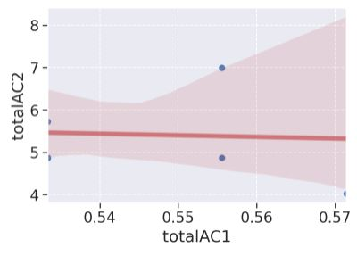
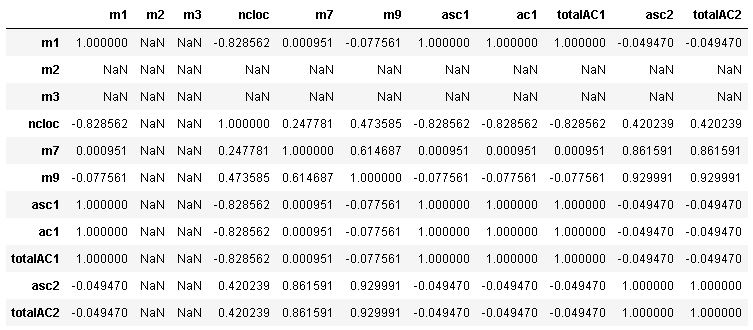

# Analytics Mailer

## Complexidade

1. Release 1 :
    - 66% de arquivos não complexos.
    - 33 arquivos alterados
        - 20 novos arquivos.
        - 13 arquivos editados
    - Essa release trouxe além da configuração da pipeline e configurações relacionadas ao ambiente de desenvolvimento, tais como a inclusão do Morgan, configurações do Husky e do Prettier, alterações relacionadas ao tratamento de erros dentro do serviço. O conjunto dessas alterações foi responsável pelo aumento da complexidade ciclomática.

2. Release 5 :
    - 60% de arquivos não complexos.
    - 3 arquivos alterados
        - 1 novo arquivo
        - 2 arquivos editados
    - Essa release representou um aumento da complexidade ciclomática. Nela foi realizada a adição do Sentry, que conta com um handler de erro para caso haja algum problema na execução. Esse tratamento acaba aumentando a complexidade por se configurar como um desvio de fluxo.

## Densidade de linhas comentadas

O repositório Mailer possui uma quantidade de comentários zerados em todas as Releases pelo fato de que o time do projeto Eccoar ter decidido por eliminar a inserção de qualquer comentário nos repositórios.

## Densidade de linhas duplicadas

A ausência de duplicações se manteve em 100% no decorrer de todo o projeto, ficando constante no decorrer de todas as releases.

## Produtividade

## Manutenibilidade

## Análise descritiva

- Sobre a m1, a média foi de 64%, com um mínimo de 60% e máxima de 71%. Apesar de não haver uma variação tão grande entre os valores, esse repositório deixou a desejar quando comparado com o gateway e o frontend, que obtiveram médias por volta de 90%. Isso indica que o código desse repositório ainda apresenta bastante espaço para melhora.
- Como visto nos gráficos anteriores a densidade de duplicações e de comentários se manteve constante no decorrer de todas as releases, então não há muita análise que pode ser feita em relação a isso.

## Análise de percentis

## Regressão linear

## Matriz de correlação

Nessa tabela podemos perceber que:

- m1/m2/m3/m7/m9/asc1/ac1/totalAC1/asc2/totalAC2 e m2/m3 possue uma correlação nula, já que seu coeficiente é igual a zero. Dessa forma, não ocorre uma relação.

- m1 e m7 se correlacionam positivamente. Como seu valor é aproximado de zero, sua correlação é fraca.

- m1 e m9 se correlacionam negativamente. Como seu valor é aproximado de zero, sua correlação é fraca.

- m1 e asc1/ac1/totalAC1 se correlacionam positivamente. Como seu valor é igual a 1, sua correlação é forte.

- m1 e asc2/totalAC2 se correlacionam negativamente. Como seu valor é aproximado de zero, sua correlação é fraca.

- m7 e m9 se correlacionam positivamente. Como seu valor é aproximado de 1, sua correlação é forte.

- m7 e asc1/ac1/totalAC1 se correlacionam positivamente. Como seu valor é aproximado de 0, sua correlação é fraco.

- m7 e asc2/totalAC2 se correlacionam positivamente. Como seu valor é aproximado de 1, sua correlação é forte.

- m9 e asc1/ac1/totalAC1 se correlacionam negativamente. Como seu valor é aproximado de -1, sua correlação é forte.

- m9 e asc2/totalAC2 se correlacionam positivamente. Como seu valor é aproximado de 1, sua correlação é forte.

- asc1/ac1 e totalAC1 se correlacionam positivamente. Como seu valor é igual a 1, sua correlação é forte.

- asc1/ac1/totalAC1 e asc2/totalAC2 se correlacionam negativamente. Como seu valor é aproximado de -1, sua correlação é forte.