# Analytics Reports

## Complexidade

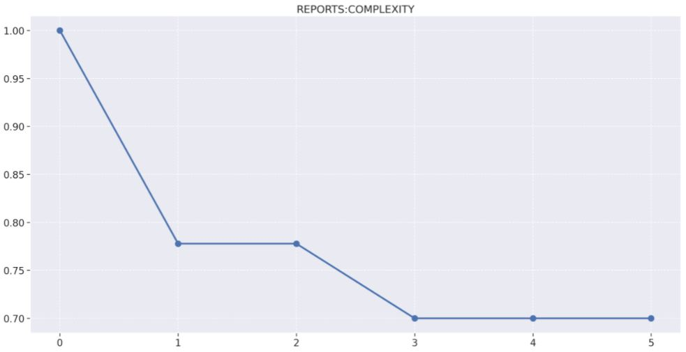
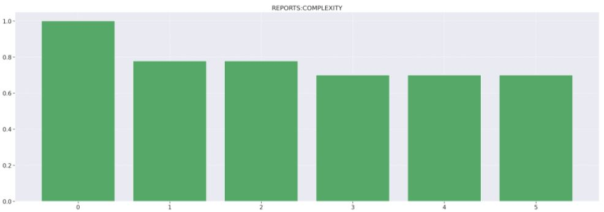
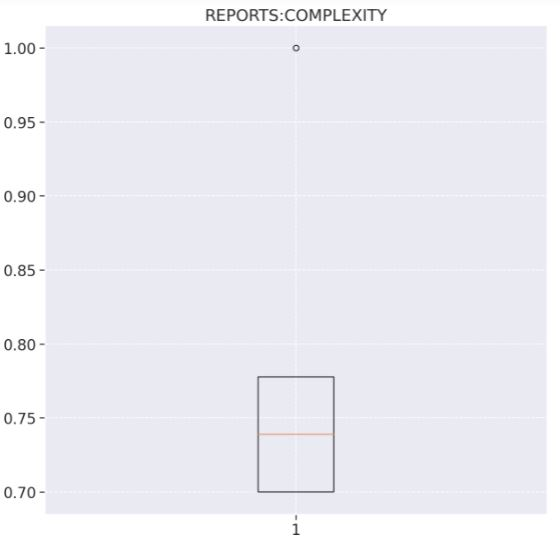

1. Release 1:
    - 77% de arquivos não complexos.
    - 26 arquivos alterados
        - 15 novos arquivos
    - Além de configurações relacionadas ao ambiente de desenvolvimento, nessa release foi adicionada toda a estrutura de geração do PDF de relatório e o envio do arquivo ao serviço de armazenamento na nuvem da AWS, o S3. Ainda foi adicionado ao serviço, o tratamento de erros. O conjunto dessas alterações refletiu no aumento da complexidade.

2. Release 3:
    - 70% de arquivos não complexos.
    - 3 arquivos alterados
    - Essa release representou um aumento da complexidade ciclomática. Nela foi realizada a adição do Sentry, que conta com um handler de erro para caso haja algum problema na execução. Esse tratamento acaba aumentando a complexidade por se configurar como um desvio de fluxo.

## Densidade de linhas comentadas

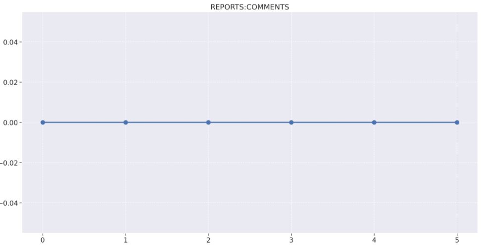
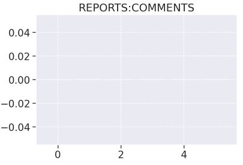
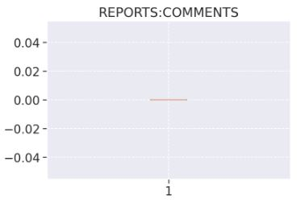

O repositório Reports possui uma quantidade de comentários zerados em todas as Releases pelo fato de que o time do projeto Eccoar ter decidido por eliminar a inserção de qualquer comentário nos repositórios.

## Densidade de linhas duplicadas

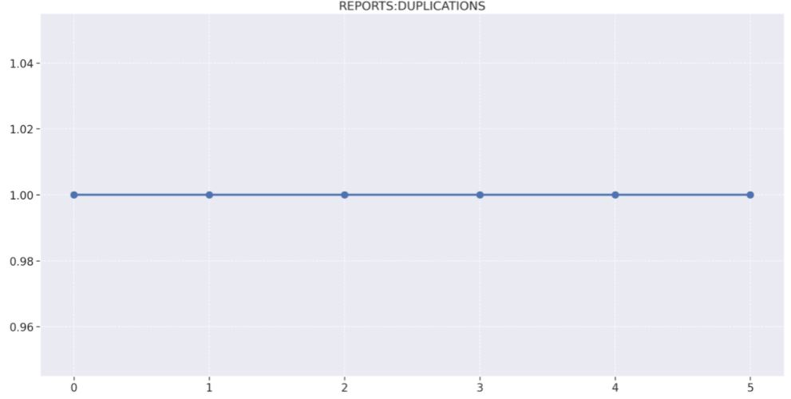
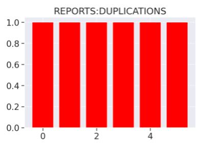
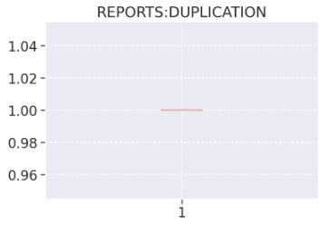

A ausência de duplicações se manteve em 100% no decorrer de todo o projeto, ficando constante no decorrer de todas as releases.

## Produtividade

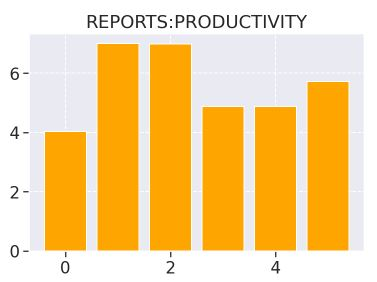

## Manutenibilidade

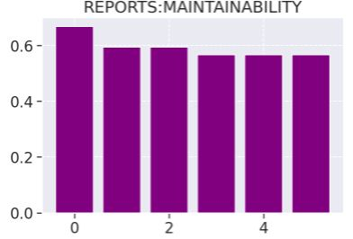

## Análise descritiva

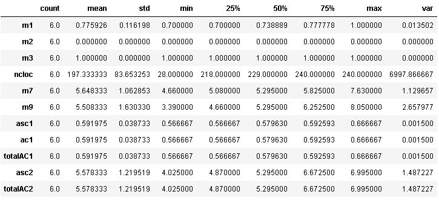

- Na m1, podemos ver que a média de não complexidade ficou em 78%, o que demonstra que o código apresenta um bom nível de linearidade de execução no seu fluxo. Possuindo pouca queda da mesma para sua métrica mínima de complexidade, o que confirma a hipótese apresentada anteriormente.
- Na m2, podemos observar baixa variação na taxa de linhas comentadas, o que demonstra que o time não utilizou comentários como uma ferramenta em seu desenvolvimento.
- Na m3, observando os dados, olhamos que a constância de densidade de código duplicado permanece máxima em todo momento, demonstrando a efetividade do time.

## Análise de percentis

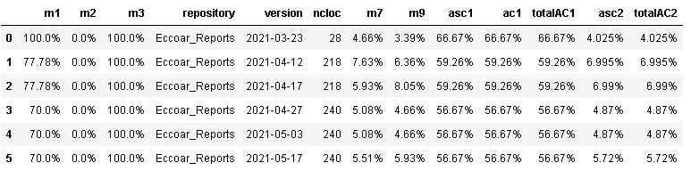

## Regressão linear

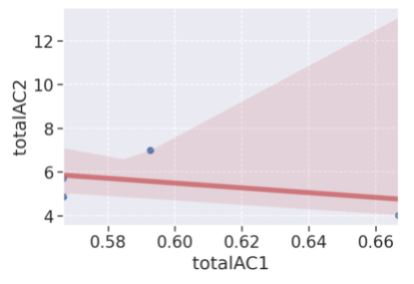

## Matriz de correlação

Nessa tabela podemos perceber que:

- m1/m2/m3/m7/m9/asc1/ac1/totalAC1/asc2/totalAC2 e m2/m3 possue uma correlação nula, já que seu coeficiente é igual a zero. Dessa forma, não ocorre uma relação.

- m1 e m7 se correlacionam negativamente. Como seu valor é aproximado de 0, sua correlação é fraca.

- m1 e m9 se correlacionam negativamente. Como seu valor é aproximado de 0, sua correlação é fraca.

- m1 e asc1/ac1/totalAC1 se correlacionam positivamente. Como seu valor é igual a 1, sua correlação é forte.

- m1 e asc2/totalAC2 se correlacionam negativamente. Como seu valor é aproximado de zero, sua correlação é fraca.

- m7 e m9 se correlacionam positivamente. Como seu valor é aproximado de 1, sua correlação é forte.

- m7 e asc1/ac1/totalAC1 se correlacionam negativamente. Como seu valor é aproximado de zero, sua correlação é fraca.

- m7 e asc2/totalAC2 se correlacionam positivamente. Como seu valor é aproximado de 1, sua correlação é forte.

- m9 e asc1/ac1/totalAC1 se correlacionam negativamente. Como seu valor é aproximado de zero, sua correlação é fraca.

- m9 e asc2/totalAC2 se correlacionam positivamente. Como seu valor é aproximado de 1, sua correlação é forte.

- asc1/ac1 e totalAC1 se correlacionam positivamente. Como seu valor é igual a 1, sua correlação é forte.

- asc1/ac1/totalAC1 e asc2/totalAC2 se correlacionam negativamente. Como seu valor é aproximado de zero, sua correlação é fraca.