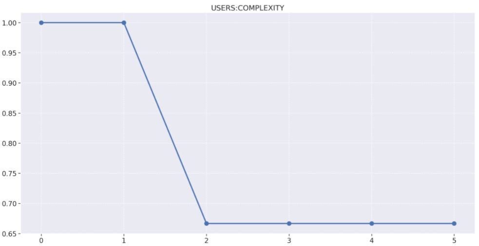
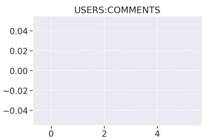
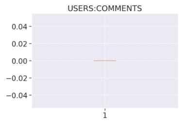
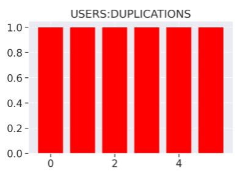
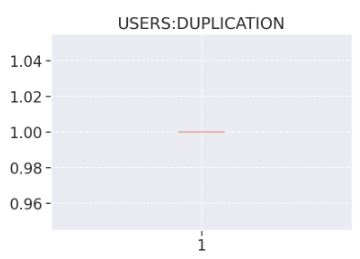
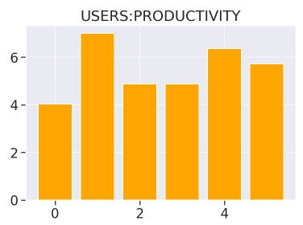
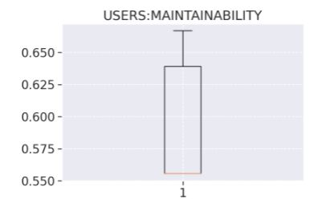
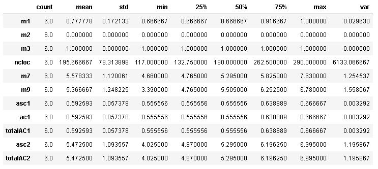
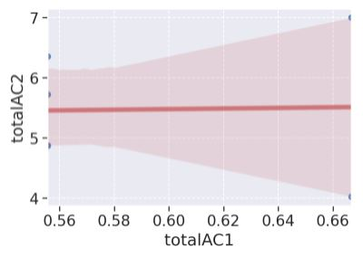

# Analytics Users

## Complexidade

1. Release 1
    - 66% de arquivos não complexos.
    - 28 arquivos alterados.
        - 8 novos arquivos.
    - Nessa release, por decisão da equipe o repositório de usuários que havia sido depreciado, foi reinstaurado e reestruturado para ser utilizado como serviço de cadastro/gerenciamento de usuário.
    - Foi reestruturado o Docker do serviço, e foi estabelecida a conexão com o Firebase. Além disso, foi configurado o Morgan no ambiente para o ambiente de desenvolvimento e foi criado o tratamento de erros do serviço. O conjunto dessas mudanças resultou num aumento brusco da complexidade do serviço.

## Densidade de linhas comentadas

O repositório de Users possui uma quantidade de comentários zerados em todas as Releases pelo fato de que o time do projeto Eccoar ter decidido por eliminar a inserção de qualquer comentário nos repositórios.

## Densidade de linhas duplicadas

A ausência de duplicações se manteve em 100% no decorrer de todo o projeto, ficando constante no decorrer de todas as releases.

## Produtividade

## Manutenibilidade

## Análise descritiva

- Na métrica m1, de complexidade, conseguimos constatar pelo quartil 50% que ½  de todas as releases geradas tiveram uma não complexidade maior que 66.67%, mostrando que durante todo o projeto o código de manteve não complexo. Confirmamos isso vendo a média alta de 76.19%.
- Na métrica m2, de densidade de linhas comentadas, temos que ela está zerada porque o time não usou comentários no desenvolvimento do código.
- Na métrica m3, de linhas de código duplicadas, vemos que ela permaneceu constante em todo o desenvolvimento.

## Análise de percentis

## Regressão linear

## Matriz de correlação

Nessa tabela podemos perceber que:

- m1/m2/m3/m7/m9/asc1/ac1/totalAC1/asc2/totalAC2 e m2/m3 possue uma correlação nula, já que seu coeficiente é igual a zero. Dessa forma, não ocorre uma relação.

- m1 e m7 se correlacionam positivamente. Como seu valor é aproximado de 0, sua correlação é fraca.

- m1 e m9 se correlacionam negativamente. Como seu valor é aproximado de 0, sua correlação é fraca.

- m1 e asc1/ac1/totalAC1 se correlacionam positivamente. Como seu valor é igual a 1, sua correlação é forte.

- m1 e asc2/totalAC2 se correlacionam positivamente. Como seu valor é aproximado de zero, sua correlação é fraca.

- m7 e m9 se correlacionam positivamente. Como seu valor é aproximado de 1, sua correlação é forte.

- m7 e asc1/ac1/totalAC1 se correlacionam positivamente. Como seu valor é aproximado de zero, sua correlação é fraca.

- m7 e asc2/totalAC2 se correlacionam positivamente. Como seu valor é aproximado de 1, sua correlação é forte.

- m9 e asc1/ac1/totalAC1 se correlacionam negativamente. Como seu valor é aproximado de zero, sua correlação é fraca.

- m9 e asc2/totalAC2 se correlacionam positivamente. Como seu valor é aproximado de 1, sua correlação é forte.

- asc1/ac1 e totalAC1 se correlacionam positivamente. Como seu valor é igual a 1, sua correlação é forte.

- asc1/ac1/totalAC1 e asc2/totalAC2 se correlacionam positivamente. Como seu valor é aproximado de zero, sua correlação é fraca.