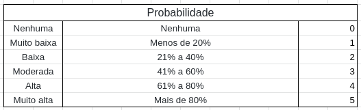
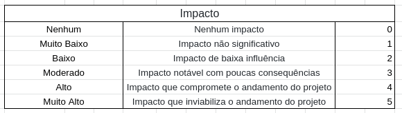

# Gerenciamento de Risco

## Histórico de revisão
|Autor|Mudanças|Data|Versão|
|--|--|--|--|
|[Pedro Féo](https://github.com/phe0)|Criação do documento|18/02/2021|1.0|

## Motivação

Durante a elaboração e desenvolvimento de um produto de software, muitos problemas podem ocorrer. Esses problemas abrangem diversos aspectos do produto e do projeto, como a organização da equipe, tecnologias usadas, problemas pessoais, etc.

Tais problemas podem vir a impactar o o resultado final do produto, além de aspectos do projeto como as datas de entrega.

Levando em consideração a existência de diversos tipos diferentes de riscos que podem ocorrer, se mostra necessário um método para a identificação e solução dos mesmos.

## Método

### Identificação de riscos

Para se identificar possíveis riscos, serão usados dois métodos diferentes, sendo eles:

 - Pauta de reunião entre a [Retrospectiva da sprint](/metodologia/templates/retrospective/) e o [Planejamento da sprint](/metodologia/templates/planning/) com o intuíto de que todos na equipe, MDS e EPS, possam vir a opinar sobre os possíveis riscos detectados.
 - Utilização de um formulário que será individualmente respondido pelos membros do grupo, MDS e EPS, com o intuíto de captar possíveis problemas e observações que um membro possa não se sentir a vontade para compartilhar com todo o grupo. Tal formulário será utilizado também para captar o [humor do grupo](/metodologia/templates/review/#grafico-de-humor) e suas respostas só serão acessíveis para o grupo de EPS.

### Metricas

Para se metrificar os riscos do projeto, será utilizado um burndown de riscos, o burndown é responsável por mostrar o quão relevante um risco é ao decorrer das sprints.

Para se saber a relevância de um risco, é necessário se estipular a probabilidade do risco acontecer. A probabilidade será representada por um valor de 0 a 5 de acordo com a imagem a baixo:

Além da probabilidade também será estimado um impacto para o risco, como na imagem abaixo:

A relevância total do risco é calculada como Impacto x Probabilidade.

O resultado será mostrado em um gráfico que mostra a relevância de cada um dos riscos no decorrer das sprints.

### Soluções

 - Possíveis soluções para problemas levantados durante a reunião, serão levantadas durante a própria reunião.
 - Problemas levantados durante a analise do formulário, terão possíveis soluções levantadas pelo [Scrum Master](https://github.com/phe0)

## Referências

 - Risk Management in Software Engineering – Development Project Prepared For Every Threat. Asper Brothers, 27 de jan de 2020. Disponível em: <https://asperbrothers.com/blog/risk-management-in-software-development/>. Acesso em 18 de fev de 2021.
 - SHAW, John. Risk Burndown. Capgemini, 12 de mar de 2015. Disponível em: <https://capgemini.github.io/agile/risk-burndown/>. Acesso em 18 de fev de 2021.