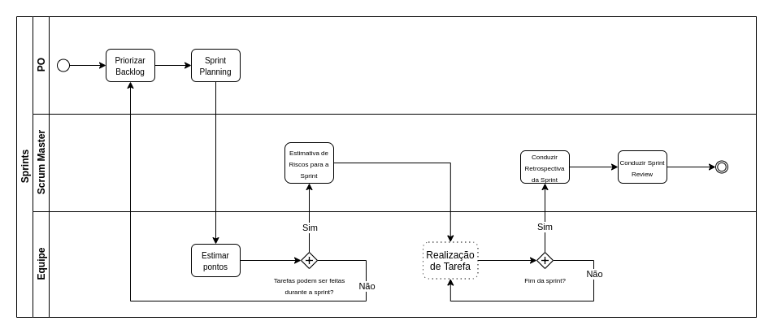
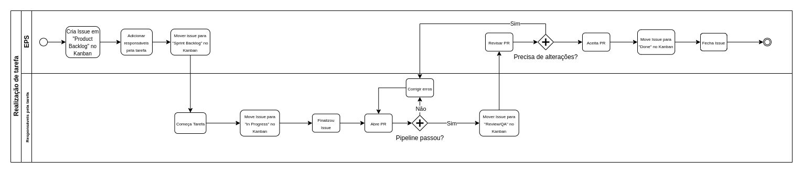

# Processos do Grupo

## Histórico de revisão

| Autor                                | Mudanças                       | Data       | Versão |
| ------------------------------------ | ------------------------------ | ---------- | ------ |
| [Pedro Féo](https://github.com/phe0) | Criação do documento           | 22/03/2021 | 1.0    |
| [Pedro Féo](https://github.com/phe0) | Adicionando Weekly ao processo | 19/04/2021 | 1.1    |

## Introdução

Esse documento tem como objetivo detalhar o processo e metodologias utilizadas durante o andamento do projeto.

## Metodologia do grupo

A metodologia usada durante a disciplina é uma adaptação de elementos de diversas metodologias ágeis. Podemos destacar nos diagramas abaixo um pouco do processo geral utilizado.

Além dos diagramas, também disponibilizamos os elementos de algumas metodologias que adotamos e adaptamos para nosso contexto.

Para complementar o entendimento dos nossos proessos, recomendo a leitura dos demais documentos de gerência utilizados, como:

- [Ferramentas de Comunicação](comunicacao.md)
- [Gerenciamento de Riscos](gerenciaRisco.md)
- [Template de Sprint Review](templates/review.md)
- [Template de Retrospectiva](templates/retrospective.md)
- [Template de Sprint Planning](templates/planning.md)

### Processo das Sprints

No diagrama abaixo conseguimos visualizar o fluxo usado durante a sprint, levando em consideração os papeis do Product Owner, Scrum Master e restante da equipe

Dentro desse processo existe um subprocesso chamado Realização de Tarefa que está descrito abaixo.

### Processo de realização de tarefas

Esse diagrama mostra o fluxo de trabalho que deve ser usado para realizar uma tarefa.

### Elementos Kanban

- Utilização do ZenHub como kanban para gerenciamento de tarefas;
- Delimitação de responáveis pelas tarefas;
- Limitação de quantidade de trabalho limite por membro;
- Coleta de métricas de produtividade;

### Elementos XP

- Programação em pares;
- Integração contínua;
- Refatoramento, quando necessário;
- Feedback constante;

### Elementos Scrum

- Sprints com 7 dias de duração;
- Reunião de planejamento da sprint, realizada aos sábados;
- Reunião de review das Sprints, realizada aos sábados;
- Reunião de retrospectiva das Sprints, realizada aos sábados;
- Dailies via chat realizadas de segunda a sexta;
- Product Backlog;
- Sprint Backlog;
- Uso de critérios de aceitação;
- Entregas incrementais;

#### Extras

- As reuniões de daily via chat se mostraram pouco efetivas, por conta disso adicionamos uma reunião semanal, chamada de weekly, toda quarta-feira para fazermos um checkpoint com todo o grupo;

## Referências

- MÉTODO ÁGIL XP (EXTREME PROGRAMMING) - Luciano Malaquias de Souza.
- Schwaber, Ken. Agile Project Management with Scrum.
- Metodologia do projeto. QR Comer. Disponível em <https://fga-desenho-2019-2.github.io/Wiki/seminario2/metodologia/>.
