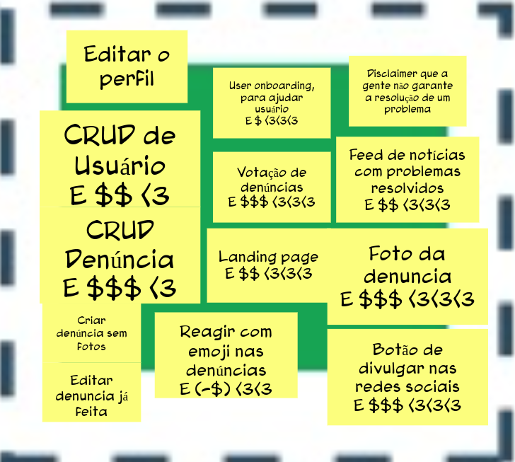

# Lean Inception

## Visão do Produto

|||
|-|-|
|Para|Comunidades e seus moradores|
|Cujo|Problema se encontra na demora e burocracia na de resolução de problemas|
|O Eccoar|É um PWA  de denúncias para problemas de natureza pública|
|Que|Visa aumentar visibilidade para os problemas e facilitar a comunicação entre o governo, orgãos responsáveis e o povo|
|Diferentemente da|Colab|
|O nosso produto|Coleta informações sobre o problema e os envia diretamente para o Estado, facilitando o relato de problemas. Assim, removendo a necessidade da comunidade se comunicar com orgãos públicos|

## É, Não É, Faz, Não Faz
| É | Não é | Faz | Não faz |
|--|--|--|--|
| Um app de denúncias | Rede social | Facilita a comunicação mandando denúncias para o orgão | Não faz transações monetárias |
| Ponte de comunicação entre a comunidade e orgãos responsáveis | chat com o órgão público | Faz com que as pessoas procurem verificar os problemas na comunidade | Não faz o governo se comunicar com o usuário |
| | Crowdfunding | Agrupa denúncias no sentido de pegar as denúncias mais verificadas e confirmadas | Não faz a solução da sua comunidade |
| | Não é uma solução rápida | Mostra o andamento da resolução do problema | Não faz ads comerciais |
| | Não é uma api de emails | Mostra as denúncias no feed apenas por geolocalização a partir de um raio | |
| | Não é uma rede de notificação  | Entra em contato com o orgão responsável | |
| | Não é uma garantia da solução do problema | | |

## Objetivos de Negócio

| Engajar comunidade | Facilitar o relato de problemas | Buscar soluções às problemáticas | Dar visibilidade para os problemas |
|--|--|--|--|
| Incentivar o usuário a relatar problemas da comunidade | Reportar problemas comunitários | Mostrar os impactos de um problema na vida em comunidade para o governo | Filtrar os problemas por relevância, veracidade |
| Incentivar a comunidade a relatar os problemas | Retirar responsabilidade do usuário de comunicar com entidades governamentais | Relatar ao governo problemas existentes | |
| | Facilitar o processo de denúncias | Encaminhar denúncias para os orgãos certos | |

## Personas

### Persona 1
| Persona | Perfil | Comportamento | Necessidades |
|--|--|--|--|
| Seu Zé | - 47 anos - Casado - Pai de 5 filhos - Dono de produção rural - Trabalhador  | - Usa a própria caminhonete a trabalho - Passa horas dirigindo - Conhece a cidade - Cauteloso por onde vai com a caminhonete de trabalho | - Manutenção regular das vias - Manter as vendas para sustentar a família - Ter mais retorno dos impostos que paga  |

### Persona 2
| Persona | Perfil | Comportamento | Necessidades |
|--|--|--|--|
| Prof. Hilmer | - Casado - Professor da Universidade de Brasília | - Leciona a materia de metodos de desenvolvimento de software para os estudantes de Engenharia de Software - Leciona a materia de Engenharia de Produto de Software | - Avaliar alunos da disciplina de MDS e EPS -  Repassar o conhecimento da disciplina de uma forma clara e objetiva |

### Persona 3
| Persona | Perfil | Comportamento | Necessidades |
|--|--|--|--|
| Maria | - 31 anos - Mãe de 1 filho | - Principal fonte de renda da casa - Funcionária do DER -DF - É responsável por receber processos ligados a infraestrutura | - Saber priorizar os processos a serem resolvidor primeiro - Facilitar na organização das denúncias feitas pro DER-DF - Reduzir seu estresse no trabalho para não descontar no filho e marido |

## Jornada do Usuário
As jornadas são referentes as numerações das respectivas personas anteriores.

### Jornada 1

### Jornada 2

### Jornada 3

## Brainstorm de Funcionalidades
Os pontos elencados a seguir foram frutos de uma brainstorm coletivo da equipe.

## Revisão Técnica, de Negócio e UX

|| COMO FAZER | <b>versus</b> | O QUE FAZER |
|--|--|--|--|
|<h1>/</h1>| <h1>Baixo</h1> | <h1>Médio</h1> | <h1>Alto</h1> |
|<h1>Alto</h1>||||
|<h1>Médio</h1>||||
|<h1>Baixo</h1>||||

## Sequenciador
||
|--|
|
  
|

## Canvas MVP

