# Protótipo

| Autor                                               | Mudanças                                         | Data     | Versão |
| --------------------------------------------------- | ------------------------------------------------ | -------- | ------ |
| [Victor Buendia](https://github.com/Victor-Buendia) | Criação de Versão no Figma.                      | 04/03/21 | 0.1    |
| [Brian Pina](https://github.com/DLBrianPina)        | Criação de Versão no Figma.                      | 04/03/21 | 0.1    |
| [Pedro Féo](https://github.com/Phe0)                | Criação de Versão no Figma.                      | 04/03/21 | 0.1    |
| [Pedro Féo](https://github.com/Phe0)                | Segunda versão do protótipo.                     | 05/03/21 | 0.1    |
| [Pedro Féo](https://github.com/Phe0)                | Documentação na wiki.                            | 06/03/21 | 0.1    |
| [Matheus Blanco](https://github.com/MatheusBlanco)  | Transformação do documento para mostrar evolução | 17/05/21 | 1.0    |

## Introdução

O protótipo de alta fidelidade do _Eccoar_ foi criado com o intuito de ser o guia principal da equipe durante o desenvolvimento do produto. Para que se pudesse se tornar tal guia, foi criado como o produto final do _Lean Inception_, da elicitação de requisitos, definição da arquitetura e esboço inicial do _Roadmap_ e _Backlog_ do Produto, contendo elementos e abordando discussões de todos os artefatos citados, de maneira a ser capaz de interagir com os dados necessários e se tornar um produto de simples utilização por parte do usuário.

## Construção do protótipo

### Definição da identidade visual

A primeira etapa da criação do protótipo foi a definição da identidade visual. Os três membros responsáveis pela tarefa, [Victor Buendia](https://github.com/Victor-Buendia), [Brian Pina](https://github.com/DLBrianPina) e [Pedro Féo](https://github.com/Phe0), se reuniram para realizar um brainstorm de ícones e logos que poderiam ser utilizadas pelo grupo no futuro. Valendo-se do tema de ecoar um problema para a comunidade, alguns esboços foram criados para serem apresentados para o time.

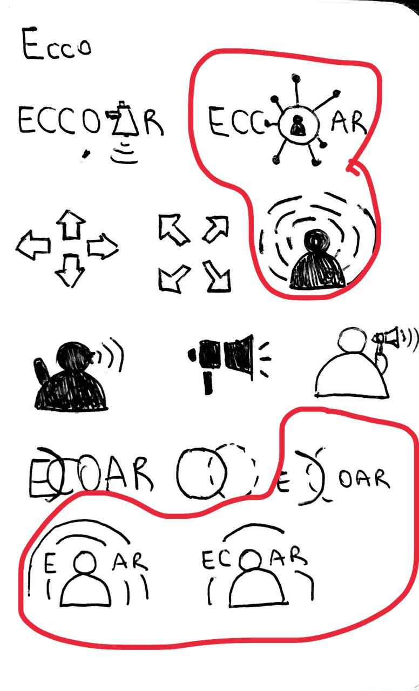

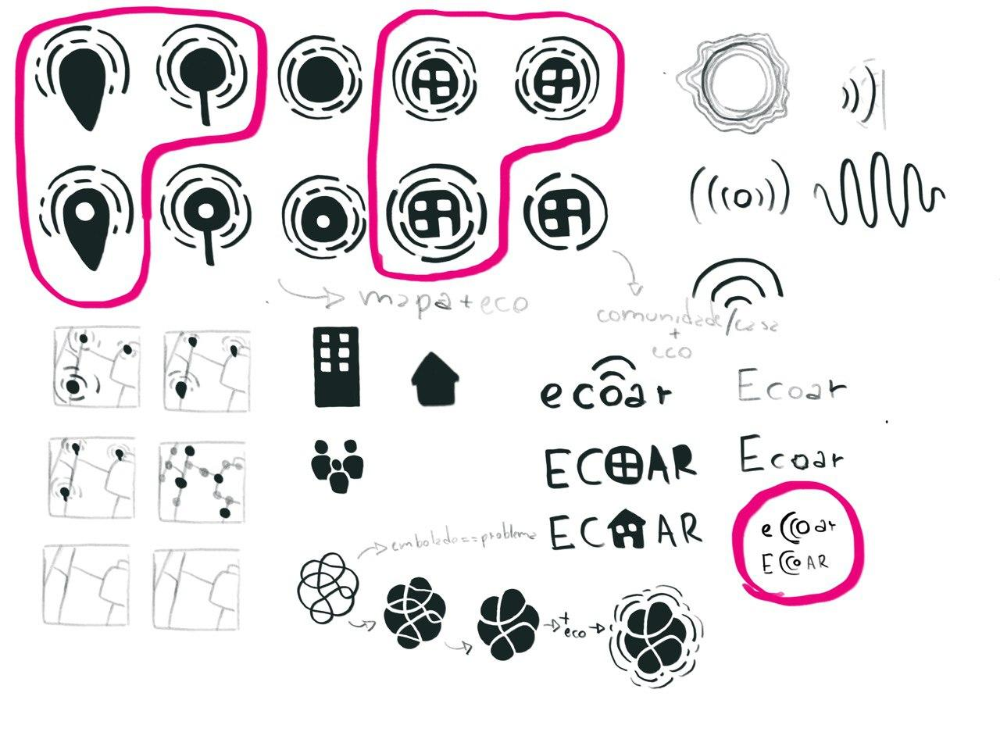

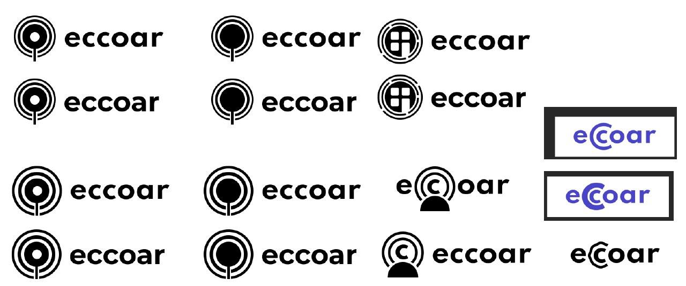

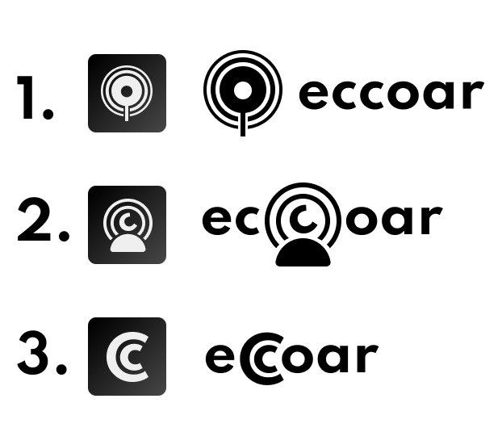

Desses esboços, o time pode escolher as logos do projeto, as quais foram:

Também foram definidas as cores principais do projeto:

| Cor                     | Código |
| ----------------------- | ------ |
| Vermelho forte primário | F55050 |
| Vermelho médio primário | F87171 |
| Vermelho claro primário | FFAAAA |
| Verde Secundário        | 95F0E0 |
| Verde Secundário 2      | 8ACCC1 |
| Amarelo secundário      | E7D42B |
| Amarelo secundário 2    | FFF27B |
| Preto                   | 484848 |
| Branco Logo             | F8F8F8 |

Os membros do time responsáveis pela tarefa também realizaram protótipos em paralelo de maneira a projetarem possíveis situações. As versões diferentes podem ser encontradas na seguinte tabela.

| Versão      | Link                                                                                                                     | Autores                                             |
| ----------- | ------------------------------------------------------------------------------------------------------------------------ | --------------------------------------------------- |
| Buendia-1.0 | [Disponível aqui](https://www.figma.com/proto/y5ak8SDlqgaPKGfPIble7R/Projeto-Eccoar?node-id=32%3A133&scaling=scale-down) | [Victor Buendia](https://github.com/Victor-Buendia) |
| Brian-1.0   | [Disponível aqui](https://www.figma.com/proto/y5ak8SDlqgaPKGfPIble7R/Projeto-Eccoar?node-id=113%3A0&scaling=min-zoom)    | [Brian Pina](https://github.com/DLBrianPina)        |
| Feo-1.0     | [Disponível aqui](https://www.figma.com/proto/y5ak8SDlqgaPKGfPIble7R/Projeto-Eccoar?node-id=81%3A469&scaling=min-zoom)   | [Pedro Féo](https://github.com/Phe0)                |
| 1.0         | [Disponível aqui](https://www.figma.com/proto/y5ak8SDlqgaPKGfPIble7R/Projeto-Eccoar?node-id=123%3A859&scaling=min-zoom)  | [Pedro Féo](https://github.com/Phe0)                |

### Roadmap de telas

Após a definição da identidade visual, o trabalho de se prototipar as telas em si da aplicação começou. Para que muito esforço e tempo não fosse gasto na criação das telas, a criação das telas foi realizada de maneira incremental, de acordo com as demandas do projeto.

### Pré-MVP

#### Telas para o MVP

Feed de denúncias:

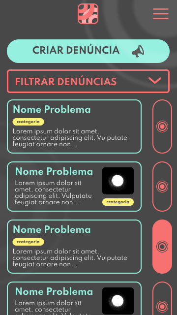

Tela de detalhamento:

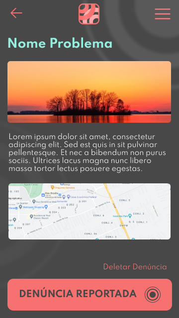

Drawer:

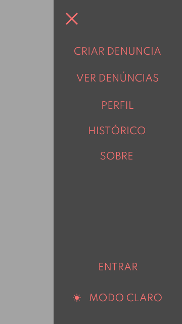

Formulário de denúncias:

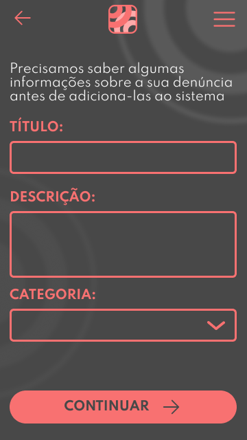

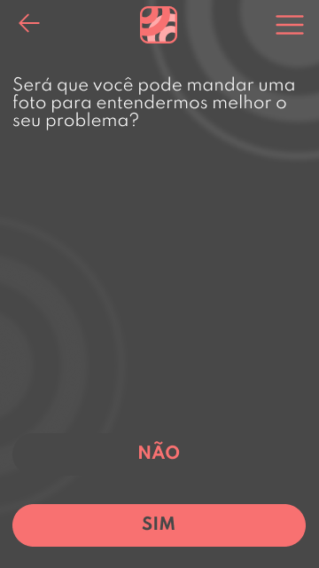

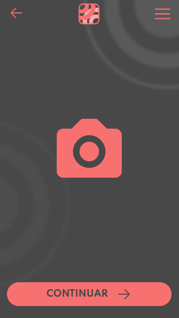

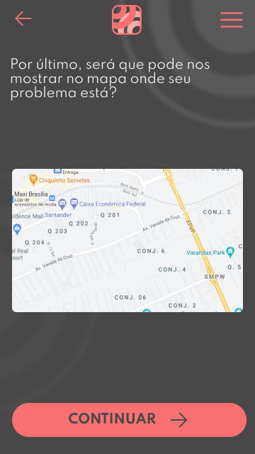

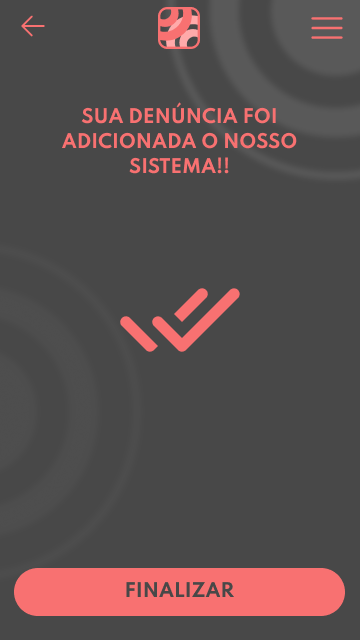

### Pós-MVP

#### Telas para cadastro e login de usuário (Sprint 9 e 10)

Tela inicial:

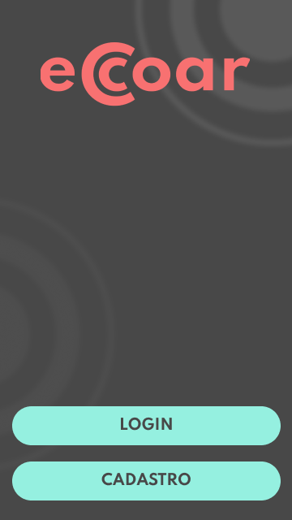

Cadastro:

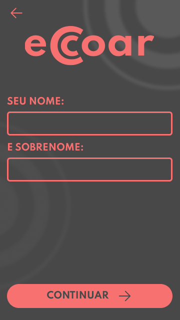

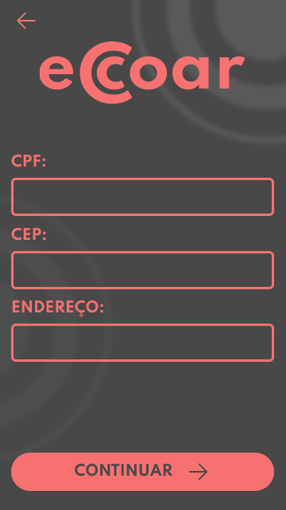

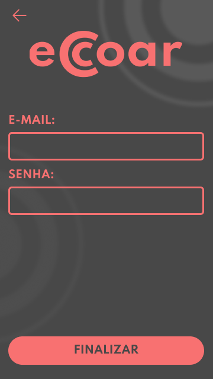

Login:

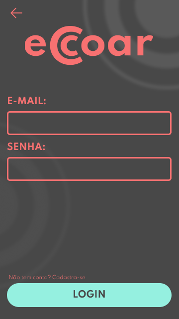

#### Telas de perfil e histórico de denúncias (Sprint 11 e 12)

Perfil:

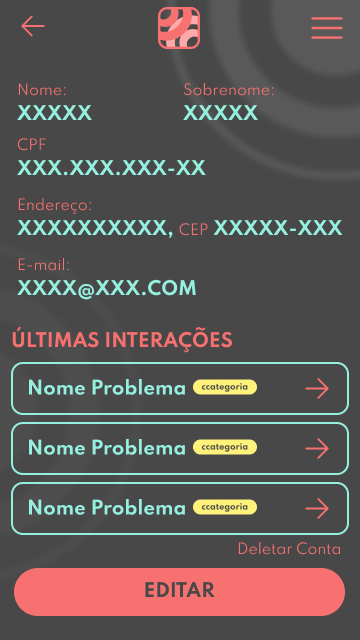

Histórico:

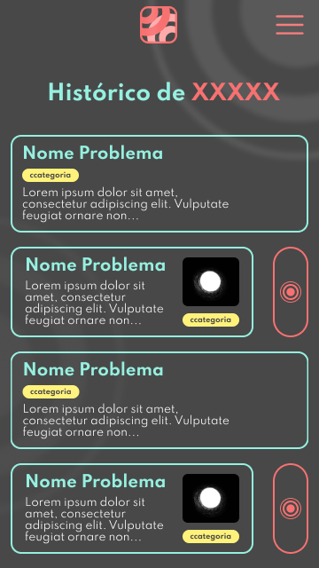

#### Tela de filtro de denúncia (Sprint 12)

Filtro de denúncia:

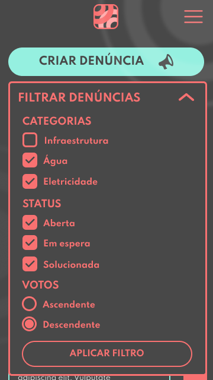

#### Tela de Landing Page (Sprint 13)

