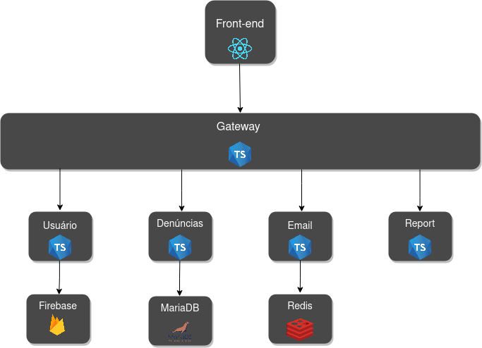
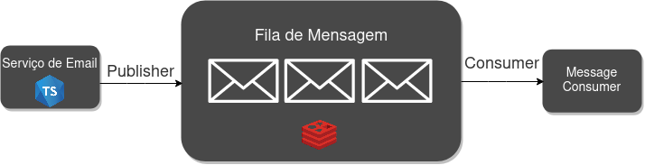
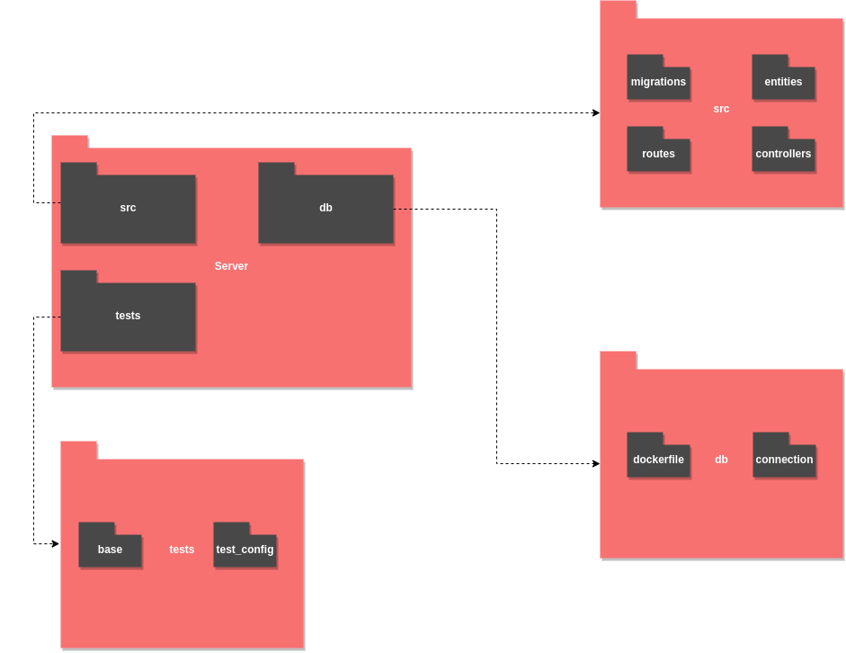
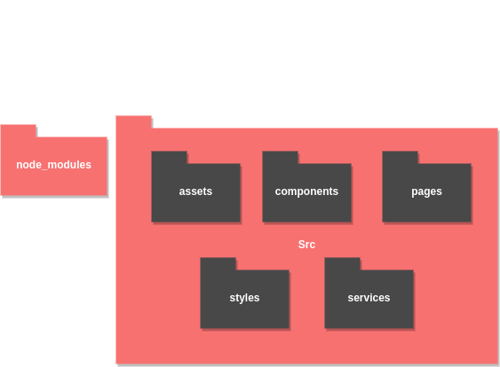

# Documento de Arquitetura de Software

## Histórico de Revisão

|Autor|Mudanças|Data|Versão|
|--|--|--|--|
|[Brian Pina](https://github.com/DLBrianPina) e [Arthur Matos](https://github.com/Arthur-Matos)| Tópicos: 1.1, 1.2, 1.3 e 1.4 |03/03/2021|0.1|
|[Brian Pina](https://github.com/DLBrianPina), [Arthur Matos](https://github.com/Arthur-Matos) e   [Gabriel Sabanai](https://github.com/Sabanai104)|Tópicos: 2.1 |03/03/2021|0.2|
|[Arthur Matos](https://github.com/Arthur-Matos), [Brian Pina](https://github.com/DLBrianPina) e   [Gabriel Sabanai](https://github.com/Sabanai104)|Tópicos: 3, 4.1 |03/03/2021|0.3|
|[Brian Pina](https://github.com/DLBrianPina), [Arthur Matos](https://github.com/Arthur-Matos),  [Gabriel Sabanai](https://github.com/Sabanai104) e [Saleh Kader](https://github.com/devsalula)|Tópicos: 3, 4.2 |05/03/2021|0.4|
|[Saleh Kader](https://github.com/devsalula)| Tópicos: 1.4, 4.2, 4.3 | 05/03/2021 | 0.5|
|[Saleh Kader](https://github.com/devsalula)| Tópicos: 1.3, 1.4, 2.0, 2.1, 4.3 | 23/03/2021 | 0.6|
|[Saleh Kader](https://github.com/devsalula)| Tópicos: 1.3, 2.0, 2.1 | 23/03/2021 | 0.6|

## 1. Introdução

### 1.1 Finalidade

Este documento oferece uma visão geral arquitetural abrangente do sistema, usando diversas visões arquiteturais para representar os diferentes aspectos do sistema. O objetivo deste documento é capturar e comunicar as decisões arquiteturais significativas que foram tomadas em relação ao sistema.

### 1.2 Escopo

O Eccoar é um *Progressive Web App* (PWA)  que tem por objetivo ser a voz do cidadão em comunicar para as instituições governamentais sobre problemas em suas cidades.

Esse documento tem como objetivo representar as decisões arquiteturais do Eccoar, levando em conta as restrições impostas devido o contexto e visão da aplicação. Estão descritos neste documento especificações de tecnologia como linguagens, *frameworks* e padrões de projeto.

### 1.3 Definições, Acrônimos e Abreviações

* API: Application Programming Interface ou Interface de Programação de Aplicações é conjunto de definições e protocolos usado no desenvolvimento e na integração de software de aplicações.
* API Gateway: O *gateway* de API é uma ferramenta de gerenciamento de APIs que fica entre o cliente e uma coleção de serviços de *back end*.
* _Progressive Web App_ (PWA): são aplicações desenvolvidas para web que dão acesso a funcionalidades nativas, tendo como três pilares instabilidade, confiabilidade e capacidade.
* _Feature Toggle_: Conjunto de Padrões de desenvolvimento de software, que ajudam equipes entregar novas funcionalidade de maneira mais segura e sem dependência entre elas.
* BaaS: Backend as a Service é um recurso de desenvolvimento _Serverless_, onde se terceiriza o gerenciamento de infraestrutura e recursos para terceiros, dando maior liberdade para o desenvolvimento.

### 1.4 Referências
> Parnas, D. L. On the Criteria To Be Used in Decomposing Systems into Modules. Comm. ACM (Dec., 1972) 1053-1056

> Rahman, T. Emad, S. The Modular and Feature Toggle Architectures of Google Chrome. Montreal, Concordia University.

> Documento de Arquitetura. Kalkuli, Brasília, Novembro de 2018. Disponível em: [https://fga-eps-mds.github.io/2018.2-Kalkuli/docs/docArquitetura](https://fga-eps-mds.github.io/2018.2-Kalkuli/docs/docArquitetura). Acesso em: 03 de Março de 2021

> Documento de Arquitetura. HubCare, Brasília, Abril de 2019. Disponível em: [https://cjjcastro.gitlab.io/2019-1-hubcare-docs/project/architecture-document/](https://cjjcastro.gitlab.io/2019-1-hubcare-docs/project/architecture-document/). Acesso em: 03 de Março de 2021

> O que é API? Red Hat. Disponível em: [https://www.redhat.com/pt-br/topics/api/what-are-application-programming-interfaces](https://www.redhat.com/pt-br/topics/api/what-are-application-programming-interfaces). Acesso em: 03 de Março de 2021

> Qual é a função de um gateway de API? Red Hat. Disponível em: [https://www.redhat.com/pt-br/topics/api/what-does-an-api-gateway-do](https://www.redhat.com/pt-br/topics/api/what-does-an-api-gateway-do). Acesso em: 03 de Março de 2021

> What Is React? ReactJs. Disponível em: [https://reactjs.org/tutorial/tutorial.html#what-is-react](https://reactjs.org/tutorial/tutorial.html#what-is-react). Acesso em: 03 de Março de 2021.

> Richard, S. LePage, P. What are Progressive Web Apps? web.dev. Janeiro de 2020. Disponível em: [https://web.dev/what-are-pwas/](https://web.dev/what-are-pwas/). Acesso em: 03 de Março de 2021.

> Naik, V. Architecting for Continuous Delivery. ThoughtWorks. Janeiro de 2016. Disponível em: [https://www.thoughtworks.com/pt/insights/blog/architecting-continuous-delivery](https://www.thoughtworks.com/pt/insights/blog/architecting-continuous-delivery). Acesso em: 03 de Março de 2021

> Valente, M. Engenharia de Software Moderna. Disponível em: [https://engsoftmoderna.info/cap7.html](https://engsoftmoderna.info/cap7.html). Acesso em: 03 de Março de 2021

> Fowler, M. Software Architecture Guide. MartinFowler. Agosto de 2019. Disponível em: [https://martinfowler.com/architecture/](https://martinfowler.com/architecture/). Acesso em: 03 de Março de 2021

> Fowler, M. Microservice Prerequisites. MartinFowler. Agosto de 2014. Disponível em: [https://martinfowler.com/bliki/MicroservicePrerequisites.html](https://martinfowler.com/bliki/MicroservicePrerequisites.html). Acesso em: 03 de Março de 2021

> Fowler, M. Lewis, J. Microservice. MartinFowler. Março de 2014. Disponível em: [https://martinfowler.com/articles/microservices.html](https://martinfowler.com/articles/microservices.html). Acesso em: 03 de Março de 2021

> Richardson, C. Pattern: Messaging. Microservice.io. Disponível em: [https://microservices.io/patterns/communication-style/messaging.html](https://microservices.io/patterns/communication-style/messaging.html). Acesso em: 23 de Março de 2021.

> Richardson, C. API Gateway. Microservice.io. Disponível em: [https://microservices.io/patterns/apigateway.html](https://microservices.io/patterns/apigateway.html). Acesso em: 23 de Março de 2021.

## 2. Representação Arquitetural

O Padrão Arquitetural escolhido é baseado em Microsserviços para toda a camada de _Backend_. Devido a cobrança da disciplina em gerar uma independência de desenvolvimento de funcionalidades, foi enxergado a necessidade de aumentar a modularização dentro do _Backend_ com o objetivo de agilizar as entregas contínuas da equipe no desenvolvimento do projeto.

A modularização dos microsserviços foi feita embasada em estudos como do David Parnas, em "_On the Criteria To Be Used in Decomposing Systems into Modules"_ e também no artigo [Microservice](https://martinfowler.com/articles/microservices.html) do Martin Fowler e do James Lewis. Arquitetura ficou sendo distribuida em 4 microsserviços com uma API _gateway_, que atua como um _Facade_, responsável por intermediar a comunicação entre os serviços e o _Frontend_. A escolha de utilização de comunicação através da API _Gateway_ se deu devido a grande necessidade de a aplicação depender do casamento de dados de diferentes microsserviços, com a utilização desse modelo, é centralizado em uma única requisição para o _Frontend_ se comunicar com os mesmos.

Além disso, o serviço de emails representado no diagrama ele possui uma particularidade de ser um serviço orientado a mensagens, devido a necessidade de enviar emails em massa para grande parte das insituições governamentais que o projeto pretende seguir, tornando a comunicação assíncrona e consequentemente prevenindo a necessidade de o serviço de emails e o provedor de emails estarem simultaneamente disponíveis para se comunicarem, como sugerido pelo Chris Richardson no [_Microservice.io_](https://microservices.io/patterns/communication-style/messaging.html).

No _Frontend_  será um _Progressive Web App_ e foi aderido o uso dos padrões de desenvolvimento das _Feature Toggles_. Como a existe uma necessidade de realizar entregas de funcionalidade de maneira independentes, foi optado pela utilização de _Feature Toggles_, que irá entregar bem com toda a _pipeline_ de CI/CD. Com elas será possível utilizar do seu poder para ativar ou desativar novas funcionalidades sem a adição de um novo código, além de permitir uma experimentação com um maior controle ao longo do ciclo de vida do projeto. A implementação das _Feature Toggles_ se dará no _Front_ diretamente pelo código da aplicação e será gerenciada por uma dashboard externa para controler das funcionalidades. 

### 2.1. Tecnologias Escolhidas

Foram escolhidas as seguintes tecnologias de desenvolvimento:

* **ReactJS**: React é uma biblioteca de JavaScript flexível, declarativa e eficiente para construção de interfaces para exibição ao usuário. O React permite a criação desde interfaces complexas até pequenos e isolados pedaços de código chamados “componentes”.

* **NodeJS**: NodeJS é um software de código aberto que executa códigos Javascript no backend/servidor e no frontend. É baseado no interpretador de Javascript em C++ V8.

* **Typescript**: Typescript é um superconjunto de Javascript que insere na linguagem conceitos como tipagem estática, forte e inferida.

* **Redis**: Redis é um banco de dados em memória altamente performático com funciona com base em estruturas de chave-valor. Utilizado para gerenciar a fila de mensagens no serviço de emails.

**MariaDB**: MariaDB é um banco de dados relacional que surgiu de um fork do MySQL. Ele pertence a um seleto grupo de bancos de dados NewSQL, onde se utiliza o modelo de organização dos bancos relacionais, com algumas das maiores vantagens dos bancos NoSQL. 

**Firebase**: Firebase é uma plataforma BaaS desenvolvida pelo Google, com o objetivo de prestar serviços qualificados em desenvolvimentos em nuvem. Na aplicação é utilizado para atuar com um servidor de usuários, criando um servidor completo de autenticação de usuário.

* **Sass**: O Sass é uma linguagem de folha de estilo compilada para CSS, adicionando poder para a linguagem. Com o Sass é possível utilizar variáveis, regras de alinhamento, mixins, funções e várias outras funcionalidades.

* **Flagr**: Ferramenta _open source_ para o consumo de _Feature Toggles_. Conta com uma API Rest para o gerenciamento das Flags que serão utilizadas para a implementação das _Feature Toggles_.

* **Microsserviços**: É uma abordagem arquitetônica e organizacional do desenvolvimento de software na qual consiste em pequenos serviços independentes, como módulos, que se comunicam usando API's. Dessa forma, os microsserviços facilitam a escalabilidade do software. Os microsserviços usados nesta aplicação são: 

    - **Módulo de Usuário**: Módulo responsável pelo registro e gerenciamento de usuários da aplicação;

    - **Módulo de Denúncias**: Módulo responsável por relatar e armazenar as denúncias relacionadas aos posts dentro da aplicação ;

    - **Módulo de Email**: Módulo responsável pelo envio de email para as instituições governamentais;

    - **Módulo de Report**: Módulo responsável por gerar os relatórios das denúncias;

    - **Gateway**: Ponte entre a interação da interface do usuário com os microsserviços do back-end;

    - **Front-end**: Tela de interface do usuário por onde o mesmo vai interagir com a aplicação;

* **Service Worker**: Os services workers são extremamente importantes para a criação de PWA’s. Ele é um script no navegador que roda separado da página web, possibilitando recursos que não precisam da interação do usuário. Na prática ele é um script em javascript que controla a página do site na qual ele é associado.

## 3. Metas e Restrições da Arquitetura

São metas da arquitetura:

* Facilitação no processo de desenvolvimento.

* Acessibilidade para a maior parte da população.

* Independência no desenvolvimento das equipes.

* Alta mutabilidade em seus serviços.

* Clareza no desenvolvimento dos serviços.

São restrições da arquitetura:

* A aplicação deverá se comportar como um *Progressive Web App*;

* A aplicação necessita de ser executada nos navegadores Google Chrome, Mozilla Firefox e Safari;

## 4. Visão Lógica 

### 4.1 Visão Geral

A aplicação é baseada na arquitetura de microsserviços, com o intuito de facilitar o desenvolvimento como a escalabilidade do software. Dessa forma, cada microsserviço vai ser responsável por executar uma tarefa, uma requisição ou um processamento de dados, resultando assim, em uma implementação mais rápida com facilidade na sua manutenção.

### 4.2 Pacotes de Design Significativos do Ponto de Vista da Arquitetura

O *Back End* será construído por completo em cima da tecnologia *NodeJs*. No diagrama abaixo enxerga-se como será a estrutura básica de pacotes de um dos microsserviços.

A aplicação no *Front End* será construído por completo em cima da tecnologia *ReactJs*. No diagrama abaixo enxerga-se como será a estrutura básica de pacotes do nosso PWA.

### 4.3 Visão de Dados

O Diagrama Entidade Relacionamento foi importante para a facilitação na modelagem dos microsserviços, nele é ilustrado como entidades se relacionarão dentro do sistema. Ficou modelado da seguinte forma:

