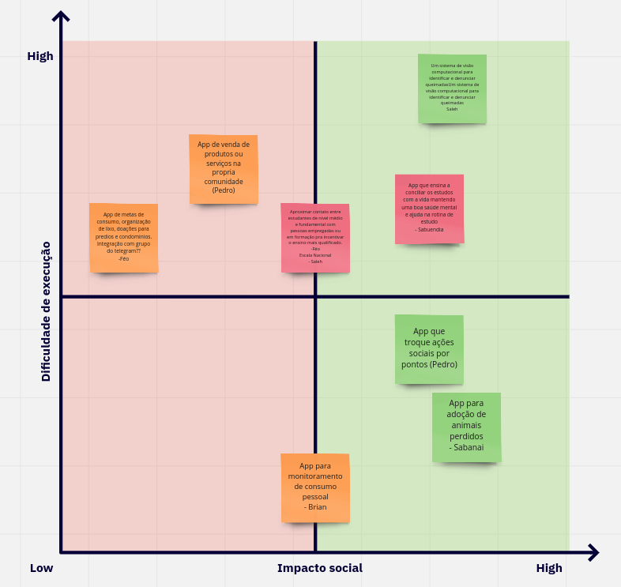

# Reunião do dia 06/02/2021

## Histórico de revisão
|Autor|Mudanças|Data|Versão|
|--|--|--|--|
|[Pedro Féo](https://github.com/Phe0) && [Saleh Kader](https://github.com/devsalula)|Criação da ata do dia 06|07/02/2021|1.0|

## Presença na reunião

### EPS
|Matrícula|Nome|Presente|
|-|-|-|
|160007739|[Guilherme Rosa](https://github.com/guilhesme23)|Sim|
|160138400|[Matheus Blanco](https://github.com/MatheusBlanco)|Sim|
|170020461|[Pedro Féo](https://github.com/Phe0)|Sim|
|170062686|[Pedro Rodrigues](https://github.com/pedro-prp)|Sim|
|160144485|[Saleh Kader](https://github.com/devsalula)|Sim|

### MDS
|Matrícula|Nome|Presente|
|-|-|-|
|190010495|[Arthur Matos](https://github.com/Arthur-Matos)|Sim|
|190010967|[Brian Pina](https://github.com/DLBrianPina)|Sim|
|190028122|[Gabriel Sabanai](https://github.com/Sabanai104)|Sim|
|190033681|[Luiz Henrique](https://github.com/luiz-herique)|Sim|
|200042327|[Nicolas Chagas](https://github.com/nszchagas)|Sim|
|190020601|[Victor Buendia](https://github.com/Victor-Buendia)|Sim|

## Resultados da reunião

1. **Apresentação dos membros**
    - Todos os membros, tanto MDS quando EPS, se apresentaram, dizendo seus nomes, semestre e pretenções para a disciplina.
2. **Dailies**
    - Foi decidio que em primeiro momento as dailies ocorrerão via texto por meio de um grupo no Telegram.
    - Caso seja notado que os membros não estejam lendo ou interragindo a partir das dailies, providências serão tomadas.
    - As dailies ocorrerão de segunda a sexta as 18:30.
3. **Canais de comunicação**
    - Até o momento os canais de comunicação escolhidos são:
        - Discord: será utilizado para realizar reuniões e pareamentos.
        - Telegram: o telegram possuíra multiplas funções, haverá um canal de avisos, onde informações importantes serão centralizadas, um grupo destinado apenas para as dailies e grupos de interação para fácil acesso aos membros do grupo.
        - GitHub: serão utilizados comentários via Issues e PRs no github para comunicações a respeito de Issues ou implementaćoes de código.
4. **Data e Horário das Reuniões**
    - Foi decidido que as reuniões de sprint planning e review serao realizadas aos Sáabados às 9 da manhã.
5. **Treinamentos e Qualificações**
    - Foi criada uma planilha para rastrear o nível de conhecimento dos membros do grupo.
    - A escala utiliza uma escala de 1 a 5.
    - Está disponível [aqui](https://docs.google.com/spreadsheets/d/1Fy8Jx7c16pxeeZH9AWMGx-RSY9LvQYLu_ByCjqJmn-Q/edit?usp=sharing).
6. **Escolha do tema para o projeto**
    - Os membros no geral decidiram que gostariam de trabalhar em cima das ODS e não dos dados abertos do governo.
    - Houve uma votação para decidir quais ODS os membros gostariam de trabalhar. Foi realizada uma votação, em que cada membro tinha o direito de votar até cinco vezes. O resultado foi o seguinte:
    
    - As ODS escolhidas foram:
        - Vida sobre a terra;
        - Consumo e produções responsáveis;
        - Educação de qualidade;
    - Em seguida cada um dos membros ficou responsável em dar pelo menos uma ideia de projeto para cada uma das ODS escolhidas. Os resultados foram os seguintes:
    
    - Logo em seguida, cada um dos membros receubeu três votos para votas nas ideias de cada uma das ODS. Os resultados foram:
    
    - Foram escolhidas três ideias de cada uma das ODS. Foram elas:
        - Vida sobre a terra:
            - Um sistema de visão computacional para identificar e denunciar queimadas;
            - App que troque ações sociais por pontos;
            - App para adoção de animais perdidos;
        - Consumo e produção responsáveis:
            - App de venda de produtos ou serviços na propria comunidade;
            - App de metas de consumo, organização de lixo, doações para predios e condominios;
            - App para monitoramento de consumo pessoal;
        - Educação de qualidade:
            - Aproximar contato entre estudantes de nivel médio e fundamental com pessoas empregadas ou em formação pra incentivar o ensino mais qualificado em escala nacional;
            - App para ajudar na rotina de estudo motivação;
            - App que ensina a conciliar os estudos c a vida mantendo uma boa saude mental;
    - Duas ideias da ODS "Educação de Qualidade" se uniram para formar a ideia "App que ensina a conciliar os estudos com a vida mantendo uma boa saúde mental e ajuda na rotina de estudo".
    - Em seguida, utilizamos uma matriz de Dificuldade de Execução por Impacto Social para nos ajudar a priorizar as ideias. Os resultados forma:
    
    - A partir da matriz de priorização foram escolhidas as seguintes ideias:
        1. App para adoção de animais perdidos;
        2. App que troque ações sociais por pontos;
        3. App que ensina a conciliar os estudos com a vida mantendo uma boa saúde mental e ajuda na rotina de estudo;