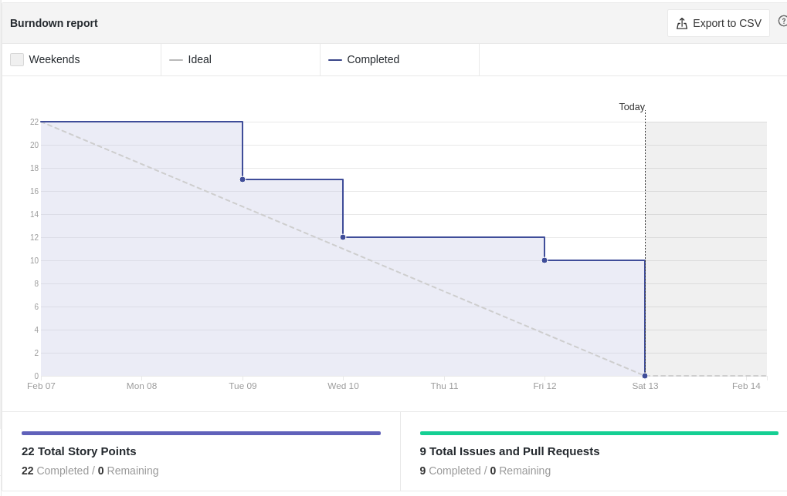
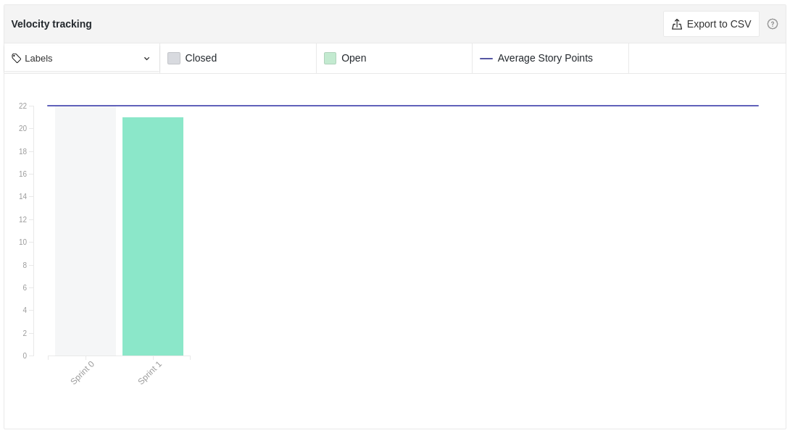
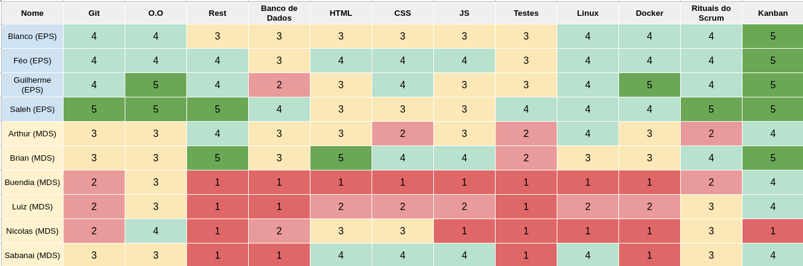
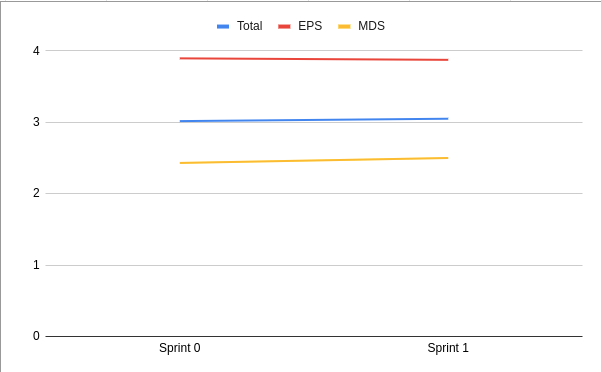
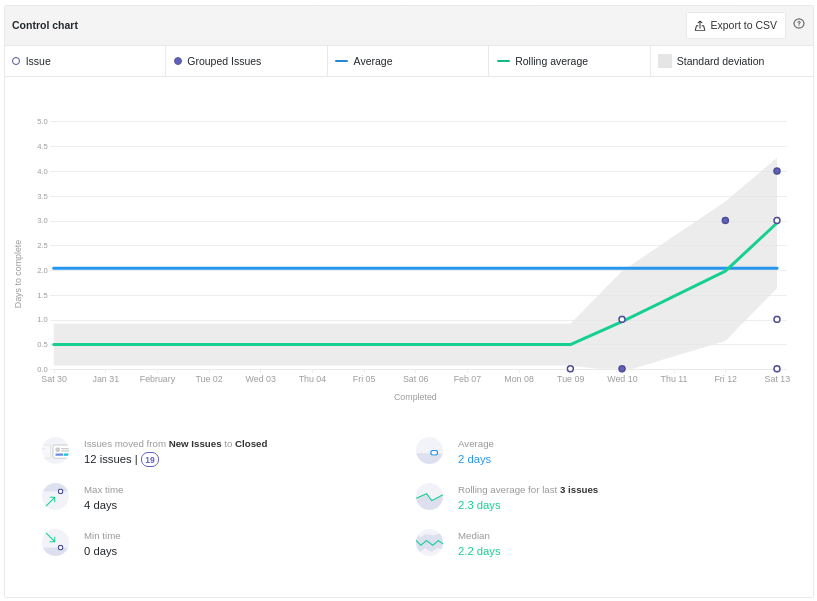
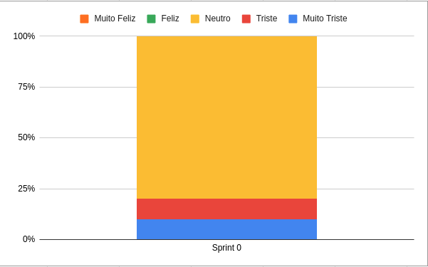

# Review da Sprint 0

## Histórico de revisão
|Autor|Mudanças|Data|Versão|
|--|--|--|--|
|[Pedro Féo](https://github.com/phe0)|Criação do documento|13/02/2021|1.0|

## Avaliação do Scrum Master
É possível visualizar que houve uma certa desorganização durante a abertura de issues durante a sprint, diversas atividades foram decidias durante a a semana, o que fez com que muitos pontos fossem fechados no ultimo dia da sprint.

Foi possível ver que apesar dos MDS só terem atividades relacionadas à ideação do projeto, alguns níveis de conhecimento técnico aumentaram, o quê mostra que os MDS estão animados para aprender e começar com a parte mais técnica. Alȩm disso, alguns conhecimentos relacionados à metodologia diminuiram, isso está relacionado a alguns membros do grupo começarem a ter um maior entendimento do que realmente é a metodologia por agora.

Um ponto de destaque é o gráfico de humor da equipe, a grande maioria do time diz estar neutro, enquanto outros estão tristes ou até muito tristes, essa baixa moral parece ter sido causada por essa confusão que aconteceu dirante a semana, a troca e incerteza de temas fez o grupo se sentir um pouco confuso e desanimado, além disso muitos membros relataram ainda estar se adaptando à rotina de volta às aulas.

## Reports

### Tarefas Realizadas

|Tarefa|Responsáveis|Pontuação|Concluída|
|--|--|--|--|
|Planejar Treinamento de Git|[Saleh Kader](https://github.com/devsalula)|3|✔|
|Elaborar templates de rituais do Scrum|[Matheus Blanco](https://github.com/MatheusBlanco) e [Pedro Féo](https://github.com/phe0)|5|✔|
|Estudar Lean Inception|[Guilherme Rosa](https://github.com/guilhesme23), [Matheus Blanco](https://github.com/MatheusBlanco), [Saleh Kader](https://github.com/devsalula) e [Pedro Féo](https://github.com/phe0)|0|✔|
|Criar guia de contribuição do projeto|[Saleh Kader](https://github.com/devsalula)|2|✔|
|Definir o código de conduta do projeto|[Matheus Blanco](https://github.com/MatheusBlanco)|2|✔|
|Ideação de possíveis projetos|[Arthur Matos](https://github.com/Arthur-Matos), [Brian Pina](https://github.com/DLBrianPina), [Gabriel Sabanai](https://github.com/Sabanai104), [Luiz Henrique](https://github.com/luiz-herique), [Nicolas Chagas](https://github.com/nszchagas) e [Victor Buendia](https://github.com/Victor-Buendia)|5|✔|

### Burndown

### Velocity

### Conhecimento dos membros

#### Começo da Sprint

#### Fim da Sprint

#### Gráfico de Melhoria

### Riscos

### Cumulative flow

### Cycle time

### Gráfico de Humor
