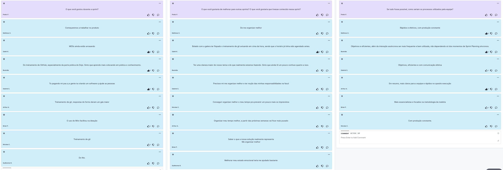

# Retrospectiva da Sprint 1

## Histórico de revisão
|Autor|Mudanças|Data|Versão|
|--|--|--|--|
|[Pedro Féo](https://github.com/phe0)|Criação do documento|20/02/2021|1.0|

## Avaliação do Scrum Master
Os membros, principalmente MDS, gostaram bastante do treinamento de git, relataram que aprender a mexer com uma ferramenta nova motivou bastante o grupo.

Os membros no geral relataram bastante problema de organização pessoal, relataram não estar conseguindo conciliar atividades da faculdade, aulas e estágio. Um treinamento de gestão de tempo pode vir a aumentar a produtividade geral do grupo.

Os membros também gostariam de ver mais objetividade no projeto, as reuniões tem se extendido bastante e nem toda comunicação realizada pela equipe tem sido tão efetiva para esclarecer todos a respeito das decições tomadas e passos futuros. O [Scrum Master](https://github.com/phe0) ficou responsável por estudar um pouco mais a respeito de comunicação assíncrona efetiva para tentar melhorar a comunicação da equipe.

## Pontos levantados

