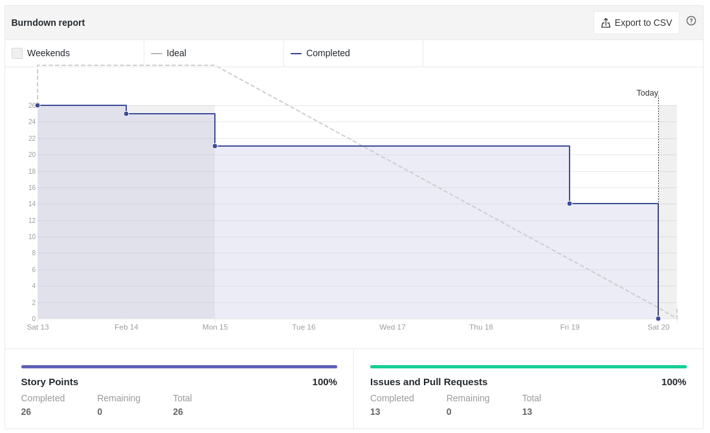
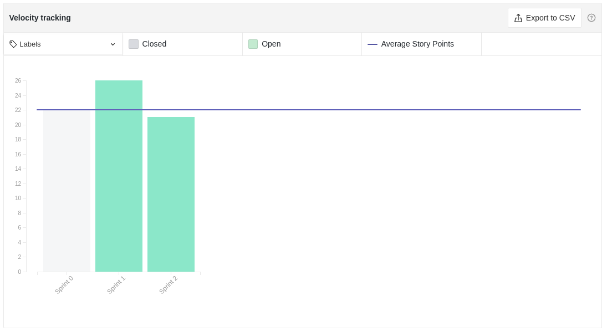
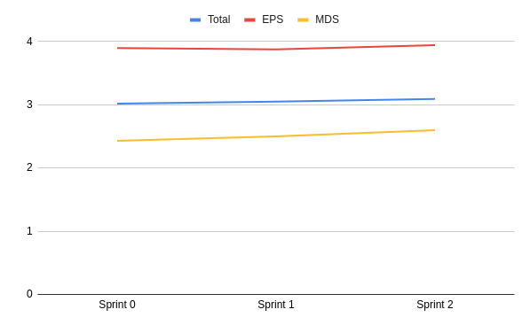
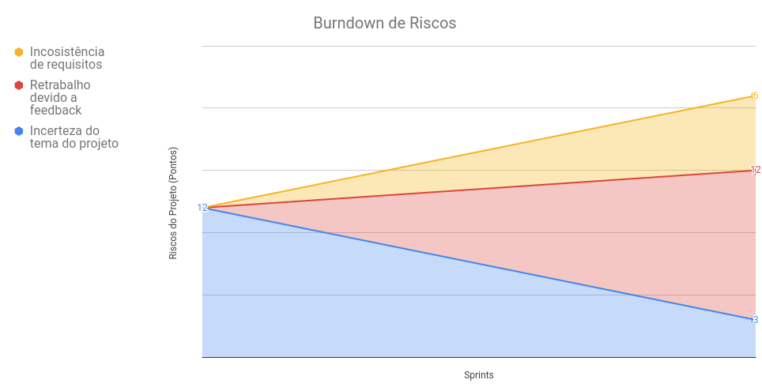
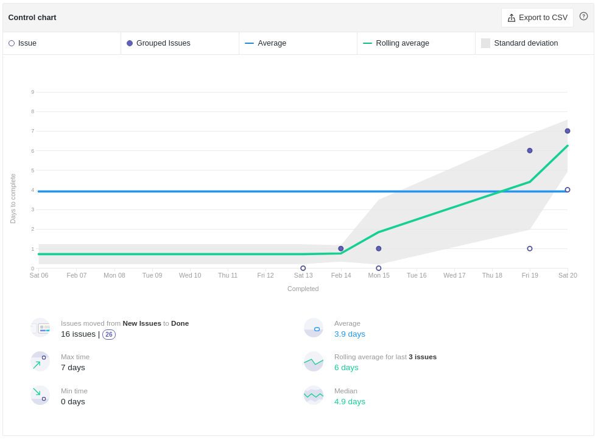
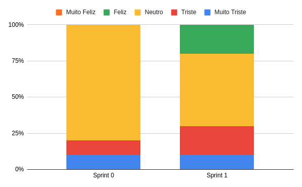

# Review da Sprint 1

## Histórico de revisão
|Autor|Mudanças|Data|Versão|
|--|--|--|--|
|[Pedro Féo](https://github.com/phe0)|Criação do documento|20/02/2021|1.0|

## Avaliação do Scrum Master
Pelo burndown e pelo cycle time, é possível ver que as issues levaram um tempo maior para serem concluídos nessa sprint, a equipe chegou a iniciar as tarefas no período esperado, porém levaram muito tempo para serem concluídas. Muitos membros precisaram de ajuda durante a sprint, por isso acabaram tendo que colocar as atividades em um status de espera por bastante tempo.

Apesar de todas as issues terem sido concluídas o time continua fechando muitas atividades no final da sprint, talvez isso seja devido a maior disponibilidade do grupo nos dias finais da sprint, porém só poderá ser validado ao se analizar os horários disponíveis e horários de trabalho dos membros.

O velocity da equipe obteve um bom aumento, porém como estamos nas primeiras sprints, esse valor ainda pode ser bem instável, deixando difícil de prever a quantidade de pontos que o time pode realizar.

Além disso o time como um todo teve um aumento no conhecimento e na motivação, muito disso é devido ao treinamento de git realizado durante a semana.

## Reports

### Tarefas Realizadas

|Tarefa|Responsáveis|Pontuação|Concluída|
|--|--|--|--|
|[Documentação Planning Sprint 1](https://github.com/fga-eps-mds/EPS-2020-2-G2/issues/27)|[Matheus Blanco](https://github.com/MatheusBlanco)|1|✔|
|[Documentação Review Sprint 0](https://github.com/fga-eps-mds/EPS-2020-2-G2/issues/25)|[Pedro Féo](https://github.com/phe0)|1|✔|
|[Lean Inception - Início](https://github.com/fga-eps-mds/EPS-2020-2-G2/issues/24)|[Matheus Blanco](https://github.com/MatheusBlanco)|3|✔|
|[Quest #3 - Problema e Concorrentes](https://github.com/fga-eps-mds/EPS-2020-2-G2/issues/23)|[Matheus Blanco](https://github.com/MatheusBlanco), [Saleh Kader](https://github.com/devsalula), [Luiz Henrique](https://github.com/luiz-herique) e [Gabriel Sabanai](https://github.com/Sabanai104)|3|✔|
|[Documentar o gerenciamento de riscos do projeto](https://github.com/fga-eps-mds/EPS-2020-2-G2/issues/22)|[Pedro Féo](https://github.com/phe0)|2|✔|
|[Elaborar treinamento de Figma](https://github.com/fga-eps-mds/EPS-2020-2-G2/issues/21)|[Pedro Féo](https://github.com/phe0)|3|✔|
|[Elaborar treinamento de Docker](https://github.com/fga-eps-mds/EPS-2020-2-G2/issues/19)|[Guilherme Rosa](https://github.com/guilhesme23)|3|✔|
|[Forms da problemática](https://github.com/fga-eps-mds/EPS-2020-2-G2/issues/18)|[Arthur Matos](https://github.com/Arthur-Matos) e [Nicolas Chagas](https://github.com/nszchagas)|2|✔|
|[RichPicture do Produto](https://github.com/fga-eps-mds/EPS-2020-2-G2/issues/17)|Todos os membros|2|✔|
|[Trocar a Versão do MKDocs](https://github.com/fga-eps-mds/EPS-2020-2-G2/issues/6)|[Brian Pina](https://github.com/DLBrianPina) e [Victor Buendia](https://github.com/Victor-Buendia)|3|✔|

### Burndown

### Velocity

### Conhecimento dos membros

#### Quadro de Conhecimentos

#### Gráfico de Melhoria

### Riscos

### Cumulative flow

### Cycle time

### Gráfico de Humor
