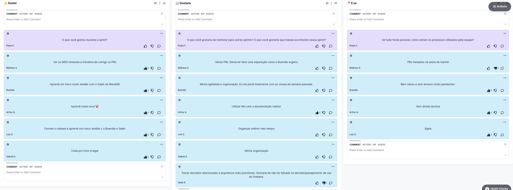

# Retrospectiva da Sprint 10

## Histórico de revisão

| Autor                                | Mudanças             | Data       | Versão |
| ------------------------------------ | -------------------- | ---------- | ------ |
| [Pedro Féo](https://github.com/phe0) | Criação do documento | 26/04/2021 | 1.0    |

## Avaliação do Scrum Master

Pontos levantados durante a retrospectiva:

- Os MDS continuam a relatar que estão aprendendo mais sobre as tecnologias mesmo estando na décima sprint, é muito bom ver o empenho da equipe em aprender;
- Essa semana ficou marcada pelo começo das revisões de Pull Requests pelos MDS, o que desafogou um pouco os EPS;
- Muitos membros, principalmente de MDS, relataram que estão com a organização pssoal ruim e que poderiam se dedicar mais à disciplina se não fosse por isso;

## Pontos levantados

