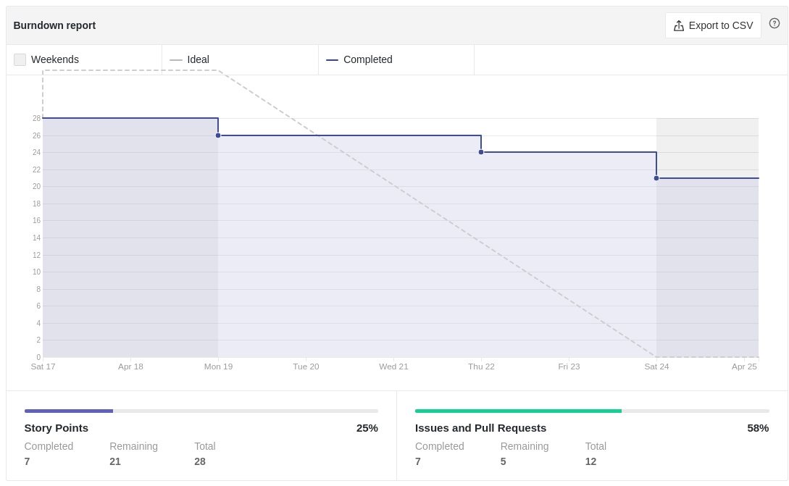
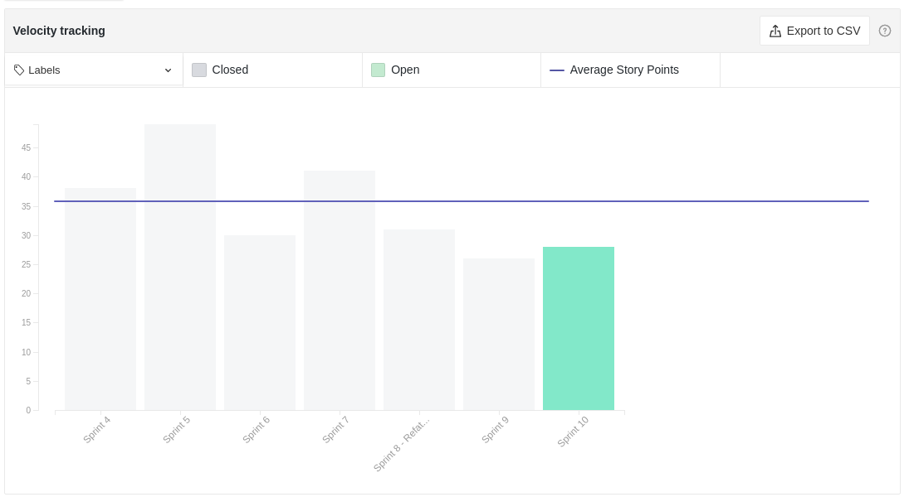
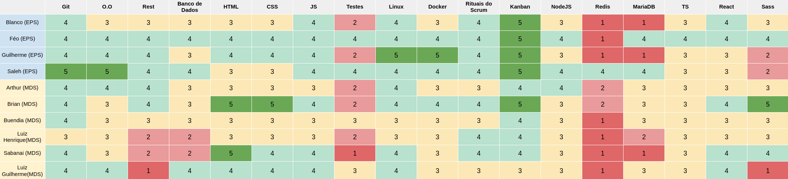
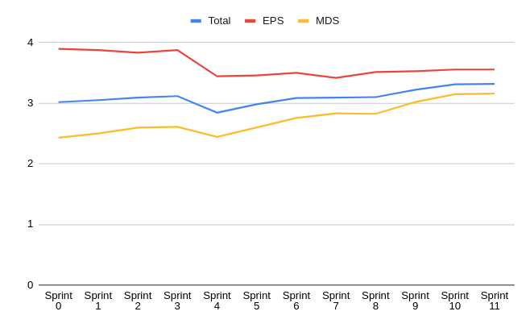
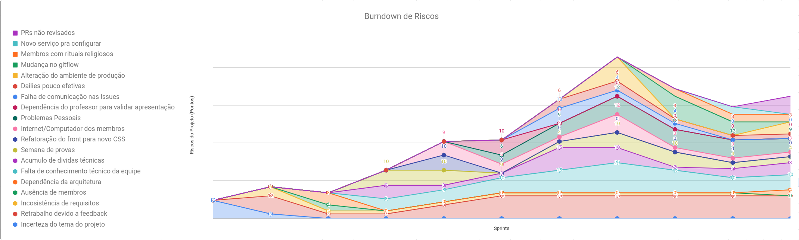
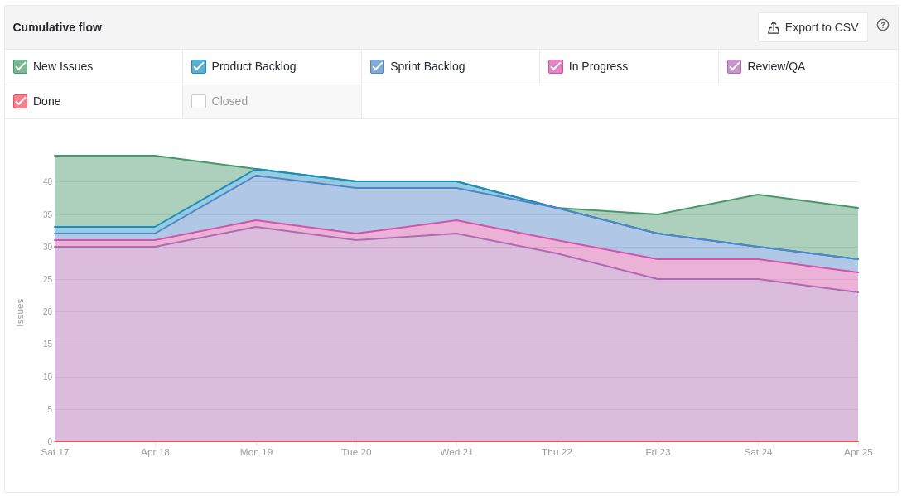
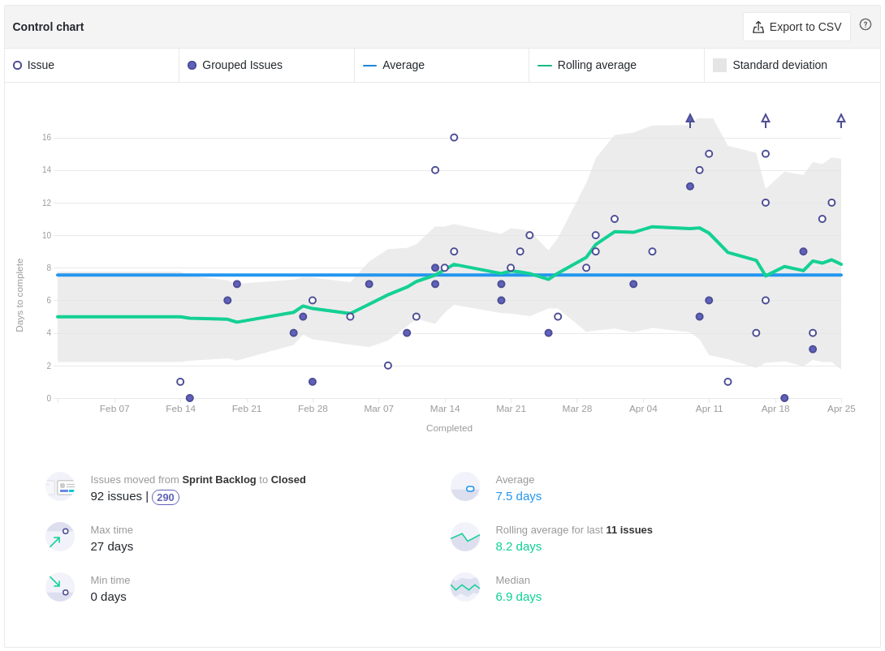

# Review da Sprint 10

## Histórico de revisão

| Autor                                | Mudanças             | Data       | Versão |
| ------------------------------------ | -------------------- | ---------- | ------ |
| [Pedro Féo](https://github.com/phe0) | Criação do documento | 26/04/2021 | 1.0    |

## Avaliação do Scrum Master

- A tarefa [Roteiro de testes de Usabilidade e percepções de usuário](https://github.com/fga-eps-mds/EPS-2020-2-G2/issues/171) foi realizada em maior parte, porém estamos aguardando retorno do professor para fechamento da mesma;
- A tarefa [US - Filtro de denúncia por geolocalização](https://github.com/fga-eps-mds/EPS-2020-2-G2/issues/167) foi feita e entrou para revisão em tempo hábil, porém tivemos alguns problemas com o SonarCloud bloqueando o Pull Request, o que atrasou a sua revisão;
- Os membros responsáveis pela tarefa [US - Autenticação de usuário](https://github.com/fga-eps-mds/EPS-2020-2-G2/issues/165) tiveram bastante dificuldade com o Firebase, nova ferramenta adotada pela equipa para realizar auteticação de usuários;
- Um novo risco de PRs não revisados foi destacado, vários PRs estão demorando para serem revisados, muito disso é devido a parte de responsabilidade de revisão ter sido passada aos MDS, que ainda estão aprendend como ealizar as revisões;
- O risco de maior destaque é a de Retrabalho devido a feedback, isso ocorre pois já estamos a várias sprints aguardando pelo feedback do professor relacionado às entragas da primeira release. Dependendo do feedback recebido, diersas mudanças podem vir a ocorrer no restante do anamento do projeto;
- Há uma queda aparente no velocity da equipe, muito disso é devido à grande quantidade de dívidas técnicas causadas por atrasos na revisão de PRs, além dos pontos serem estimados por sprint, com isso a pontuação de issues que no início do projeto eram consideradas difíceis agora são consideradas mais fáceis;
- O tempo de conclusão de tarefas diminuiu bastante, muito disso é devido a grande quantidade de tarefas de documentação e revisão de documentos, que são mais rápidas de serem concluídas, além de serem mais rápidas de revisar, por só precisar de um revisor;
- Houve um grande aumento do tempo de ciclo de revisão de tarefas, isso ocorre, pois como estacado acima, parte da responsabilidade de revisão de Pull Requests migrou para os MDS;

## Reports

### Tarefas Realizadas

| Tarefa                                                                                                              | Responsáveis                    | Pontuação | Concluída |
| ------------------------------------------------------------------------------------------------------------------- | ------------------------------- | --------- | --------- |
| [Documentação Planning Sprint 10](https://github.com/fga-eps-mds/EPS-2020-2-G2/issues/170)                          | Matheus Blanco                  | 1         | ✔         |
| [Documentação Review Sprint 9](https://github.com/fga-eps-mds/EPS-2020-2-G2/issues/169)                             | Pedro Féo                       | 1         | ✔         |
| [Revisão: Novo modelo de acompanhamento](https://github.com/fga-eps-mds/EPS-2020-2-G2/issues/176)                   | Pedro Féo                       | 1         | ✔         |
| [Revisão: Documentar GitFlow](https://github.com/fga-eps-mds/EPS-2020-2-G2/issues/174)                              | Pedro Féo                       | 1         | ✔         |
| [Roteiro de testes de Usabilidade e percepções de usuário](https://github.com/fga-eps-mds/EPS-2020-2-G2/issues/171) | Matheus Blanco                  | 2         | ✘         |
| [Documento de implantação](https://github.com/fga-eps-mds/EPS-2020-2-G2/issues/175)                                 | Guilherme Marques               | 1         | ✘         |
| [Revisão: Documento de arquitetura](https://github.com/fga-eps-mds/EPS-2020-2-G2/issues/173)                        | Saleh Kader                     | 1         | ✔         |
| [Mapear feature toggles](https://github.com/fga-eps-mds/EPS-2020-2-G2/issues/172)                                   | Guilherme Marques e Saleh Kader | 2         | ✔         |
| [US - Histórico de denúncias](https://github.com/fga-eps-mds/EPS-2020-2-G2/issues/166)                              | Gabriel Sabanai e Luiz Henrique | 5         | ✘         |
| [US - Filtro de denúncia por geolocalização](https://github.com/fga-eps-mds/EPS-2020-2-G2/issues/167)               | Brian Pina e Luiz Pettengil     | 5         | ✘         |
| [US - Autenticação de usuário](https://github.com/fga-eps-mds/EPS-2020-2-G2/issues/165)                             | Arthur Matos e Brian Pina       | 8         | ✘         |

### Burndown

### Velocity

### Conhecimento dos membros

#### Quadro de Conhecimentos

#### Gráfico de Melhoria

### Riscos

### Cumulative flow

### Cycle time

### Ciclo de Início da realização da tarefa até o final

### Ciclo do tempo de Revisão até a conclusão da tarefa

### Gráfico de Humor

