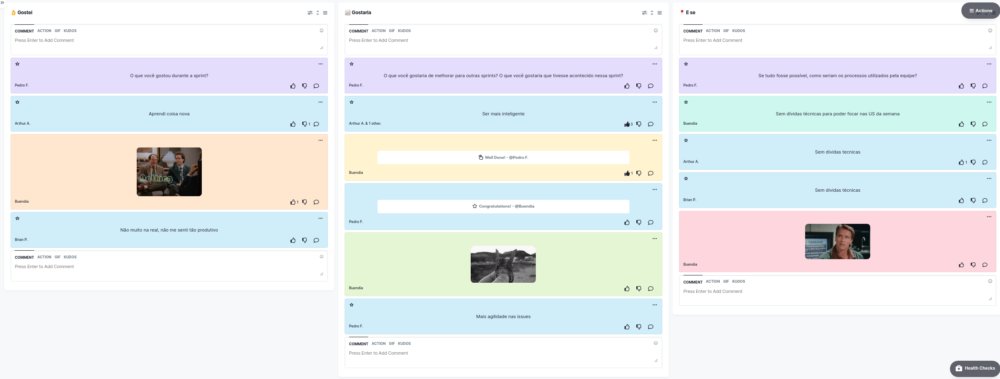

# Retrospectiva da Sprint 11

## Histórico de revisão

| Autor                                | Mudanças             | Data       | Versão |
| ------------------------------------ | -------------------- | ---------- | ------ |
| [Pedro Féo](https://github.com/phe0) | Criação do documento | 03/05/2021 | 1.0    |

## Avaliação do Scrum Master

Pontos levantados durante a retrospectiva:

- A moral do time tem caído bastante, é visível que a quantidade de comentários na retrospectiva caiu bastante;
- O time está sofrendo bastante com dívidas técnicas;

## Pontos levantados

