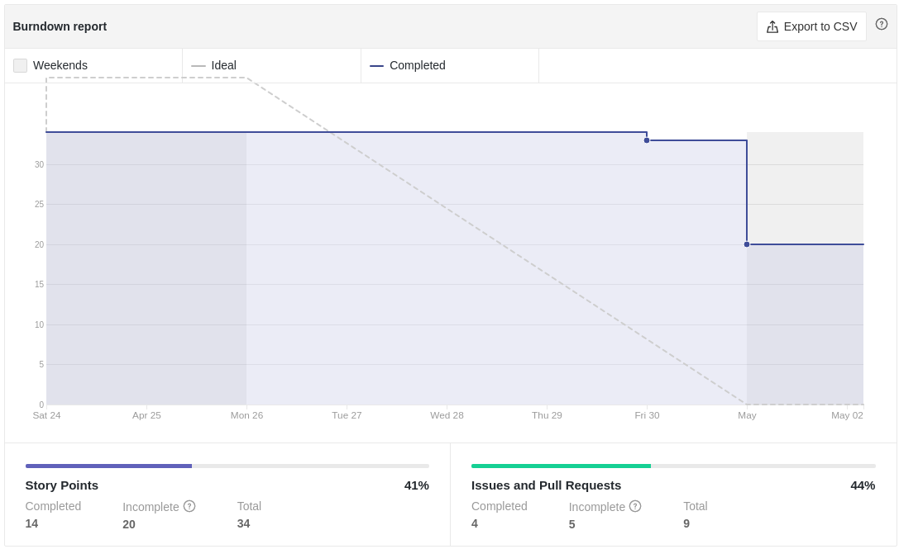
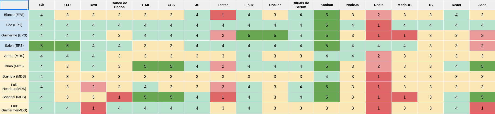
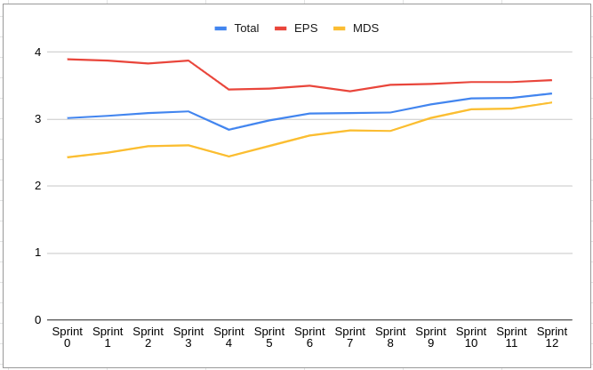
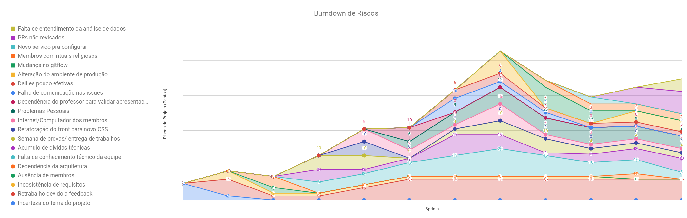
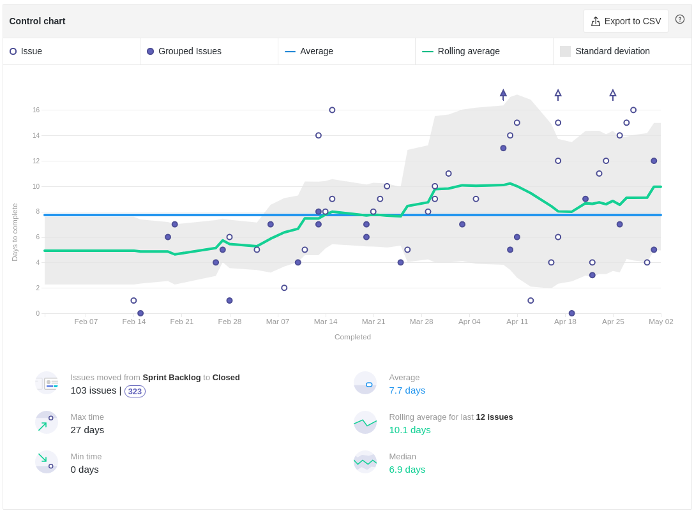
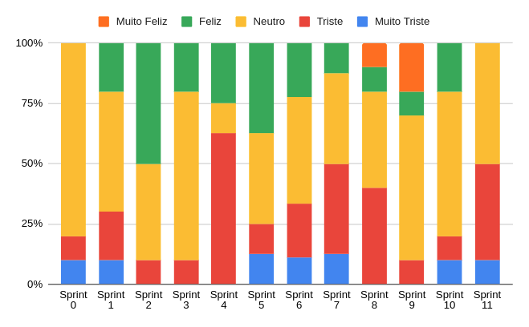

# Review da Sprint 11

## Histórico de revisão

| Autor                                | Mudanças             | Data       | Versão |
| ------------------------------------ | -------------------- | ---------- | ------ |
| [Pedro Féo](https://github.com/phe0) | Criação do documento | 03/05/2021 | 1.0    |

## Avaliação do Scrum Master

- As tarefas [Documentação Planning Sprint 11](https://github.com/fga-eps-mds/EPS-2020-2-G2/issues/188), [Revisão: CI/CD](https://github.com/fga-eps-mds/EPS-2020-2-G2/issues/185) e [US - Automatização do envio de e-mails](https://github.com/fga-eps-mds/EPS-2020-2-G2/issues/182) tiveram Pull Requests abertos, porém não concluíram o processo de revisão a tempo;
- Os mebros responsáveis pela tarefa [US - Filtro de denúncias](https://github.com/fga-eps-mds/EPS-2020-2-G2/issues/181) ficaram muito atarefados tentando fechar dívidas técnicas que ficaram de sprints anteriores, com isso, não conseguiram nem começar a nova tarefa;
- Alguns dados interessantes de se notar são o tempo médio de fechamento das atividades, que é de 7.7 dias, considerando que a sprint apresenta 7 dias, a maioria das tarefas se tornam dívidas técnicas por pouco menos de 1 dia, fazendo com que muitas tarefas sejam mostradas como dívida técnica;
- O tempo médio de revisão de tarefas que é de 2.4 dias, isso significa que um pouco mais de 30% do tempo de realização de uma tarefa é destinada apenas para revisão, seja por atrasos em revisar os pull requests ou pelo novo código implementado apresentar defeitos que precisam ser alterados;
- O velocity da equipe tem ficado bem baixo por conta dessas dívidas técnicas;
- Os MDS continuam relatando um aumento no conhecimento técnico no decorrer do semestre;
- Um novo risco surgiu, referente ao baixo entendimento relacionado a parte de análise de dados cobrado durante a disciplina, para suprir essa dependência, diversas novas atividades relacionadas à análise de dados serão realizadas na sprint 12;
- O tempo de ciclo de uma atividade teve um leve aumento, junto ao tempo de revisão;
- A moral do time está bem baixa como mostrado pela retrospectiva, velocity e gráfico de humor dos membros;

## Reports

### Tarefas Realizadas

| Tarefa                                                                                              | Responsáveis                                | Pontuação | Concluída |
| --------------------------------------------------------------------------------------------------- | ------------------------------------------- | --------- | --------- |
| [Documentação Planning Sprint 11](https://github.com/fga-eps-mds/EPS-2020-2-G2/issues/188)          | Matheus Blanco                              | 1         | ✘         |
| [Documentação Review Sprint 10](https://github.com/fga-eps-mds/EPS-2020-2-G2/issues/189)            | Pedro Féo                                   | 1         | ✔         |
| [Revisão: CI/CD](https://github.com/fga-eps-mds/EPS-2020-2-G2/issues/185)                           | Guilherme Marques                           | 3         | ✘         |
| [Configurar CI/CD do repositório de Users](https://github.com/fga-eps-mds/EPS-2020-2-G2/issues/186) | Guilherme Marques                           | 5         | ✔         |
| [Prototipar a tela da Landing Page](https://github.com/fga-eps-mds/EPS-2020-2-G2/issues/187)        | Matheus Blanco                              | 2         | ✔         |
| [Cobertura de testes: Front-end](https://github.com/fga-eps-mds/EPS-2020-2-G2/issues/183)           | Victor Buendia e Luiz Pettengil             | 8         | ✔         |
| [US - Automatização do envio de e-mails](https://github.com/fga-eps-mds/EPS-2020-2-G2/issues/182)   | Arthur Matos                                | 5         | ✘         |
| [US - Filtro de denúncias](https://github.com/fga-eps-mds/EPS-2020-2-G2/issues/181)                 | Brian Pina, Gabriel Sabanai e Luiz Henrique | 8         | ✘         |

### Burndown

### Velocity

### Conhecimento dos membros

#### Quadro de Conhecimentos

#### Gráfico de Melhoria

### Riscos

### Cumulative flow

### Cycle time

### Ciclo de Início da realização da tarefa até o final

### Ciclo do tempo de Revisão até a conclusão da tarefa

### Gráfico de Humor

