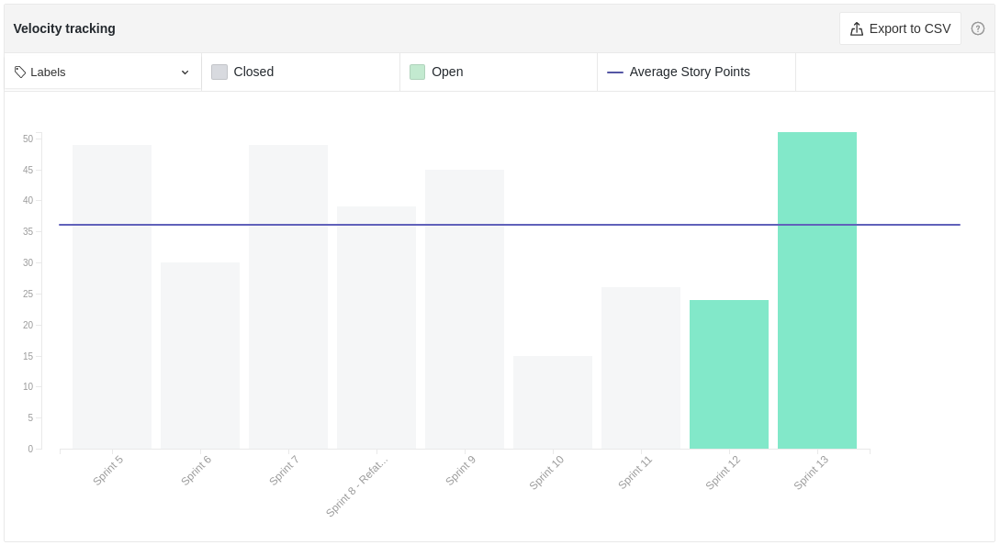
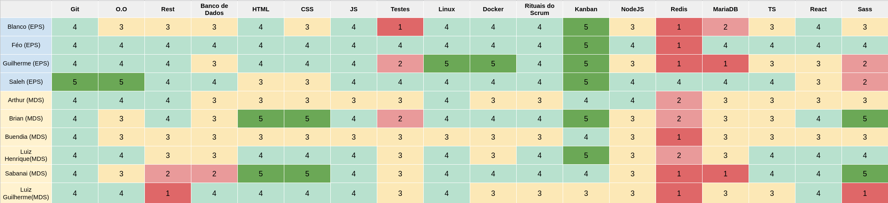
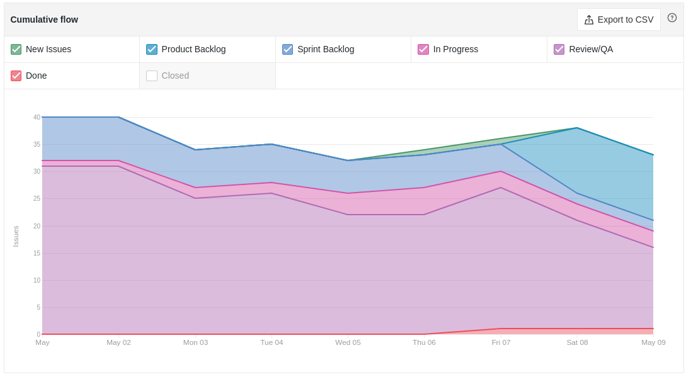
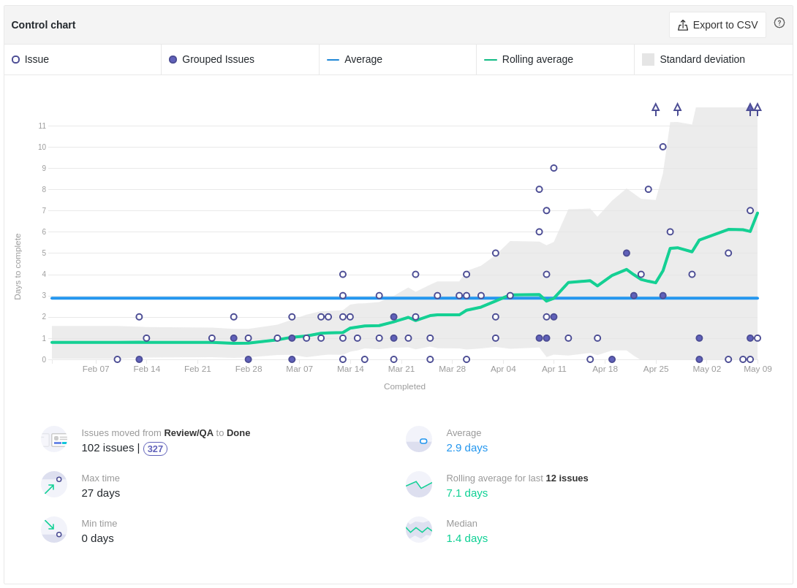

# Review da Sprint 12

## Histórico de revisão

| Autor                                | Mudanças             | Data       | Versão |
| ------------------------------------ | -------------------- | ---------- | ------ |
| [Pedro Féo](https://github.com/phe0) | Criação do documento | 14/05/2021 | 1.0    |

## Avaliação do Scrum Master

- A tarefa [Adicionar etapa na pipeline para salvar jsons do Sonar](https://github.com/fga-eps-mds/EPS-2020-2-G2/issues/203) foi feita em um dos repositórios, faltou replicar para os demais,
- Os membros responsáveis pela tarefa [US - Perfil de Usuário](https://github.com/fga-eps-mds/EPS-2020-2-G2/issues/194) estavam com muitas dívidas técnicas para resolver, acabaram nem conseguindo começar a nova US;
- No Sábado, dia 08/05/2021, realizamos uma Issue Battle, com o intuíto de fechar a maior quantidade possível de issues, visto que o grupo estava deixando muitas dívidas técnicas;
- Por conta da Issue Battle, muitas issues foram fechadas no fim de semana;
- Apesar do velocity parecer baixo, muitas issues em dívida técnica foram fechadas nessa sprint;
- A grande quantidade de fechamento e issues nessa sprint, resultou em um aumento significativo do cycle time, tendo em vista que Issues abertas a bastante tempo atŕas foram fechadas e passaram a ser contabilizadas;
- A própria Issue Battle foi considerada um risco, por poder resultar em uma equipe desgastada, além do time estar contando bastante que conseguiriam fechar uma grande quantidade de issues;
- O gráfico de conhecimento continua a aumentar e o nível de conhecimento dos MDS está quase chegando no dos EPS, o que é muito legal de ver;
- Os membros como um todo relatam estar bem cansados, deixando a moral do time bem baixa;

## Reports

### Tarefas Realizadas

| Tarefa                                                                                                            | Responsáveis                                  | Pontuação | Concluída |
| ----------------------------------------------------------------------------------------------------------------- | --------------------------------------------- | --------- | --------- |
| [Documentação Planning Sprint 12](https://github.com/fga-eps-mds/EPS-2020-2-G2/issues/199)                        | Matheus Blanco                                | 1         | ✔         |
| [Documentação Review Sprint 11](https://github.com/fga-eps-mds/EPS-2020-2-G2/issues/200)                          | Pedro Féo                                     | 1         | ✔         |
| [Recuperar JSONs das releases antigas](https://github.com/fga-eps-mds/EPS-2020-2-G2/issues/204)                   | Arthur Matos, Saleh Kader e Matheus Blanco    | 5         | ✔         |
| [Adicionar etapa na pipeline para salvar jsons do Sonar](https://github.com/fga-eps-mds/EPS-2020-2-G2/issues/203) | Guilherme Marques e Pedro Féo                 | 5         | ✘         |
| [Modelo de Documentação do Analytics](https://github.com/fga-eps-mds/EPS-2020-2-G2/issues/198)                    | Pedro Féo, Guilherme Marques e Victor Buendia | 5         | ✔         |
| [Revisão de Backlog e EVM](https://github.com/fga-eps-mds/EPS-2020-2-G2/issues/196)                               | Matheus Blanco                                | 3         | ✔         |
| [HOTFIX - Flaggr e quantidade de votos](https://github.com/fga-eps-mds/EPS-2020-2-G2/issues/191)                  | Saleh Kader                                   | 3         | ✔         |
| [US - Perfil de Usuário](https://github.com/fga-eps-mds/EPS-2020-2-G2/issues/194)                                 | Arthur Matos e Gabriel Sabanai                | 3         | ✘         |
| [Cobertura de testes](https://github.com/fga-eps-mds/EPS-2020-2-G2/issues/195)                                    | Luiz Pettengil e Victor Buendia               | 8         | ✔         |

### Burndown

### Velocity

### Conhecimento dos membros

#### Quadro de Conhecimentos

#### Gráfico de Melhoria

### Riscos

### Cumulative flow

### Cycle time

### Ciclo de Início da realização da tarefa até o final

### Ciclo do tempo de Revisão até a conclusão da tarefa

### Gráfico de Humor

