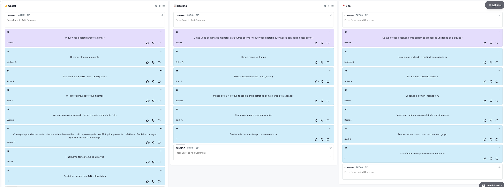

# Retrospectiva da Sprint 2

## Histórico de revisão
|Autor|Mudanças|Data|Versão|
|--|--|--|--|
|[Pedro Féo](https://github.com/phe0)|Criação do documento|28/02/2021|1.0|

## Avaliação do Scrum Master
Vários pontos positivos fora destacados durante essa retrospectiva:

 - O time como um todo ficou bem animado após a conversa com o professor hilmer, gostaram de ter o tema validado.
 - O grupo também está bem feliz em ver o projeto tomando forma.
 - Como na sprint anterior, alguns membros relataram estar tendo problemas de organização e falta de tempo.
 - Por último, os membros, principalmente de MDS, estão bem ansiosos para começar a mexer com código, o que é um ótimo sinal considerando que a falta de conhecimento técnico é um risco que pode surgir pelas próximas sprints.

## Pontos levantados

