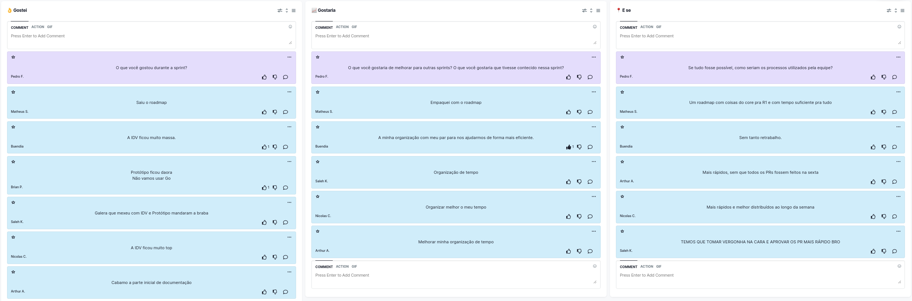

# Retrospectiva da Sprint 3

## Histórico de revisão

| Autor                                | Mudanças             | Data       | Versão |
| ------------------------------------ | -------------------- | ---------- | ------ |
| [Pedro Féo](https://github.com/phe0) | Criação do documento | 07/03/2021 | 1.0    |

## Avaliação do Scrum Master

Pontos levantados durante a retrospectiva:

- Equipe está gostando do material que tem entregue, em particular a Identidade Visual, Protótipo e Roadmap nessa Sprint;
- A equipe continua levantando pontos de falta de organização de tempo;
- A equipe também mostrou que gostaria de ter processos de review mais rápidos, os PRs estão ficando muito tempo em review.

Muitos membros estão com a agenda apertada durante a semana, com atividades extracurriculares principalmente, existe uma necessidade de melhor organização dos membros, principalmente de MDS.

Os PRs estão ficando bastante tempo em review, isso acontece pois os membros estão focados nas suas próprias atividades em vez de revisar as dos demais. É necessário um pouco mais de estudo para saber como outras empresas realizam esse processo de review no mercado.

## Pontos levantados

