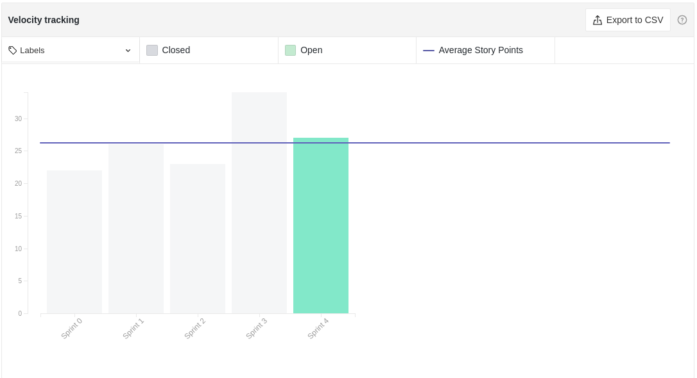
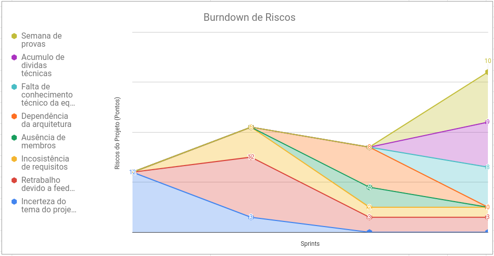
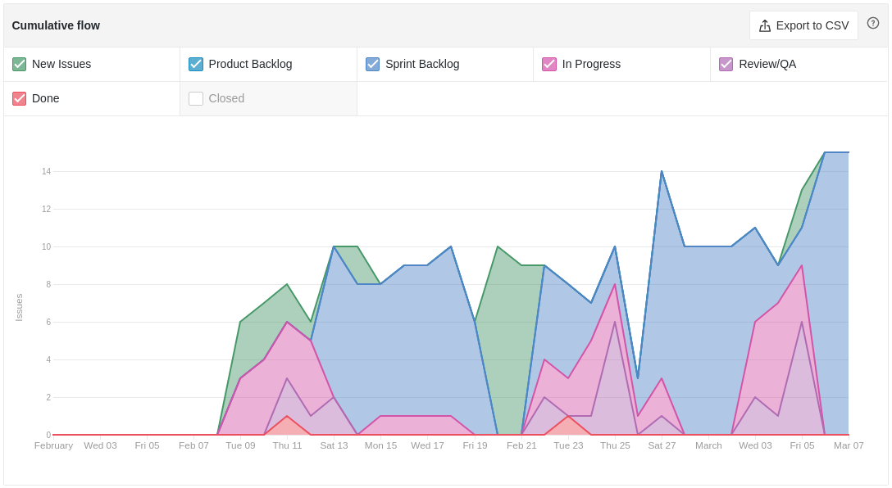
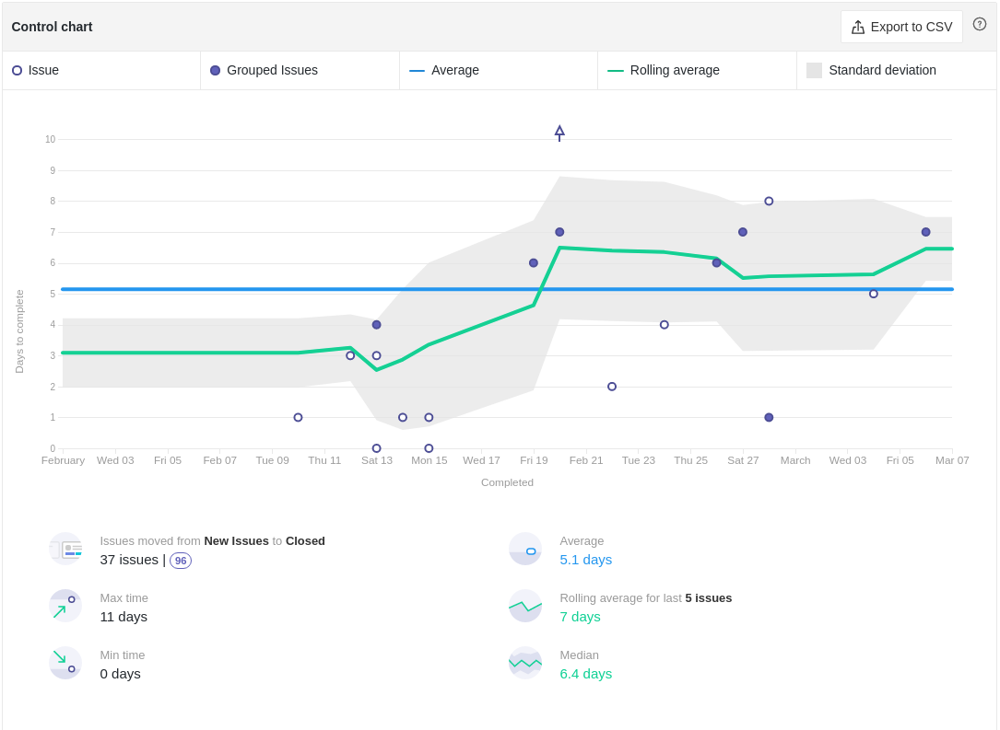
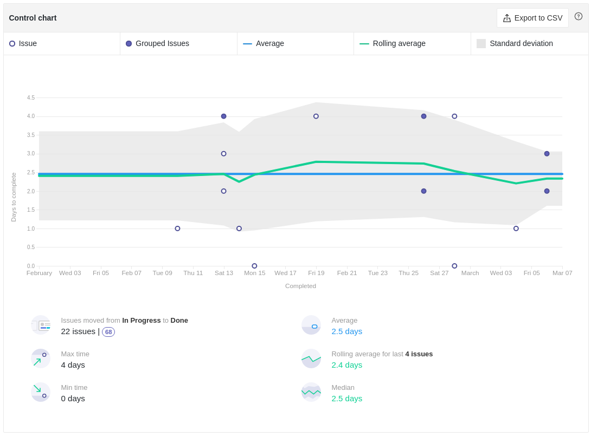

# Review da Sprint 3

## Histórico de revisão

| Autor                                | Mudanças             | Data       | Versão |
| ------------------------------------ | -------------------- | ---------- | ------ |
| [Pedro Féo](https://github.com/phe0) | Criação do documento | 07/03/2021 | 1.0    |

## Avaliação do Scrum Master

- Como é possível ver pelo burndown as issues continuam sendo fechadas apenas na sexta feira, houveram reclamações sobre o tempo de correção dos PRs, porém muitos PRs só estão sendo fechados no fim da semana também.
- A Sprint 3 teve um aumento considerável de pontos a serem realizados, porém duas issues não foram completas. Com isso iremos diminuir a quantidade de pontos para a próxima sprint para tentarmos encontrar o valor ótimo de pontos por sprint.
- Nessa sprint adicionamos mais 6 campos no quadro de conhecimento, relacionados às tecnologias que usaremos durante o projeto, por conta disso, houve uma queda expressiva no gráfico de conhecimento do time.
- No gráfico de riscos, houve uma queda dos ricos encontrados nas últimas sprints, principalmente a dependência na arquitetura, que foi escolhida durante a sprint. Três novos riscos foram levantados, sendo eles a Semana de Provas para a maioria dos MDS, que pode afetar o rendimento do time, o acumulo de dividas técnicas, pois duas issues se tornaram dívidas técnicas e a falta de conhecimento técnico da equipe, pois o time de EPS decidiu não dar dojos sobre as novas tecnologias escolhidas e sim passar cursos e materiais online sobre as tecnologias, que os membros pudessem assistir de forma assíncrona, isso resulta em uma falta de garantia do nivelamento da equipe, que pode vir a impactar o time durante as sprints ainda a vir.
- o cycle time da equipe subiu, o que indica que o tempo para conclusão de PRs aumentou, chegando um valor bem próximo a 7 dias para seus fechamentos, esse valor é bem preocupante tendo em vista que as sprints também duram cerca de 7 dias.
- Foi adicionado também o cycle time das issues a partir do momento que começam a ser feitas, indicado pela pipeline In Progress, até o momento de conclusão. Esse tempo está com uma média de 2.5 dias, o que indica que para esse grande período de Abertura das issues até seus fechamentos é devido a uma demora para que os membros começem a realizar as issues.
- De acordo com o gráfico de humor, muitos membros estão com o humor neutro, alguns relataram continuar animados em mexer com código, outros relataram não ter aprendido tanto durante a sprint.

## Reports

### Tarefas Realizadas

| Tarefa                                                                                                   | Responsáveis                                                                                                                                                                                  | Pontuação | Concluída |
| -------------------------------------------------------------------------------------------------------- | --------------------------------------------------------------------------------------------------------------------------------------------------------------------------------------------- | --------- | --------- |
| [Documentação Planning Sprint 3](https://github.com/fga-eps-mds/EPS-2020-2-G2/issues/47)                 | [Matheus Blanco](https://github.com/MatheusBlanco)                                                                                                                                            | 1         | ✔         |
| [Documentação Review Sprint 2](https://github.com/fga-eps-mds/EPS-2020-2-G2/issues/48)                   | [Pedro Féo](https://github.com/phe0)                                                                                                                                                          | 1         | ✔         |
| [Documento de arquitetura](https://github.com/fga-eps-mds/EPS-2020-2-G2/issues/49)                       | [Arthur Matos](https://github.com/Arthur-Matos), [Brian Pina](https://github.com/DLBrianPina), [Gabriel Sabanai](https://github.com/Sabanai104) e [Saleh Kader](https://github.com/devsalula) | 5         | ✔         |
| [Backlog do Produto](https://github.com/fga-eps-mds/EPS-2020-2-G2/issues/50)                             | [Luiz Henrique](https://github.com/luiz-herique) e [Matheus Blanco](https://github.com/MatheusBlanco)e                                                                                        | 3         | ✔         |
| [Histórias de Usuário](https://github.com/fga-eps-mds/EPS-2020-2-G2/issues/51)                           | [Luiz Henrique](https://github.com/luiz-herique), [Gabriel Sabanai](https://github.com/Sabanai104) e [Matheus Blanco](https://github.com/MatheusBlanco)                                       | 3         | ✘         |
| [Manual de Identidade Visual](https://github.com/fga-eps-mds/EPS-2020-2-G2/issues/52)                    | [Pedro Féo](https://github.com/phe0) e [Victor Buendia](https://github.com/Victor-Buendia)                                                                                                    | 3         | ✔         |
| [Protótipo de Alta Fidelidade](https://github.com/fga-eps-mds/EPS-2020-2-G2/issues/53)                   | [Brian Pina](https://github.com/DLBrianPina), [Pedro Féo](https://github.com/phe0) e [Victor Buendia](https://github.com/Victor-Buendia)                                                      | 5         | ✔         |
| [Realizar testes do protótipo](https://github.com/fga-eps-mds/EPS-2020-2-G2/issues/54)                   | [Brian Pina](https://github.com/DLBrianPina), [Pedro Féo](https://github.com/phe0) e [Victor Buendia](https://github.com/Victor-Buendia)                                                      | 3         | ✘         |
| [Roadmap do produto](https://github.com/fga-eps-mds/EPS-2020-2-G2/issues/55)                             | [Luiz Henrique](https://github.com/luiz-herique) e [Matheus Blanco](https://github.com/MatheusBlanco)                                                                                         | 3         | ✔         |
| [Template de Pull Request](https://github.com/fga-eps-mds/EPS-2020-2-G2/issues/56)                       | [Nicolas Chagas](https://github.com/nszchagas)                                                                                                                                                | 2         | ✔         |
| [Criar ambiente de desenvolvimento do front-end](https://github.com/fga-eps-mds/EPS-2020-2-G2/issues/57) | [Nicolas Chagas](https://github.com/nszchagas) e [Guilherme Marques](https://github.com/guilhesme23)                                                                                          | 3         | ✔         |
| [Finalizar o Lean Inception](https://github.com/fga-eps-mds/EPS-2020-2-G2/issues/58)                     | [Arthur Matos](https://github.com/Arthur-Matos) e [Gabriel Sabanai](https://github.com/Sabanai104)                                                                                            | 5         | ✔         |

### Burndown

### Velocity

### Conhecimento dos membros

#### Quadro de Conhecimentos

#### Gráfico de Melhoria

### Riscos

### Cumulative flow

### Cycle time

### Gráfico de Humor

