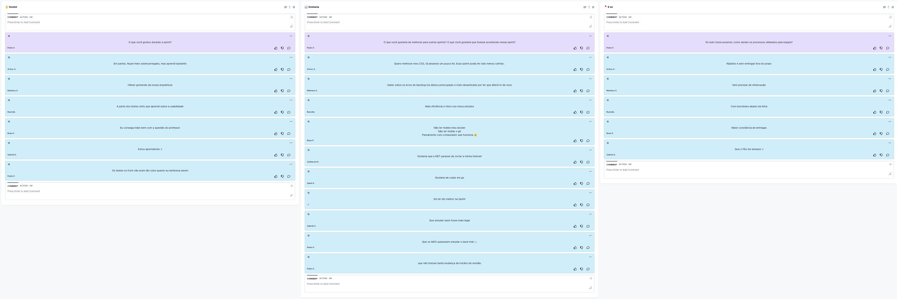

# Retrospectiva da Sprint 4

## Histórico de revisão

| Autor                                | Mudanças             | Data       | Versão |
| ------------------------------------ | -------------------- | ---------- | ------ |
| [Pedro Féo](https://github.com/phe0) | Criação do documento | 15/03/2021 | 1.0    |

## Avaliação do Scrum Master

Pontos levantados durante a retrospectiva:

- Um dos riscos durante a sprint foi a falta de conhecimento do time, para evitar esse risco, foi programada uma issue de estudos. Além disso foi realizado um formulário para saber como estavam os estudos. Foi visto que os MDS como um todo focaram mais em estudar as tecnologias do frontend em vez do backend.
- Apesar do burndown os MDS relataram se preocupar com a constância das atividades, o que é muito bom.

A sprint não teve muitos pontos de discussão além de ter sido a primeira semana de código, e mesmo sendo a primeira semana, todas as issues de código foram entregues.

## Pontos levantados

