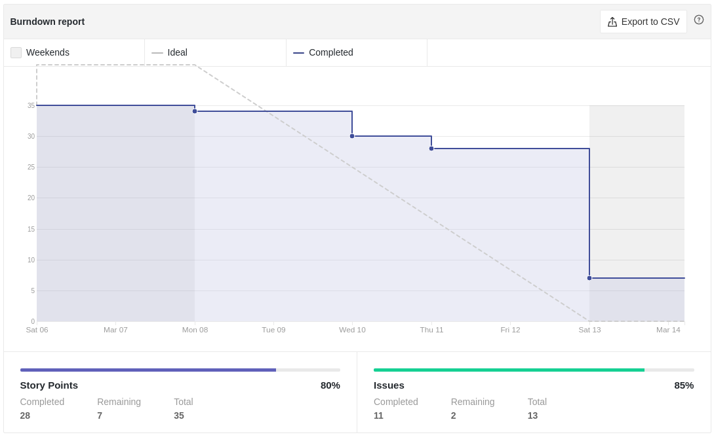
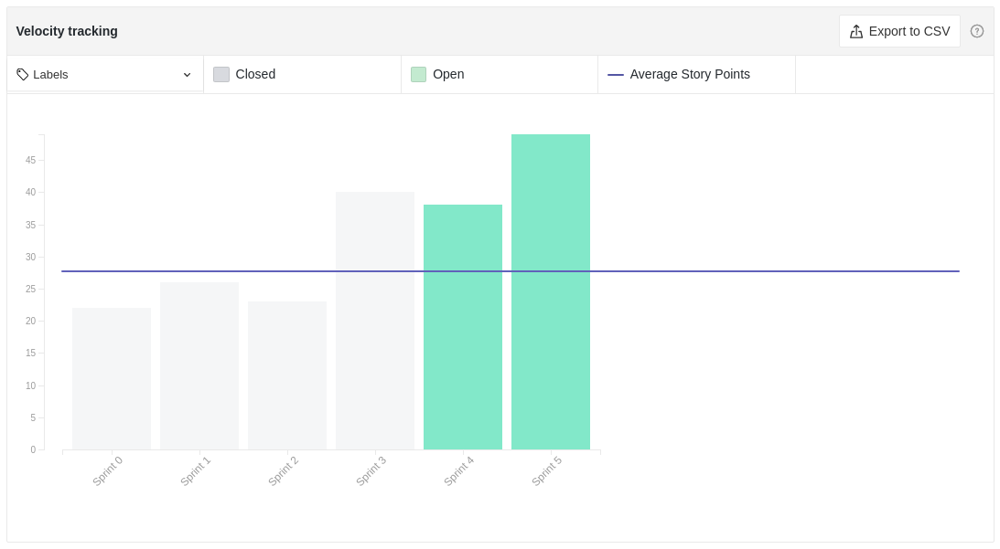
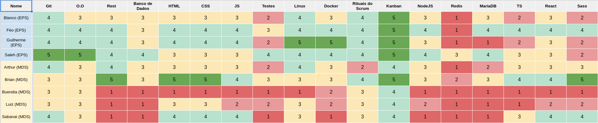
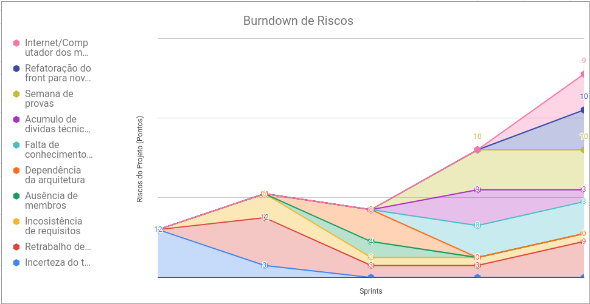
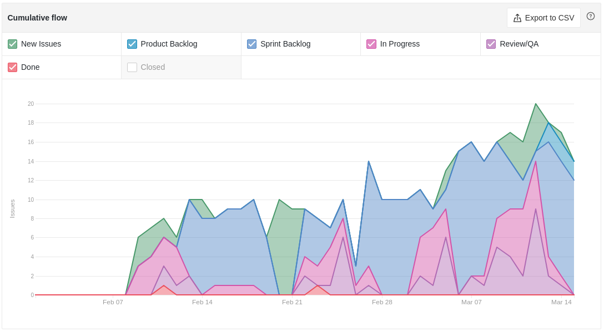
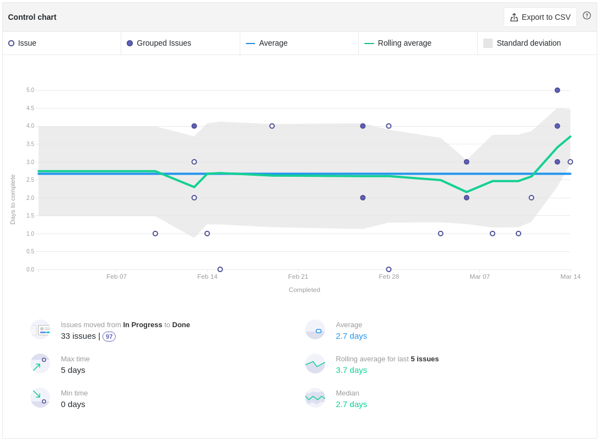
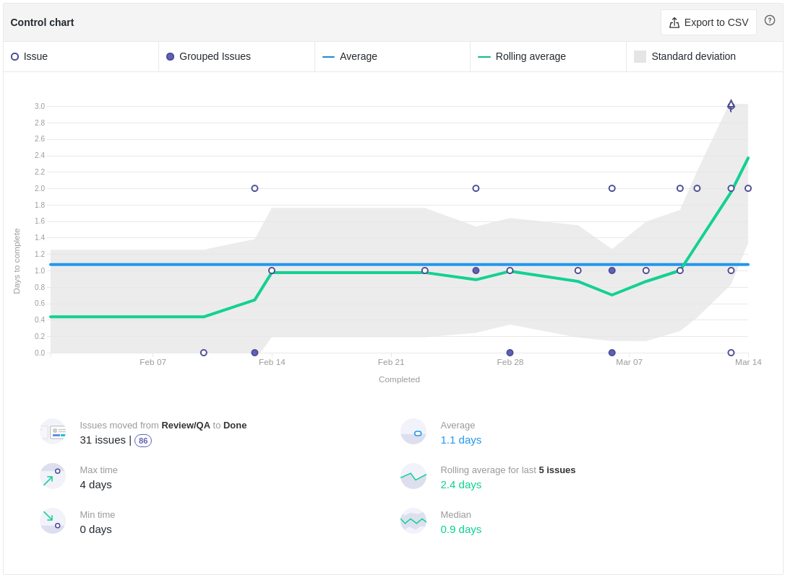
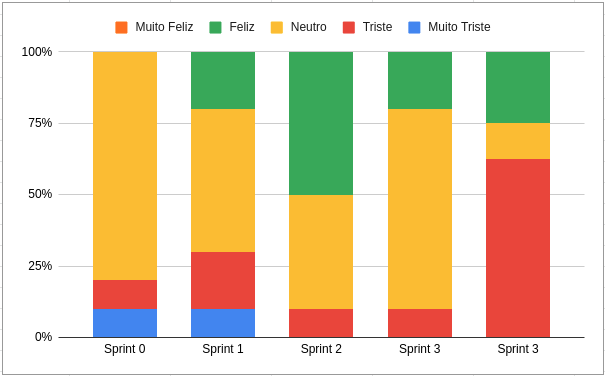

# Review da Sprint 4

## Histórico de revisão

| Autor                                | Mudanças             | Data       | Versão |
| ------------------------------------ | -------------------- | ---------- | ------ |
| [Pedro Féo](https://github.com/phe0) | Criação do documento | 15/03/2021 | 1.0    |

## Avaliação do Scrum Master

- A sprint foi marcada pela saída de um dos membros do grupo de MDS, o que afetou um pouco a moral do time.
- Burndown continua retangular, com muitas issues sendo fechadas no último ou penúltimo dia da sprint.
- Houveram duas issues que se tornaram dívida técnica novamente, isso se deve bastante ao fato dos membros estarem deixando pra realizar as tarefas no final da sprint, não levando em consideração o tempo de review.
- O velocity da sprint foi um pouco menor do que a sprint anterior, levando em consideração também que houveram duas dívidas técnicas que não tinham sido nem iniciadas.
- O conhecimento dos membros voltou a subir, tanto de MDS quando de EPS, isso ocorreu devido ao início da prática com código de alguns membros além de uma preocupação dos membros em estudar as tecnologias que serão utilizadas.
- Durante a reunião da sprint foi levantado o problema de falta de organização com arquivos CSS/SASS, como solução foi proposta uma nova arquitetura para melhorar esse problema, com isso será realizada um estudo e refatoração do código já criado, gerando um novo risco.
- Alguns dos membros relataram estar tendo dificuldades com internet e computador lento, porém não há como prever o impacto que esses problemas terão no projeto.
- Houve um aumento bastante relevante no tempo de início das tarefas até o final, principalmente no tempo em que a tarefa está ficando em revisão. Isso está acontecendo por conta do início das atividades se utilizando código, o que aumenta tanto o tempo em que a tarefa fica em progresso, por conta da baixa experiência da equipe de MDS e também pelo tempo maior necessário para revisão do código, que inclui não só estes na implementação, mas também revisão do código escrito.
- O humor do time diminuiu bastante, isso se deve a problemas pessoais de alguns membros, além da saída de um MDS da equipe e alguns membros relataram cansaço e falta de tempo durante a sprint.

## Reports

### Tarefas Realizadas

| Tarefa                                                                                                        | Responsáveis                                                                              | Pontuação | Concluída |
| ------------------------------------------------------------------------------------------------------------- | ----------------------------------------------------------------------------------------- | --------- | --------- |
| [Documentação Planning Sprint 4](https://github.com/fga-eps-mds/EPS-2020-2-G2/issues/77)                      | Matheus Blanco                                                                            | 1         | ✔         |
| [Documentação Review Sprint 3](https://github.com/fga-eps-mds/EPS-2020-2-G2/issues/78)                        | Pedro Féo                                                                                 | 1         | ✔         |
| [Histórias de Usuário - Dívida Técnica](https://github.com/fga-eps-mds/EPS-2020-2-G2/issues/51)               | Matheus Blanco                                                                            | 3         | ✔         |
| [Realizar testes do protótipo - Dívida Técnica](https://github.com/fga-eps-mds/EPS-2020-2-G2/issues/54)       | Gabriel Sabanai, Victor Buendia Pedro Féo                                                 | 3         | ✘         |
| [Configurar ambientes de desenvolvimento do back-end](https://github.com/fga-eps-mds/EPS-2020-2-G2/issues/66) | Brian Pina, Saleh Kader e Guilherme Rosa                                                  | 5         | ✘         |
| [Criar tabela de análise de EVM](https://github.com/fga-eps-mds/EPS-2020-2-G2/issues/67)                      | Matheus Blanco                                                                            | 5         | ✔         |
| [Estilização da Wiki](https://github.com/fga-eps-mds/EPS-2020-2-G2/issues/68)                                 | Gabriel Sabanai e Victor Buendia                                                          | 3         | ✔         |
| [Estudar as tecnologias](https://github.com/fga-eps-mds/EPS-2020-2-G2/issues/69)                              | Brian Pina, Arthur Matos, Gabriel Sabanai, Luiz Henrique, Nicolas Chagas e Victor Buendia | 3         | ✔         |
| [Estudo de testes do front](https://github.com/fga-eps-mds/EPS-2020-2-G2/issues/70)                           | Pedro Féo                                                                                 | 3         | ✔         |
| [Criação de componente estático - NavBar](https://github.com/fga-eps-mds/EPS-2020-2-G2/issues/71)             | Brian Pina e Nicolas Chagas                                                               | 3         | ✔         |
| [Criação do Background do Front-end](https://github.com/fga-eps-mds/EPS-2020-2-G2/issues/72)                  | Brian Pina e Nicolas Chagas                                                               | 2         | ✔         |
| [Criação de componente - Botão](https://github.com/fga-eps-mds/EPS-2020-2-G2/issues/73)                       | Arthur Matos e Luiz Henrique                                                              | 2         | ✔         |
| [Criação de componente - Input](https://github.com/fga-eps-mds/EPS-2020-2-G2/issues/75)                       | Arthur Matos e Luiz Henrique                                                              | 2         | ✔         |
| [Criação de componente - Botão](https://github.com/fga-eps-mds/EPS-2020-2-G2/issues/76)                       | Arthur Matos e Luiz Henrique                                                              | 2         | ✔         |
| [Estudo de implantação](https://github.com/fga-eps-mds/EPS-2020-2-G2/issues/79)                               | Guilherme Rosa                                                                            | 3         | ✔         |

### Burndown

### Velocity

### Conhecimento dos membros

#### Quadro de Conhecimentos

#### Gráfico de Melhoria

### Riscos

### Cumulative flow

### Cycle time

### Ciclo de Início da realização da tarefa até o final

### Ciclo do tempo de Revisão até a conclusão da tarefa

### Gráfico de Humor

