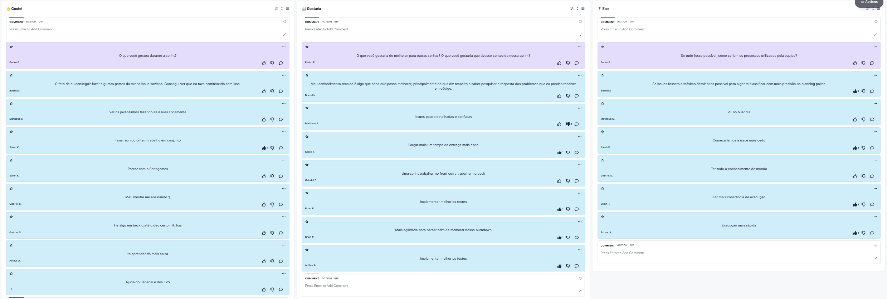

# Retrospectiva da Sprint 5

## Histórico de revisão

| Autor                                | Mudanças             | Data       | Versão |
| ------------------------------------ | -------------------- | ---------- | ------ |
| [Pedro Féo](https://github.com/phe0) | Criação do documento | 22/03/2021 | 1.0    |

## Avaliação do Scrum Master

Pontos levantados durante a retrospectiva:

- O grupo se reuniu sexta a noite para fazer várias issues em conjunto podendo pedir ajuda aos EPS e o grupo como um todo demonstrou ter gostado bastante e ter aprendido bastante durante a sprint;
- Os MDS estão apresentando uma certa dificuldade com os testes de código;
- Houve um certo problema por conta de issues com critérios de aceitação pouco detalhados;

## Pontos levantados

