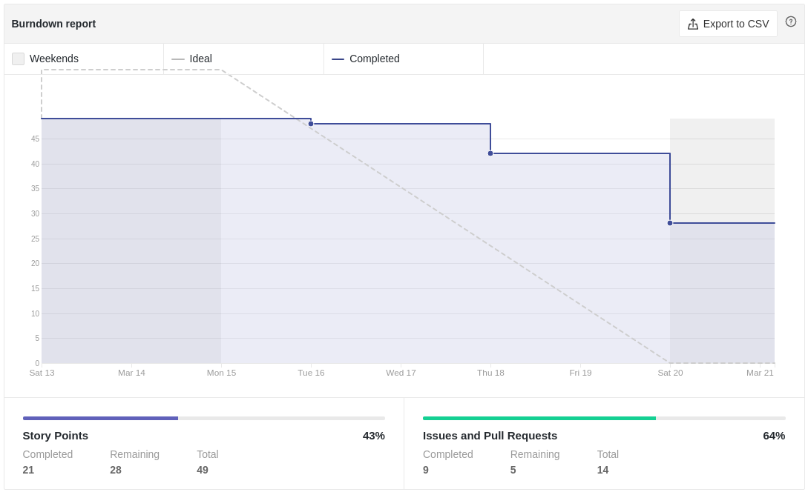
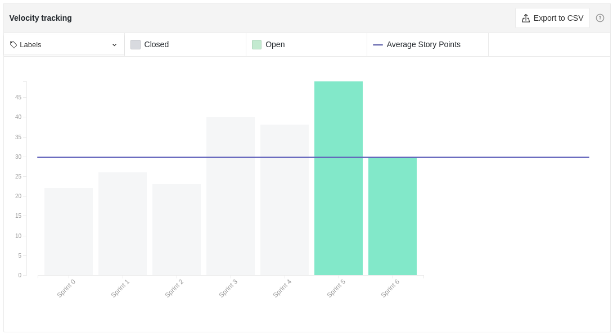
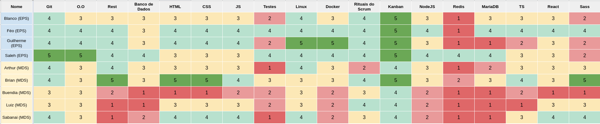
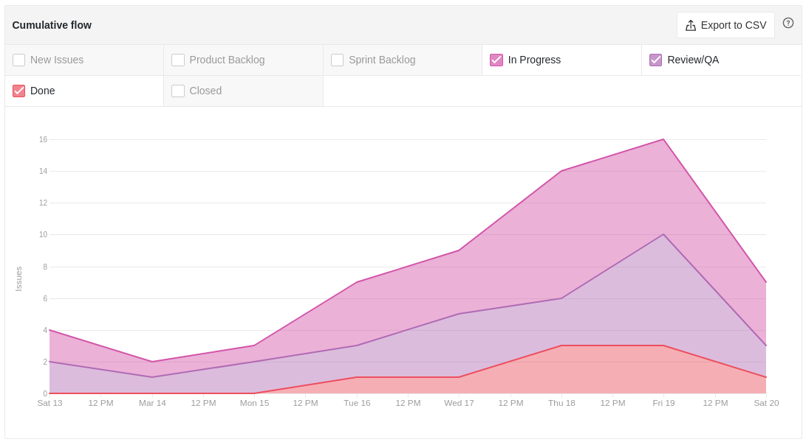
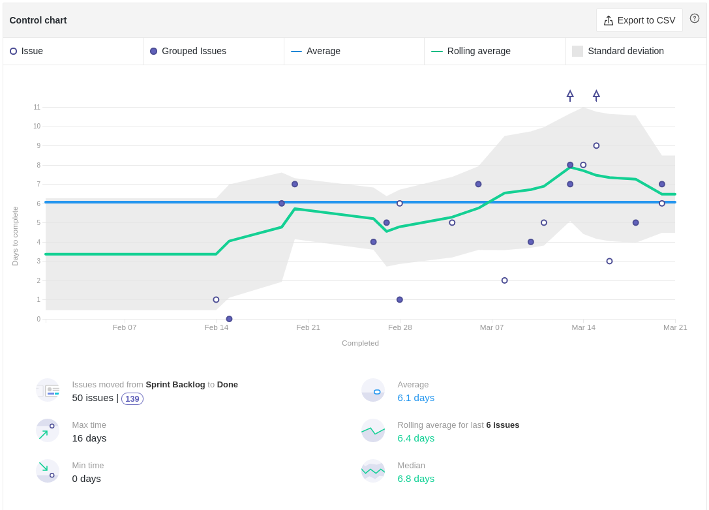
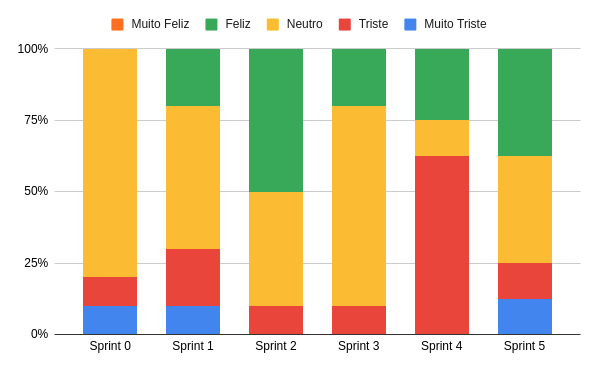

# Review da Sprint 5

## Histórico de revisão

| Autor                                | Mudanças             | Data       | Versão |
| ------------------------------------ | -------------------- | ---------- | ------ |
| [Pedro Féo](https://github.com/phe0) | Criação do documento | 22/03/2021 | 1.0    |

## Avaliação do Scrum Master

- A Sprint possuia 10 pontos a mais do que a média que a equipe estava apresentando, isso acarretou em 3 dividas técnicas.
- O quadro de conhecimento da equipe continua a crescer lentamente, o que mostra um ganho de conhecimento tanto dos MDS quanto EPS.
- Um novo risco de dependência do professor foi levantado pois o grupo sentiu que não tinha certeza do que deveriam apresentar na R1.
- Pelo cumulative flow é possível ver que a equipe apresenta um fluxo de trabalho mais ativo no fim da semana, o que encurta o período disponível para review.
- O tempo de review do grupo teve uma queda significativa quando comparado com a sprint anterior, o que mostra o aumento no empenho no processo de review.

## Reports

### Tarefas Realizadas

| Tarefa                                                                                                       | Responsáveis                     | Pontuação | Concluída |
| ------------------------------------------------------------------------------------------------------------ | -------------------------------- | --------- | --------- |
| [Documentação Planning Sprint 5](https://github.com/fga-eps-mds/EPS-2020-2-G2/issues/105)                    | Matheus Blanco                   | 1         | ✔         |
| [Documentação Review Sprint 4](https://github.com/fga-eps-mds/EPS-2020-2-G2/issues/104)                      | Pedro Féo                        | 1         | ✔         |
| [Definição da arquitetura de CSS](https://github.com/fga-eps-mds/EPS-2020-2-G2/issues/103)                   | Brian Pina e Pedro Féo           | 5         | ✔         |
| [Protótipo de alta fidelidade - status de denúncia](https://github.com/fga-eps-mds/EPS-2020-2-G2/issues/102) | Matheus Blanco                   | 2         | ✔         |
| [Criação de componente - Drawer](https://github.com/fga-eps-mds/EPS-2020-2-G2/issues/101)                    | Matheus Blanco                   | 3         | ✔         |
| [Rastreamento da arquitetura](https://github.com/fga-eps-mds/EPS-2020-2-G2/issues/100)                       | Saleh Kader                      | 1         | ✔         |
| [Preparar documentação para a R1](https://github.com/fga-eps-mds/EPS-2020-2-G2/issues/99)                    | Matheus Blanco                   | 5         | ✔         |
| [Configurar o SonarQube](https://github.com/fga-eps-mds/EPS-2020-2-G2/issues/98)                             | Pedro Féo                        | 5         | ✘         |
| [Configurar CI/CD](https://github.com/fga-eps-mds/EPS-2020-2-G2/issues/97)                                   | Guilherme Marques                | 8         | ✘         |
| [US27 - Serviço de e-mails](https://github.com/fga-eps-mds/EPS-2020-2-G2/issues/94)                          | Saleh Kader e Gabriel Sabanai    | 8         | ✔         |
| [US10 - Formulário de denúncia](https://github.com/fga-eps-mds/EPS-2020-2-G2/issues/93)                      | Brian Pina e Arthur Matos Chagas | 5         | ✔         |
| [US16 - Feed de denúncias](https://github.com/fga-eps-mds/EPS-2020-2-G2/issues/88)                           | Victor Buendia e Luiz Henrique   | 5         | ✘         |

### Burndown

### Velocity

### Conhecimento dos membros

#### Quadro de Conhecimentos

#### Gráfico de Melhoria

### Riscos

### Cumulative flow

### Cycle time

### Ciclo de Início da realização da tarefa até o final

### Ciclo do tempo de Revisão até a conclusão da tarefa

### Gráfico de Humor

