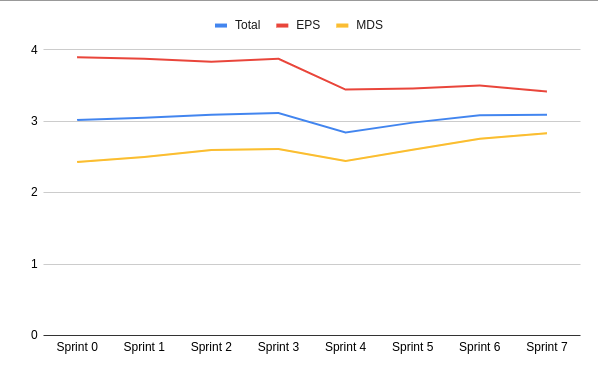
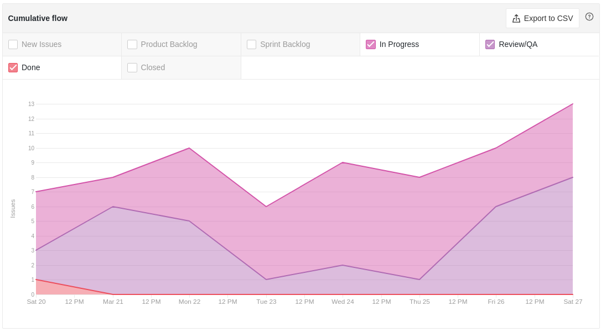
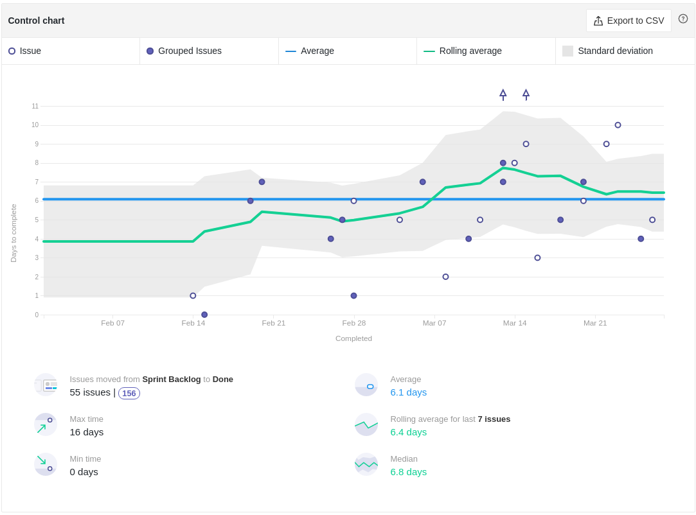
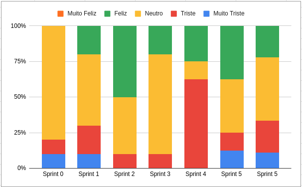

# Review da Sprint 6

## Histórico de revisão

| Autor                                | Mudanças             | Data       | Versão |
| ------------------------------------ | -------------------- | ---------- | ------ |
| [Pedro Féo](https://github.com/phe0) | Criação do documento | 31/03/2021 | 1.0    |

## Avaliação do Scrum Master

- A equipe deixou MUITAS dívidas técnicas nessa sprint, muito disse se deve ao fato de que tivemos que dedicar um bom tempo para gravar e preparar o material da R1, além disso alguns membros continuam começando suas atividades apenas na quinta feira, isso junto a falta de habilidade técnica causa bastante atraso nas atividades;
- A sprint foi planejada com menos pontos para que os membros pudessem se dedicar às entregas da R1, mesmo assim o time entregou muito abaixo do esperado.
- O conhecimento da equipe de MDS continua crescendo, mostrando que estão ficando mais confortáveis com as tecnologias utilizadas;
- Os riscos relacionados à entrega da R1 foram todos zerados e dois novos riscos foram detectados relacionados à comunicação do time;
- O tempo de ciclo da equipe continua bem parecido com as últimas semanas, o que demonstra que as dívidas estão relacionadas à demora para começar as atividades;
- Houveram diversas atividades realizadas duarante a sprint, principalmente de edição e gravação de vídeo que não foram rastreadas;

## Reports

### Tarefas Realizadas

| Tarefa                                                                                              | Responsáveis                     | Pontuação | Concluída |
| --------------------------------------------------------------------------------------------------- | -------------------------------- | --------- | --------- |
| [Documentação Planning Sprint 6](https://github.com/fga-eps-mds/EPS-2020-2-G2/issues/116)           | Matheus Blanco                   | 1         | ✔         |
| [Documentação Review Sprint 5](https://github.com/fga-eps-mds/EPS-2020-2-G2/issues/115)             | Pedro Féo                        | 1         | ✔         |
| [Modelo de maturidade de arquitetura](https://github.com/fga-eps-mds/EPS-2020-2-G2/issues/114)      | Saleh Kader                      | 3         | ✘         |
| [US - Composição de relatório](https://github.com/fga-eps-mds/EPS-2020-2-G2/issues/111)             | Brian Pina e Luiz Henrique       | 8         | ✘         |
| [US - Voto em denúncia](https://github.com/fga-eps-mds/EPS-2020-2-G2/issues/91)                     | Victor Buendia e Gabriel Sabanai | 5         | ✘         |
| [US - Confirmação de resolução da denúncia](https://github.com/fga-eps-mds/EPS-2020-2-G2/issues/90) | Arthur Matos e Saleh Kader       | 5         | ✘         |
| [Preparar Slides para a Release 1](https://github.com/fga-eps-mds/EPS-2020-2-G2/issues/112)         | Pedro Féo                        | 3         | ✔         |
| [Preparar Roteiro para a R1](https://github.com/fga-eps-mds/EPS-2020-2-G2/issues/113)               | Matheus Blanco                   | 3         | ✘         |

### Burndown

### Velocity

### Conhecimento dos membros

#### Quadro de Conhecimentos

#### Gráfico de Melhoria

### Riscos

### Cumulative flow

### Cycle time

### Ciclo de Início da realização da tarefa até o final

### Ciclo do tempo de Revisão até a conclusão da tarefa

### Gráfico de Humor

