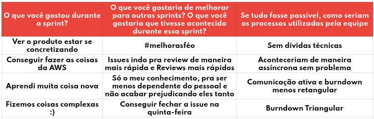

# Retrospectiva da Sprint 7

## Histórico de revisão

| Autor                                | Mudanças             | Data       | Versão |
| ------------------------------------ | -------------------- | ---------- | ------ |
| [Pedro Féo](https://github.com/phe0) | Criação do documento | 08/04/2021 | 1.0    |

## Avaliação do Scrum Master

Pontos levantados durante a retrospectiva:
 - A equipe desejou melhoras pelo membro doente;
 - Alguns membros tiveram contato com tecnologias diferentes e relataram aprender bastante;
 - Membros relataram que o processo de review está mais rápido;
 - Membros perceberam que estão acontecendo muitas dívidas técnicas;

## Pontos levantados

