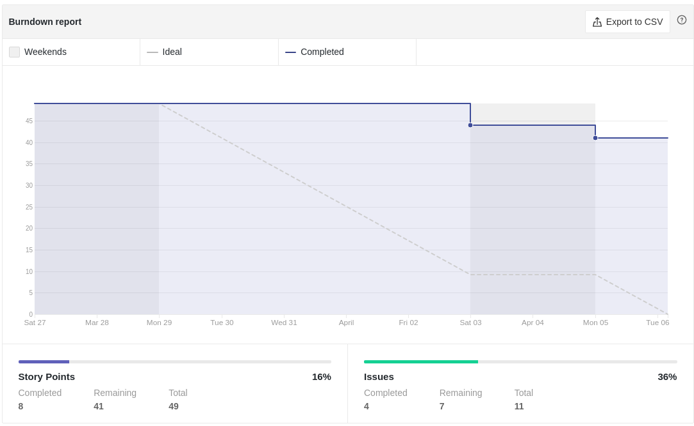
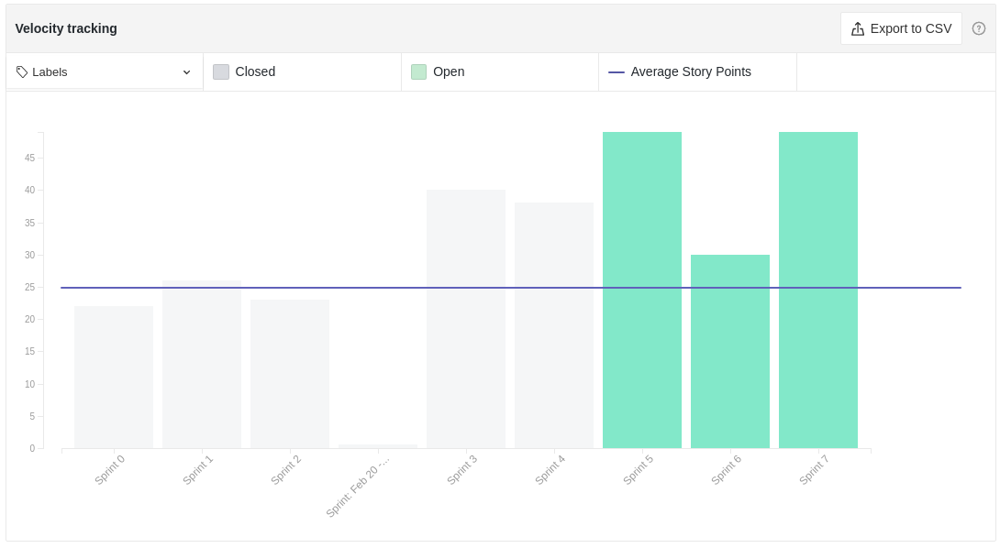
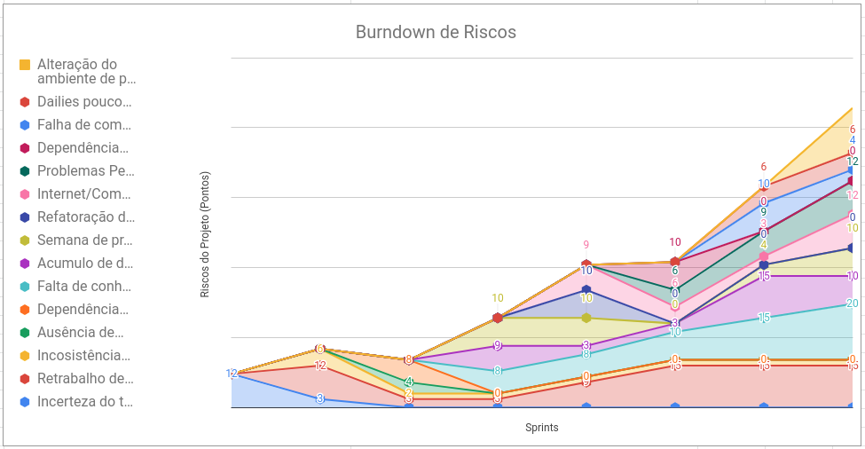
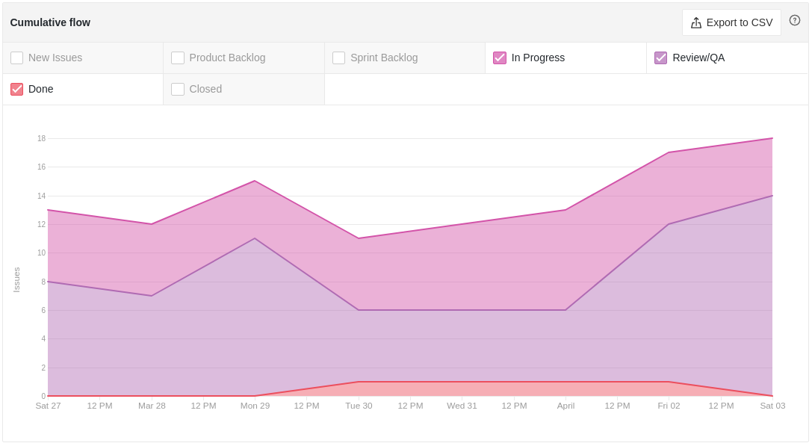
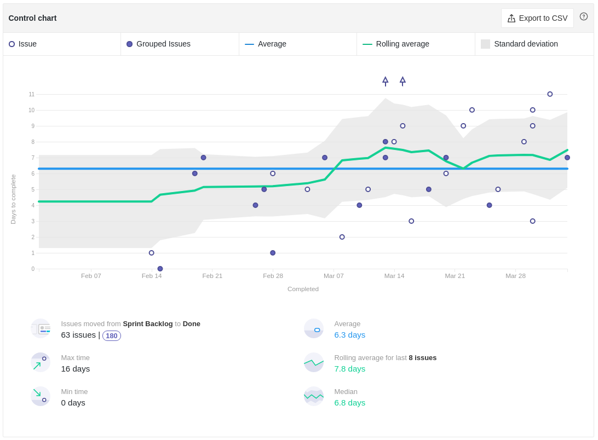
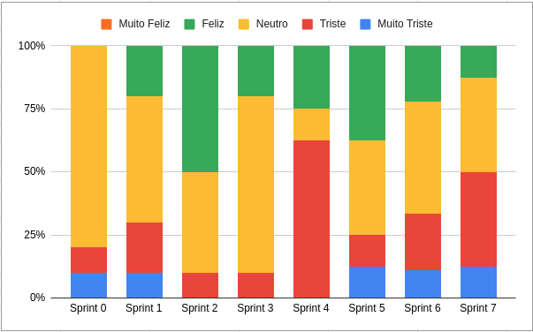

# Review da Sprint 7

## Histórico de revisão

| Autor                                | Mudanças             | Data       | Versão |
| ------------------------------------ | -------------------- | ---------- | ------ |
| [Pedro Féo](https://github.com/phe0) | Criação do documento | 22/03/2021 | 1.0    |

## Avaliação do Scrum Master

- Estamos vindo em uma sequência de sprints com muita dívida técnica, o que tem acontecido é que muitas issues estão sendo terminadas no começo da sprint seguinte. Para enfrentar esse risco decidimos que a sprint seguinte será focada em eliminar as dívidas técnicas e em refatorar os repositórios;
- O quadro de conhecimento continua subindo, mesmo com o novo integrante, o que mostra o constante crescimento da equipe;
- Foi notado um novo risco relacionado ao ambiente de produção da aplicação que irá ser alterado do google cloud para a digital ocean;
- O tempo de ciclo das issues continua bem parecido com as últimas sprints;
- Apesar de indicado que o tempo de review diminuiu durante a retrospectiva, a realidade é que o tempo em que as issues estão em review aumentou, uma causa pode ser que o tempo para alguém começar a revisar diminuiu mas o tempo para reparo aumentou;
- Os membros estão esquecendo de mover os cards de review para done ao aprovar um pull request, o que está fazendo algumas issues parecerem dívidas técnicas quando na verdade não são;

## Reports

### Tarefas Realizadas

| Tarefa                                                                                                        | Responsáveis                           | Pontuação | Concluída |
| ------------------------------------------------------------------------------------------------------------- | -------------------------------------- | --------- | --------- |
| [Documentação Planning Sprint 7](https://github.com/fga-eps-mds/EPS-2020-2-G2/issues/135)                     | Matheus Blanco                         | 1         | ✔         |
| [Documentação Review Sprint 6](https://github.com/fga-eps-mds/EPS-2020-2-G2/issues/134)                       | Pedro Féo                              | 1         | ✘         |
| [Cálculo de quantidade de votos](https://github.com/fga-eps-mds/EPS-2020-2-G2/issues/133)                     | Matheus Blanco                         | 3         | ✔         |
| [Mapear contatos das ouvidorias de órgãos públicos](https://github.com/fga-eps-mds/EPS-2020-2-G2/issues/132)  | Matheus Blanco                         | 2         | ✔         |
| [Pesquisar Cronjob e implementar coleta de métricas](https://github.com/fga-eps-mds/EPS-2020-2-G2/issues/131) | Guilherme Marques                      | 8         | ✘         |
| [Refatoração do Roadmap](https://github.com/fga-eps-mds/EPS-2020-2-G2/issues/130)                             | Matheus Salles Blanco                  | 2         | ✔         |
| [Implementar Certificados HTTPS](https://github.com/fga-eps-mds/EPS-2020-2-G2/issues/129)                     | Guilherme Marques                      | 8         | ✘         |
| [Configurar o Flaggr](https://github.com/fga-eps-mds/EPS-2020-2-G2/issues/129)                                | Saleh Kader                            | 5         | ✘         |
| [US11 - Upload de fotos](https://github.com/fga-eps-mds/EPS-2020-2-G2/issues/126)                             | Gabriel Sabanai e Luiz Pettengil       | 8         | ✘         |
| [US17 - Detalhamento da denúncia](https://github.com/fga-eps-mds/EPS-2020-2-G2/issues/125)                    | Luiz Henrique e Victor Buendia         | 3         | ✘         |
| [US26 - Envio de e-mails](https://github.com/fga-eps-mds/EPS-2020-2-G2/issues/124)                            | Arthur Matos, Brian Pina e Saleh Kader | 13        | ✘         |

### Burndown

### Velocity

### Conhecimento dos membros

#### Quadro de Conhecimentos

#### Gráfico de Melhoria

### Riscos

### Cumulative flow

### Cycle time

### Ciclo de Início da realização da tarefa até o final

### Ciclo do tempo de Revisão até a conclusão da tarefa

### Gráfico de Humor

