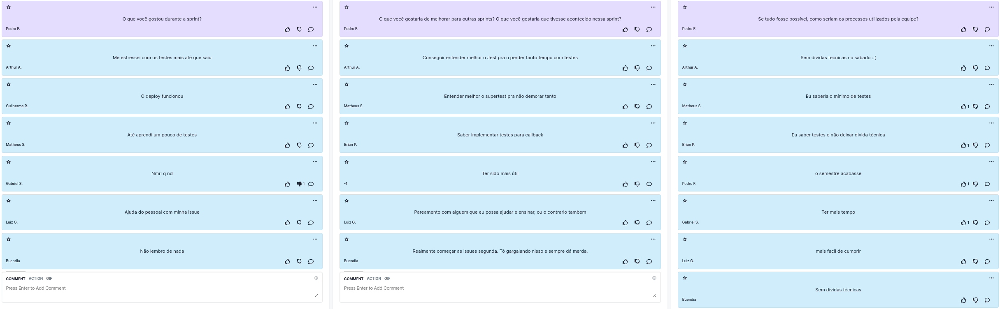

# Retrospectiva da Sprint 8

## Histórico de revisão

| Autor                                | Mudanças             | Data       | Versão |
| ------------------------------------ | -------------------- | ---------- | ------ |
| [Pedro Féo](https://github.com/phe0) | Criação do documento | 08/04/2021 | 1.0    |

## Avaliação do Scrum Master

Pontos levantados durante a retrospectiva:
 - O time relatou ter problemas com testes;
 - Time relatou continuar sem conseguir começar as issues no começo da sprint;
 - Time está triste com a quantidade de divdas técnicas =( ;

## Pontos levantados

