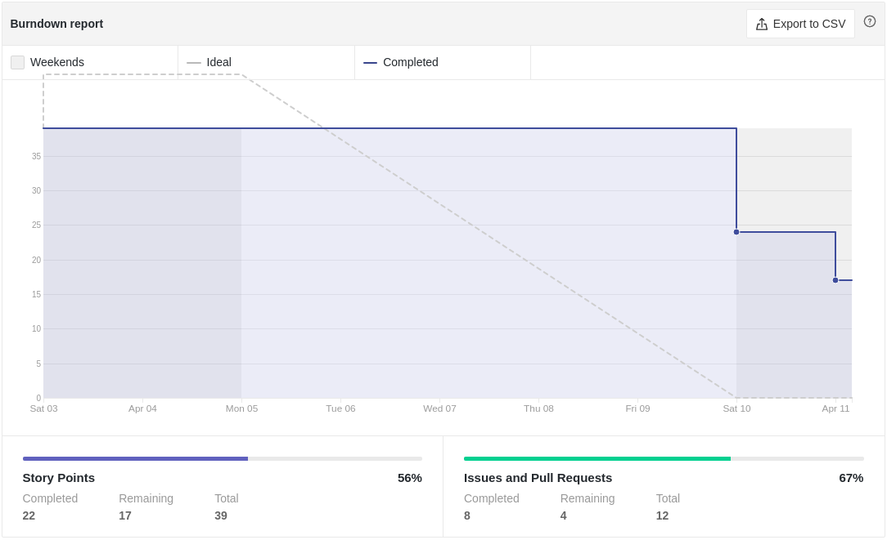
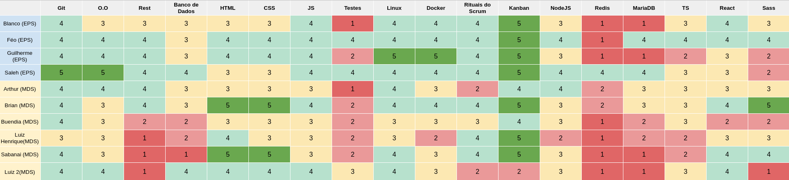
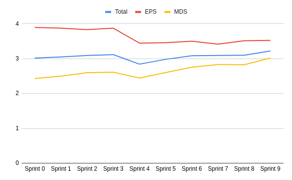
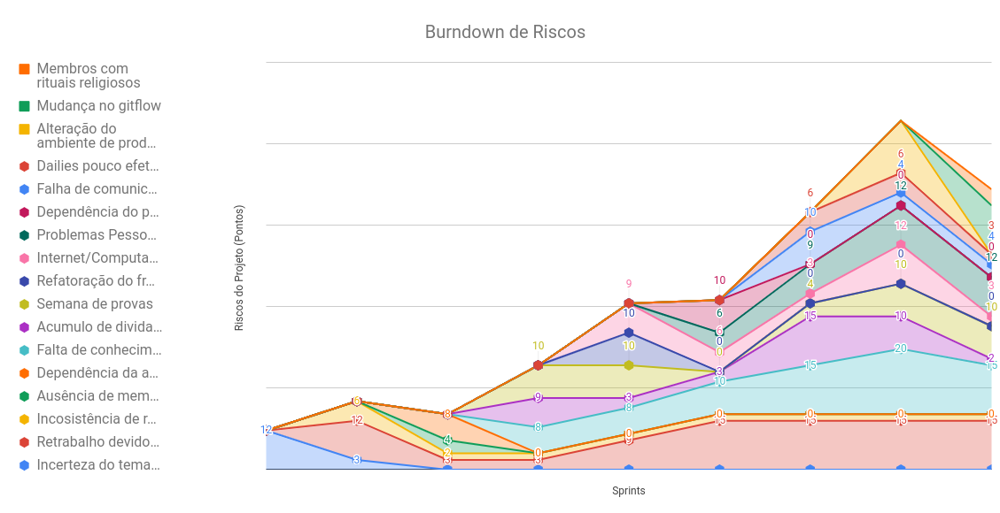
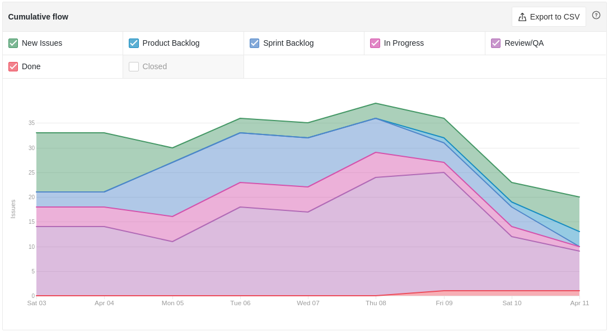
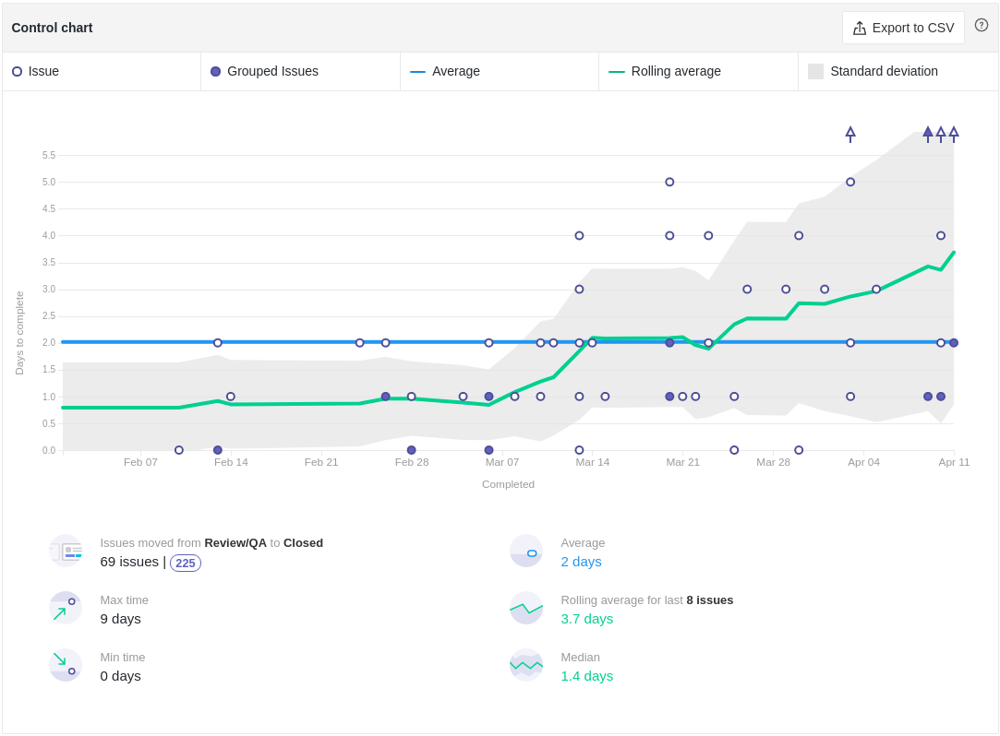

# Review da Sprint 8

## Histórico de revisão

| Autor                                | Mudanças             | Data       | Versão |
| ------------------------------------ | -------------------- | ---------- | ------ |
| [Pedro Féo](https://github.com/phe0) | Criação do documento | 16/04/2021 | 1.0    |

## Avaliação do Scrum Master

- Fizemos uma sprint para poder nos livras das dívidas técnicas e refatorar o código, melhorando sua manutebilidade e cobertura de testes, apesar de novas dívidas terem acontecido, o que foi feito será merjado desde que não quebre nada;
- Os nível de conhecimento, principalmente de MDS continua subindo;
- Na sprint a seguir iremos mudar nosso gitflow, retirando a branch devel, haverá um trabalho para migrar tudo das branchs devel para a main;
- O tempo de ciclo do início ao fim das issues estabilizou;
- O tempo de ciclo de review para done continua aumentando, algumas atividades estão se tornando dívda técnica por conta do tempo de revisão;

## Reports

### Tarefas Realizadas

| Tarefa                                                                                                    | Responsáveis                              | Pontuação | Concluída |
| --------------------------------------------------------------------------------------------------------- | ----------------------------------------- | --------- | --------- |
| [Documentação Planning Sprint 8](https://github.com/fga-eps-mds/EPS-2020-2-G2/issues/154)                 | Matheus Blanco                            | 1         | ✔         |
| [Documentação Review Sprint 7](https://github.com/fga-eps-mds/EPS-2020-2-G2/issues/151)                   | Pedro Féo                                 | 1         | ✔         |
| [Refatoração do serviço de mailer](https://github.com/fga-eps-mds/EPS-2020-2-G2/issues/149)               | Brian Pina e Arthur Matos                 | 3         | ✔         |
| [Refatoração do serviço de reports](https://github.com/fga-eps-mds/EPS-2020-2-G2/issues/148)              | Brian Pina e Arthur Matos                 | 2         | ✔         |
| [Refatorar código do serviço de gateway](https://github.com/fga-eps-mds/EPS-2020-2-G2/issues/147)         | Victor Buendia e Matheus Blanco           | 8         | ✔         |
| [Refatorar código do serviço de complaint](https://github.com/fga-eps-mds/EPS-2020-2-G2/issues/146)       | Luiz Henrique, Luiz Pettengil e Pedro Féo | 2         | ✘         |
| [Refatorar código do front-end](https://github.com/fga-eps-mds/EPS-2020-2-G2/issues/145)                  | Gabriel Sabanai                           | 8         | ✘         |
| [Configurar firebase para o serviço de usuário](https://github.com/fga-eps-mds/EPS-2020-2-G2/issues/1144) | Arthur Matos e Saleh Kader                | 5         | ✘         |
| [Popular e configurar o repositório de users](https://github.com/fga-eps-mds/EPS-2020-2-G2/issues/143)    | Saleh Kader                               | 8         | ✘         |
| [Configurar ESLINT nos repositórios](https://github.com/fga-eps-mds/EPS-2020-2-G2/issues/142)             | Pedro Féo                                 | 3         | ✔         |
| [Configurar APK para o projeto](https://github.com/fga-eps-mds/EPS-2020-2-G2/issues/141)                  | Luiz Henrique e Victor Buendia            | 13        | ✔         |

### Burndown

### Velocity

### Conhecimento dos membros

#### Quadro de Conhecimentos

#### Gráfico de Melhoria

### Riscos

### Cumulative flow

### Cycle time

### Ciclo de Início da realização da tarefa até o final

### Ciclo do tempo de Revisão até a conclusão da tarefa

### Gráfico de Humor

