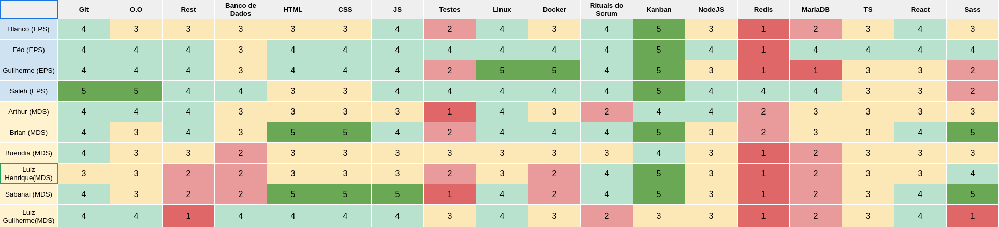
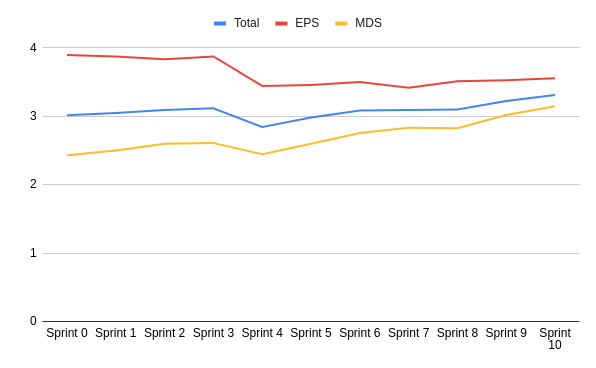
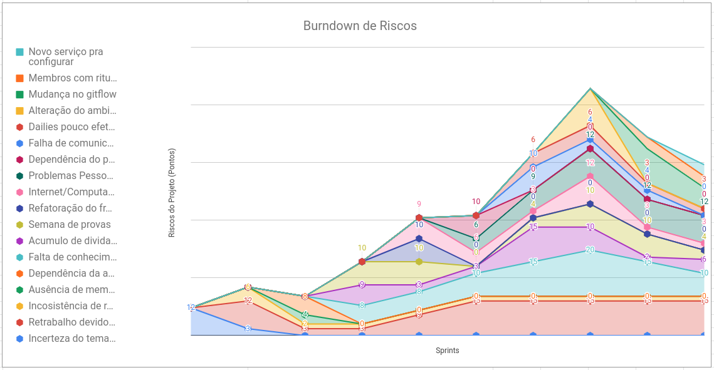
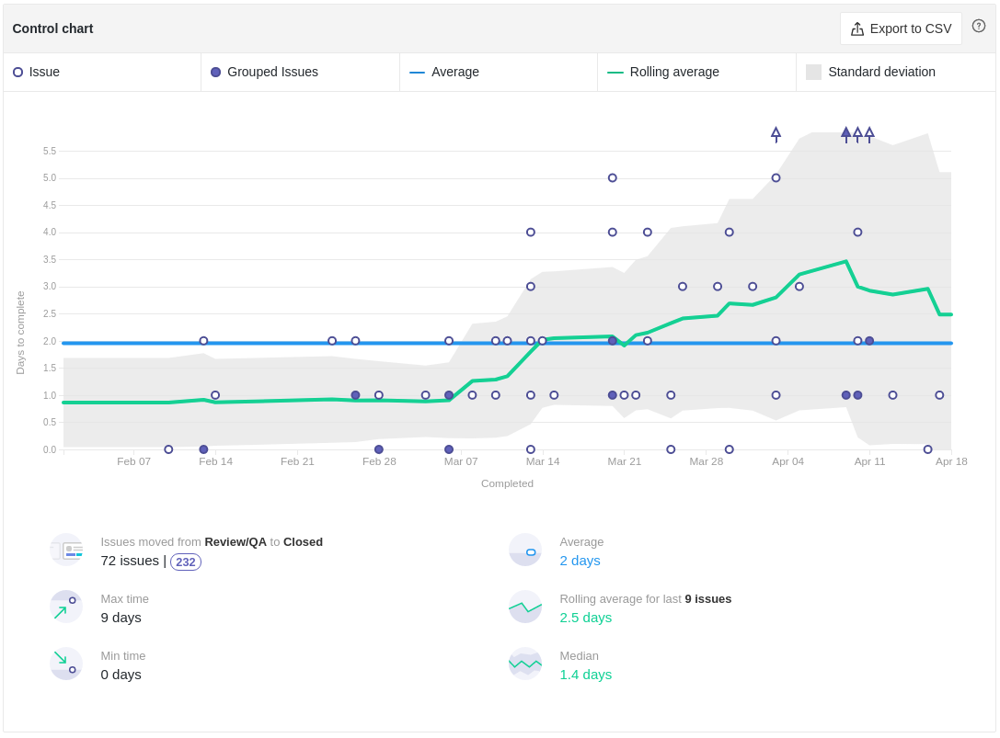
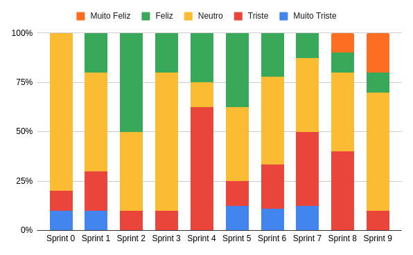

# Review da Sprint 9

## Histórico de revisão

| Autor                                | Mudanças             | Data       | Versão |
| ------------------------------------ | -------------------- | ---------- | ------ |
| [Pedro Féo](https://github.com/phe0) | Criação do documento | 19/04/2021 | 1.0    |

## Avaliação do Scrum Master

- Tivemos uma sprint com issues mais tranquilas, com pontuações de 3 e 5 na maioria, com isso os membros relataram ficar mais tranquilos durante a semana;
- As issues que ficaram em dívida os membros relataram dificuldade com as ferramentas novas desde o início da semana, isso se deve a introdução do firebase como ferramenta no projeto;
- O burndown deu uma boa melhorada, porém ainda está deslocado, talvez iniciando as issues um ou dois dias antes a equipe fique com um burndown ideal;
- Temos ocilado o velocity por volta das mesmas pontuações, acredito que algo nessa média de 30 pontos seja o ideal para a equipe;
- O quadro de conhecimento continua subindo, principalmente dos mds, estão ficando mais confortáveis com as tecnologias e isso trás uma confiança maior da equipe como um todo;
- Um novo risco foi detectado com a implementação de um novo serviço que irá substituir o serviço de usúarios, com o novo serviço novas complicações com a pipeline, deploy e novas ferramentas podem aparecer;
- O tempo de ciclo tanto para finalização das tarefas quanto para se realizar review teve uma queda boa;
- Os membros tem relatado estar mais felizes, talvez seja por conta da confiança maior com as tecnologias e a entrega do MVP;

## Reports

### Tarefas Realizadas

| Tarefa                                                                                               | Responsáveis                   | Pontuação | Concluída |
| ---------------------------------------------------------------------------------------------------- | ------------------------------ | --------- | --------- |
| [Documentação Planning Sprint 9](https://github.com/fga-eps-mds/EPS-2020-2-G2/issues/157)            | Matheus Blanco                 | 1         | ✔         |
| [Documentação Review Sprint 8](https://github.com/fga-eps-mds/EPS-2020-2-G2/issues/158)              | Pedro Féo                      | 1         | ✔         |
| [Configuração de provedor de E-mail](https://github.com/fga-eps-mds/EPS-2020-2-G2/issues/163)        | Guilherme Marques              | 5         | ✘         |
| [Configurar Migrações](https://github.com/fga-eps-mds/EPS-2020-2-G2/issues/159)                      | Pedro Féo                      | 5         | ✔         |
| [Configuração do Sentry nos repositórios](https://github.com/fga-eps-mds/EPS-2020-2-G2/issues/156)   | Matheus Blanco                 | 3         | ✔         |
| [HOTFIX - Cors e Security Hotspots](https://github.com/fga-eps-mds/EPS-2020-2-G2/issues/162)         | Saleh Kader                    | 5         | ✘         |
| [HOTFIX - Fila de e-mails](https://github.com/fga-eps-mds/EPS-2020-2-G2/issues/161)                  | Saleh Kader                    | 5         | ✔         |
| [HOTFIX - Hover de botão no PWA](https://github.com/fga-eps-mds/EPS-2020-2-G2/issues/160)            | Saleh Kader                    | 3         | ✔         |
| [US - Retirada de denúncia](https://github.com/fga-eps-mds/EPS-2020-2-G2/issues/153)                 | Victor Buendia e Luiz Henrique | 3         | ✔         |
| [US - Geolocalização de denúncia](https://github.com/fga-eps-mds/EPS-2020-2-G2/issues/140)           | Brian Pina e Luiz Pettengil    | 5         | ✔         |
| [US - Retirar upvote e voto de confirmação](https://github.com/fga-eps-mds/EPS-2020-2-G2/issues/139) | Victor Buendia e Luiz Henrique | 3         | ✔         |
| [US - Cadastro de usuário](https://github.com/fga-eps-mds/EPS-2020-2-G2/issues/138)                  | Arthur Matos e Gabriel Sabanai | 5         | ✘         |

### Burndown

### Velocity

### Conhecimento dos membros

#### Quadro de Conhecimentos

#### Gráfico de Melhoria

### Riscos

### Cumulative flow

### Cycle time

### Ciclo de Início da realização da tarefa até o final

### Ciclo do tempo de Revisão até a conclusão da tarefa

### Gráfico de Humor

